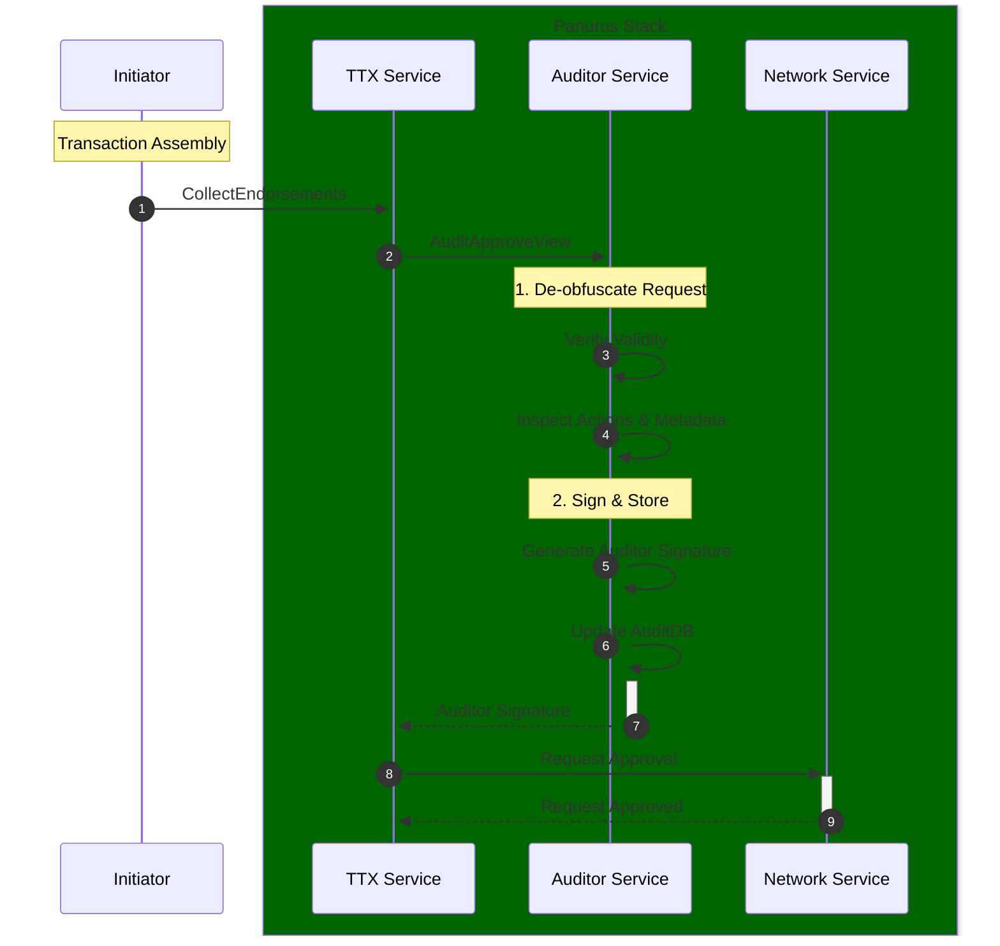

# Auditor Service

The **Auditor Service** (`token/services/auditor`) provides specialized tools and interfaces for nodes acting in an oversight or compliance role. 
It allows authorized auditors to inspect token transactions.

## Core Responsibilities

The Auditor Service is responsible for:
*   **Transaction Inspection**: De-obfuscating and verifying the contents of token requests (Issue and Transfer actions) using the auditor's cryptographic material.
*   **Compliance Verification**: Checking that transactions adhere to system-wide rules (e.g., maximum token values, authorized issuers).
*   **Audit Approval**: Providing the necessary signatures and proofs to authorize a transaction, which are often required by the ledger's validation logic for certain drivers (e.g., `zkatdlog`).
*   **Audit Storage**: Maintaining a separate **AuditDB** to store historical records of audited transactions for reporting and regulatory purposes.

## Interaction with TTX Service

The Auditor Service is typically invoked during the `CollectEndorsements` phase of a token transaction.



## Audit Management

Auditors use specialized wallets (Auditor Wallets) managed by the **Identity Service**. These wallets contain the cryptographic keys necessary to "open" the commitments and proofs found in privacy-preserving token transactions.

The service provides the `AuditApproveView`, which auditors use to respond to incoming audit requests. This view automates the verification and signing process, ensuring that the auditor only approves transactions that are fully compliant with the system's public parameters.

## Input Attribution

An audit record pairs every input and output with an enrollment ID. Inputs do not always carry one, so those left empty are resolved before the record is stored; the rest are untouched.

Each such input is resolved from its own spent token:

1. The spent token is read from the vault, yielding its owner, type, and quantity.
2. The owner is resolved to an enrollment ID and revocation handle through `WalletManager.GetEIDAndRH`, using the audit info attached to the input: the locally stored audit info of the spent token's owner where present, the one carried by the request metadata otherwise — a counterparty's audit info is not necessarily present locally. An owner the identity layer cannot decode counts as resolving to nothing; any other resolution failure — a storage error, a canceled context — fails the audit.

Across the built-in drivers, a **token upgrade** is the action whose metadata describes no sender for its inputs, and whose pre-upgrade owner often resolves to nothing: that identity predates the current driver and the request carries no audit info for it. Since an upgrade re-issues the spent tokens to the same party under a fresh identity, such an input takes the enrollment ID of the outputs issued by **its own action**, when every one of them resolves to the same party. The revocation handle comes from the same output, and is dropped when the outputs carry more than one. Without this the upgraded amount would be credited to the owner without ever being debited, doubling the holding. A composite owner issues one output row per member, all under one output index: members resolving to one enrollment ID attribute the input to it, while members spanning enrollment IDs fail the audit — a record keeps a single sender per action, and an unattributed input would credit the members without debiting anyone. Issued outputs that only partly resolve fail the audit for the same reason; when none resolve, nothing is credited and the input stays unattributed.

An owner that maps to no single enrollment ID — a composite owner such as a multisig, or one whose audit info is not available to, or not decodable by, this auditor — leaves its input **unattributed**, with an empty enrollment ID. Amount aggregations skip empty enrollment IDs, so an unattributed input is counted for nobody. Guessing instead, for instance from the first output, would in a payment attribute the payer's spending to the recipient and silently corrupt both balances.

An action whose inputs attribute to **more than one** enrollment ID — reachable when the tokens to spend are passed explicitly, since they are not constrained to a single wallet — fails the audit with an error naming the cause: a transaction record keeps a single sender per action, so the store cannot represent it. Representing multi-sender actions is tracked separately.

Attribution runs in `Audit`, before the enrollment IDs are collected, so the EID locking described below covers the enrollment ID each input is finally booked under. `Append` reuses the record `Audit` attributed and stores it as it stands; it attributes the record itself only when called without a preceding `Audit`. An input left unattributed by `Audit` therefore stays unattributed, and no enrollment ID outside the locked set can reach the store.

## Distributed EID Locking

When multiple auditor replicas share the same AuditDB (PostgreSQL), concurrent processing of the same enrollment IDs (EIDs) must be serialized. The **auditor locker** (`token/services/storage/auditdb/locker`) coordinates exclusive access to EIDs during audit record writes.

### Architecture

| Package | Role |
|---------|------|
| `auditdb/locker/memory` | In-process semaphores for single-replica deployments |
| `auditdb/locker/postgres` | Lease-table locking backed by PostgreSQL |
| `auditdb/locker` | Factory, configuration, and DI wiring |

The locker is injected into `auditdb.StoreService` at startup. Before appending audit records, the store calls `AssertLocksHeld` to verify leases are still valid.

### Configuration

Configure under `token.tms.<name>.auditor.locker` (see [Configuration](../configuration.md#optional-tokentmsauditorlocker)):

```yaml
token:
  tms:
    mytms:
      auditor:
        locker:
          backend: postgres   # use "memory" (default) for single replica
          postgres:
            ttl: 30s
            acquireBackoff: 100ms
            acquireDeadline: 1m
            heartbeat: 10s
            owner:            # required; defaults to the FSC node ID
```

**Backend selection:**

| Backend | Use case | Database |
|---------|----------|----------|
| `memory` | Single replica | Any |
| `postgres` | Multi-replica | PostgreSQL only |

The Postgres backend creates an `eid_leases` table (prefixed per TMS persistence settings) and uses lease rows with heartbeat renewal.

**Lease ownership:** each row is keyed by EID and carries the holding replica (`owner`) plus the request it was taken for (`anchor`). An acquisition may only take over an existing row when the lease has expired, or when the row is the same replica's lease for the *same* anchor — a re-acquisition, which just refreshes the deadline. Two different anchors therefore never hold the same EID at once, including two concurrent audits on a single replica; the second one is contended and retried until `acquireDeadline`.

### Replica owner identity

Every lease row carries an `owner` column, and each replica scopes all of its lease
queries by it — the acquire upsert, the release, the heartbeat renewal, and
`AssertLocksHeld`. The owner must therefore be **non-empty and unique per replica**.

Resolution order:

1. `token.tms.<name>.auditor.locker.postgres.owner`, when set.
2. Otherwise the FSC node ID (`fsc.id`, via the config provider's `ID()`).

If both are empty or blank, the locker **fails to start** with
`auditor locker owner is required`, and the audit store for that TMS is never
created. This is deliberate: a shared empty owner would make every owner-scoped
lease predicate match on rows belonging to *other* replicas, so a replica could
release or renew leases it does not hold and `AssertLocksHeld` could be satisfied
by another replica's row — silently removing mutual exclusion across the whole
cluster. Failing at startup surfaces the misconfiguration instead.

A common way to hit this is a templated or cloned node configuration where `fsc.id`
was left unset. Note that no owner is synthesized as a fallback: an owner that
changed on every restart would leave a restarted replica unable to renew or release
the leases it still holds in the table.

The `memory` backend has no owner concept and is unaffected.
