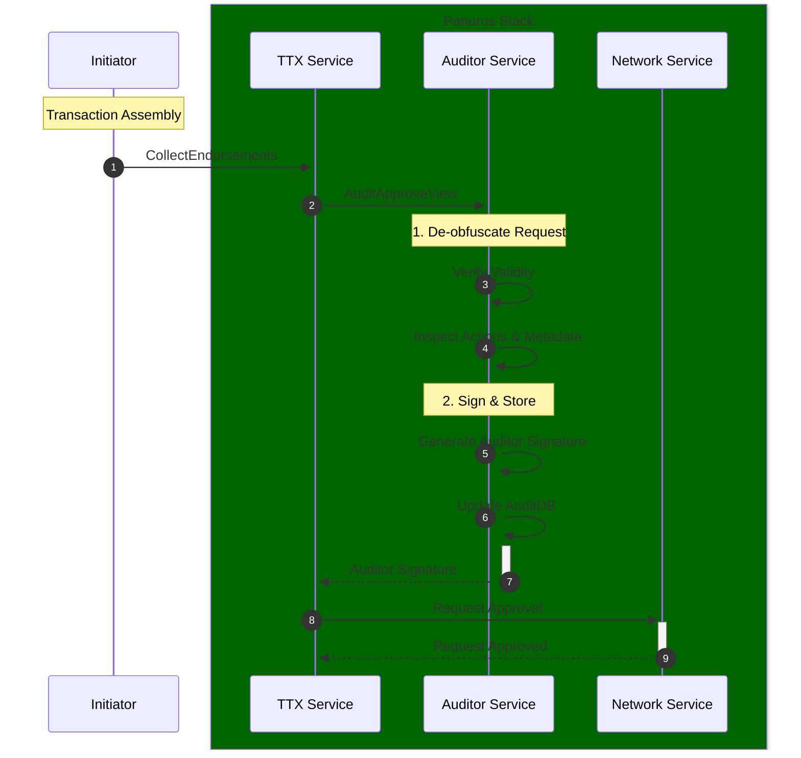

# Auditor Service

The **Auditor Service** (`token/services/auditor`) provides specialized tools and interfaces for nodes acting in an oversight or compliance role. 
It allows authorized auditors to inspect token transactions.

## Core Responsibilities

The Auditor Service is responsible for:
*   **Transaction Inspection**: De-obfuscating and verifying the contents of token requests (Issue and Transfer actions) using the auditor's cryptographic material.
*   **Compliance Verification**: Checking that transactions adhere to system-wide rules (e.g., maximum token values, authorized issuers).
*   **Audit Approval**: Providing the necessary signatures and proofs to authorize a transaction, which are often required by the ledger's validation logic for certain drivers (e.g., `zkatdlog`).
*   **Audit Storage**: Maintaining a separate **AuditDB** to store historical records of audited transactions for reporting and regulatory purposes.

## Interaction with TTX Service

The Auditor Service is typically invoked during the `CollectEndorsements` phase of a token transaction.



## Audit Management

Auditors use specialized wallets (Auditor Wallets) managed by the **Identity Service**. These wallets contain the cryptographic keys necessary to "open" the commitments and proofs found in privacy-preserving token transactions.

The service provides the `AuditApproveView`, which auditors use to respond to incoming audit requests. This view automates the verification and signing process, ensuring that the auditor only approves transactions that are fully compliant with the system's public parameters.

## Distributed EID Locking

When multiple auditor replicas share the same AuditDB (PostgreSQL), concurrent processing of the same enrollment IDs (EIDs) must be serialized. The **auditor locker** (`token/services/storage/auditdb/locker`) coordinates exclusive access to EIDs during audit record writes.

### Architecture

| Package | Role |
|---------|------|
| `auditdb/locker/memory` | In-process semaphores for single-replica deployments |
| `auditdb/locker/postgres` | Lease-table locking backed by PostgreSQL |
| `auditdb/locker` | Factory, configuration, and DI wiring |

The locker is injected into `auditdb.StoreService` at startup. Before appending audit records, the store calls `AssertLocksHeld` to verify leases are still valid.

### Configuration

Configure under `token.tms.<name>.auditor.locker` (see [Configuration](../configuration.md#optional-tokentmsauditorlocker)):

```yaml
token:
  tms:
    mytms:
      auditor:
        locker:
          backend: postgres   # use "memory" (default) for single replica
          postgres:
            ttl: 30s
            acquireBackoff: 100ms
            acquireDeadline: 1m
            heartbeat: 10s
            owner:            # required; defaults to the FSC node ID
```

**Backend selection:**

| Backend | Use case | Database |
|---------|----------|----------|
| `memory` | Single replica | Any |
| `postgres` | Multi-replica | PostgreSQL only |

The Postgres backend creates an `eid_leases` table (prefixed per TMS persistence settings) and uses lease rows with heartbeat renewal.

### Replica owner identity

Every lease row carries an `owner` column, and each replica scopes all of its lease
queries by it — the acquire upsert, the release, the heartbeat renewal, and
`AssertLocksHeld`. The owner must therefore be **non-empty and unique per replica**.

Resolution order:

1. `token.tms.<name>.auditor.locker.postgres.owner`, when set.
2. Otherwise the FSC node ID (`fsc.id`, via the config provider's `ID()`).

If both are empty or blank, the locker **fails to start** with
`auditor locker owner is required`, and the audit store for that TMS is never
created. This is deliberate: a shared empty owner would make every owner-scoped
lease predicate match on rows belonging to *other* replicas, so a replica could
release or renew leases it does not hold and `AssertLocksHeld` could be satisfied
by another replica's row — silently removing mutual exclusion across the whole
cluster. Failing at startup surfaces the misconfiguration instead.

A common way to hit this is a templated or cloned node configuration where `fsc.id`
was left unset. Note that no owner is synthesized as a fallback: an owner that
changed on every restart would leave a restarted replica unable to renew or release
the leases it still holds in the table.

The `memory` backend has no owner concept and is unaffected.
