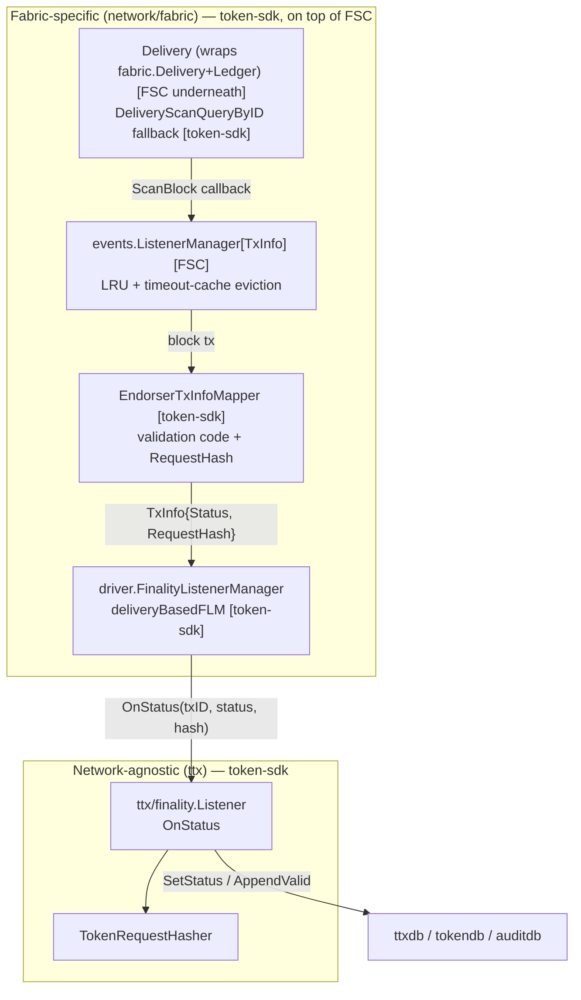

# Token Transaction Finality on Fabric

This document is a step-by-step deep-dive into how a Fabric Token SDK node determines that a token
transaction has reached **finality** on Hyperledger Fabric, and exactly what changes in local storage
as a result. It complements, and cross-references rather than repeats:

- [TTX Service](./ttx.md) — the full transaction lifecycle (assembly, signing, endorsement, ordering).
- [Network Service](./network.md) — the driver-based network abstraction.
- [Network Service - Fabric Implementation](./network-fabric.md) — Delivery vs. Notification modes,
  the Token Chaincode, endorsement policies.
- [Storage Service](./storage.md) — schema for each database.
- [Transaction Recovery Service](./storage/recovery.md) — the sweep described in step 9 below.

## 1. Definitions

A local transaction status, `storage.TxStatus` (aliased as `ttx.TxStatus`,
[`token/services/ttx/status.go`](../../token/services/ttx/status.go)):

| Status | Meaning |
|---|---|
| `Unknown` | No local record of this transaction. |
| `Pending` | Recorded locally and submitted to the ledger; outcome not yet known. |
| `Confirmed` | The ledger validated the transaction; local token state has been updated. |
| `Deleted` | The ledger rejected the transaction, or the on-ledger request didn't match what was submitted locally. |
| `Orphan` | The transaction never reached the ledger at all (e.g. a broadcast failure), discovered by the recovery sweep. |

A network-level validation code, `network.ValidationCode`
([`token/services/network/network.go`](../../token/services/network/network.go)): `Valid`, `Invalid`,
`Busy`, `Unknown`.

**Core principle: finality is a local, per-node determination.** No component polls "is the network
final yet?" as a distributed property. Each node observes the Fabric ledger for itself (directly, via
the mechanism in §3) and only then mutates its own `TxStatus`. Two nodes holding the same token
request can reach `Confirmed` at different wall-clock times, but the ledger fact they're both reacting
to is the same commit.

## 2. Two-layer listener architecture

Throughout this document, **FSC** = the underlying [fabric-smart-client](https://github.com/hyperledger-labs/fabric-smart-client)
dependency (`github.com/hyperledger-labs/fabric-smart-client`, currently pinned to `v0.13.0` in `go.mod`).
Everything under `token/services/network/fabric/...` is token-sdk code; it is a thin, token-request-aware
layer on top of a handful of FSC primitives. The diagram and bullets below tag each box/line with **[FSC]**
or **[token-sdk]** so the boundary is explicit.

- **Layer 1 (Fabric-specific, token-sdk driving FSC):** `driver.FinalityListenerManager`, implemented by
  `deliveryBasedFLM` in
  [`network/fabric/finality/deliveryflm.go`](../../token/services/network/fabric/finality/deliveryflm.go).
  It does **not** use chaincode events. token-sdk supplies three small adapters that plug directly into
  an **[FSC]** generic engine:
  - `Delivery` ([`network/fabric/finality/delivery.go`](../../token/services/network/fabric/finality/delivery.go))
    — a token-sdk struct that embeds FSC's own `*fabric.Delivery` and `*fabric.Ledger`
    (`platform/fabric/delivery.go`, `platform/fabric/ledger.go`, obtained via `ch.Delivery()`/`ch.Ledger()`
    on an FSC `fabric.Channel`), and adds only the logic to resolve a starting block from
    `Ledger.GetLedgerInfo().Height` before delegating to FSC's `ScanBlockFrom`. It satisfies FSC's
    `events.Delivery` interface (`ScanBlock(ctx, fabric.BlockCallback) error`).
  - `EndorserTxInfoMapper` — satisfies FSC's `events.EventInfoMapper[TxInfo]` interface
    (`MapTxData`, `MapProcessedTx`); this is where validation-code/`RequestHash` extraction happens.
  - `DeliveryScanQueryByID` ([`network/fabric/finality/deliveryqs.go`](../../token/services/network/fabric/finality/deliveryqs.go))
    — satisfies FSC's `events.QueryByIDService[TxInfo]` interface, used as the eviction-time fallback.

  These three are wired into **FSC's** `events.NewListenerManager[TxInfo]`
  (`platform/fabric/core/generic/events/listenermanager.go` — module
  `github.com/hyperledger-labs/fabric-smart-client`), which is the actual engine driving block delivery,
  LRU/timeout-based listener eviction, parallel block/tx mapping, and dispatch of `OnStatus` to registered
  listeners. token-sdk's `deliveryBasedFLM` is essentially a typed façade (`AddFinalityListener`) over
  this **[FSC]** manager, configured from `token.finality.delivery.*` (§6) which maps 1:1 onto FSC's own
  `DeliveryListenerManagerConfig` fields (`MapperParallelism`, `BlockProcessParallelism`,
  `ListenerTimeout`, `LRUSize`, `LRUBuffer`). `driver.FinalityListenerManager`
  ([`network/driver/network.go`](../../token/services/network/driver/network.go)) declares only this one
  method — there is no `AddPermanentListener` on the finality path. A similarly-named concept,
  `AddPermanentLookupListener`/`AddPermanentEventListener`
  ([`network/fabric/lookup/deliveryllm.go`](../../token/services/network/fabric/lookup/deliveryllm.go)),
  does exist in token-sdk, but it belongs to the unrelated **lookup**-listener manager (used for
  public-parameters/FabricX polling) — don't confuse the two.
- **Layer 2 (network-agnostic, pure token-sdk):** `ttx/finality.Listener` in
  [`ttx/finality/listener.go`](../../token/services/ttx/finality/listener.go) — the component that
  decides what a `Valid`/`Invalid` verdict means for local storage. Nothing here touches FSC.
- **Registration:** every time a transaction is appended locally, `ttx.Service.Append`
  ([`ttx/db.go`](../../token/services/ttx/db.go)) creates a fresh `finality.Listener` and registers it
  with `net.AddFinalityListener(namespace, txID, listener)`. This happens on the initiator's node *and*
  on every party that receives the transaction via `EndorseView`/`AcceptView`, since they call the same
  `Append` path — this is why every participant independently reaches finality rather than trusting the
  initiator's word for it.

The Fabric **committer** — **[FSC]** `platform/fabric/core/generic/committer` — is used only in two
narrow, indirect ways:
- `committer.MapValidationCode` (`platform/fabric/core/generic/committer/endorsertx.go`) — maps a raw
  `peer.TxValidationCode` to `driver.ValidationCode` (`VALID` → `Valid`, anything else → `Invalid`), plus
  the human-readable code name used as the status message.
- `committer.ProcessNamespace` — invoked once at network setup by
  `endorsement.NamespaceTxProcessor.EnableTxProcessing`
  ([`network/fabric/endorsement/provider.go`](../../token/services/network/fabric/endorsement/provider.go)),
  telling the local **[FSC]** committer/vault to process the token namespace at all.

## 3. Step-by-step walkthrough

1. **Selection & locking.** The Selector locks the chosen input tokens in `tokenlockdb`
   (`Lock(ctx, tokenID, consumerTxID)`,
   [`storage/db/driver/token.go`](../../token/services/storage/db/driver/token.go)) to prevent a
   concurrent transaction from double-spending the same UTXOs. See [Selector Service](./selector.md).
2. **Signature & audit collection.** Owner/issuer signatures and (unless skipped) the auditor's approval
   are collected — [`ttx/collectendorsements.go`](../../token/services/ttx/collectendorsements.go).
3. **Approval (Fabric chaincode endorsement).** `CollectEndorsementsView.requestApproval` calls
   `Network.RequestApproval(ctx, tms, requestRaw, signer, txID, metadata)`
   ([`network/fabric/network.go:340`](../../token/services/network/fabric/network.go)), which for the
   standard driver goes through `ChaincodeEndorsementService.Endorse`
   ([`network/fabric/endorsement/chaincode.go`](../../token/services/network/fabric/endorsement/chaincode.go)):
   it puts the token request in a transient field and invokes the Token Chaincode's `invoke` function.
   On the peer side, `tcc.ProcessRequest`
   ([`network/fabric/tcc/tcc.go`](../../token/services/network/fabric/tcc/tcc.go)) verifies the request
   and calls `CommitTokenRequest`, which writes the token-request key into the RWSet — this is the
   on-ledger artifact the hash check in step 8 will compare against. The result is a signed transaction
   envelope, stored on `tx.Envelope`.

   > **Alternate transport (not the default):** if the config key `services.network.fabric.fsc_endorsement`
   > is set, `endorsement.loader.load`
   > ([`network/fabric/endorsement/provider.go`](../../token/services/network/fabric/endorsement/provider.go))
   > builds `fsc.NewEndorsementService(...)` instead of `ChaincodeEndorsementService`. This mode skips the
   > chaincode `invoke` above entirely and drives **[FSC]**'s own native endorsement flow directly —
   > `endorser.NewTransaction`/`endorser.NewEndorsementOnProposalResponderView`/
   > `endorser.NewParallelCollectEndorsementsOnProposalView` from FSC's
   > `platform/fabric/services/endorser` package — collecting endorsement signatures over view-to-view
   > sessions instead of a chaincode invocation. It still produces the same kind of signed envelope for
   > step 6, so the rest of this walkthrough (ordering, delivery-based finality detection) is unaffected.
   > This is a distinct sense of "FSC" from the fabric-smart-client platform itself — it's an optional
   > endorsement *topology*, gated purely by that config key. Not used by any of the standard docs
   > cross-referenced here; mentioned for completeness.
4. **Record as Pending.** `ttx.Service.Append`
   ([`ttx/db.go:54`](../../token/services/ttx/db.go)) writes the request and per-action records with
   `Status: Pending` (`ttxdb.AppendTransactionRecord`) and, in the same call,
   registers the finality listener described in §2. The auditor does the equivalent via `auditdb.Append`.
5. **Distribution.** The envelope and transaction metadata are sent to every other involved party
   (`distributeTxToParties`); each one runs `EndorseView`/`AcceptView`, which also calls `Append` and
   therefore registers its own listener.
6. **Ordering.** `ttx/ordering.go` `orderingView.broadcast` calls `Network.Broadcast(ctx, envelope)` →
   `Ordering().Broadcast` — **[FSC]**'s ordering-client abstraction — sends the envelope to the Fabric
   ordering service. Right after broadcasting, `orderingView.Call` also caches the token request into
   `tokens.Service` via `CacheRequest` (unless `WithNoCachingRequest` was set) — this is a fast path the
   hash check in step 8 consults before falling back to `ttxdb`; a cache-write failure is only logged, not
   fatal. It also records the `OrderingDuration` histogram metric before returning.
   `NewOrderingAndFinalityView` chains ordering with a wait for finality (default timeout `10m`,
   [`ttx/ordering.go:18`](../../token/services/ttx/ordering.go)); the underlying `FinalityView` itself
   defaults to `5m` when called standalone
   ([`ttx/finality.go:67`](../../token/services/ttx/finality.go)).
7. **Ledger detection.** Once the block containing the transaction is delivered:
   - `EndorserTxInfoMapper.MapTxData` unmarshals the block transaction, confirms it is an
     `ENDORSER_TRANSACTION`, reads the RWSet, and maps the validation code from the block's
     `TRANSACTIONS_FILTER` metadata.
   - `mapTxInfo` looks up the per-namespace write at `KeyTranslator.CreateTokenRequestKey(txID)` to
     extract `RequestHash` — the token-request hash the chaincode actually committed.
   - **Fallback for evicted/missed listeners:** **[FSC]**'s `events.ListenerManager` wraps its listener
     map in a timeout cache (`ListenerTimeout`, §6); on eviction it calls token-sdk's
     `DeliveryScanQueryByID`
     ([`network/fabric/finality/deliveryqs.go`](../../token/services/network/fabric/finality/deliveryqs.go)),
     which first tries **[FSC]**'s `Ledger.GetTransactionByID` (`platform/fabric/ledger.go`) directly
     (mapped via `MapProcessedTx`); if that also fails, it rescans the ledger from
     `max(FirstBlock, lastBlock-10)` using **[FSC]**'s `fabric.Delivery.ScanFromBlock`. This exists
     because **[FSC]**'s listener manager keeps only a bounded LRU cache of pending listeners (§6
     `lruSize`/`lruBuffer`) — a transaction that takes unusually long to land can be evicted before its
     block arrives.
     - **Error normalization:** `Ledger.GetTransactionByID` reports a not-found transaction as a
       free-form error string from the underlying Fabric SDK/peer layer (observed forms:
       `"TXID [%s] not available"`, `"no such transaction ID [%s]"`), not a typed error. token-sdk's
       `normalizedLedger` adapter (`deliveryflm.go`, wrapping the `Ledger` before it's handed to the
       manager) checks both `errors.HasCause(err, fscFinality.TxNotFound)` — **[FSC]**'s own sentinel
       from `platform/fabric/core/generic/finality/deliveryqs.go`, in case some FSC code path already
       wraps it — and substring-matches those two raw strings, remapping everything to token-sdk's own
       `ErrTxNotFound` sentinel. This lets `DeliveryScanQueryByID` use `errors.Is` reliably at the call
       site instead of re-matching strings itself. (**[FSC]** ships an equivalent
       `DeliveryScanQueryByID[T]` in `platform/fabric/core/generic/finality/deliveryqs.go`, used
       internally by **FSC's own** delivery-based listener manager
       (`NewDeliveryFLM`/`deliveryListenerManager` in `platform/fabric/core/generic/finality/deliveryflm.go`
       — a separate, parallel construction of the same `events.NewListenerManager[T]` pattern, wired for
       FSC's own `fabric.FinalityListener` interface and not used by token-sdk directly); token-sdk's copy
       in `network/fabric/finality/` is a separate implementation with this extra normalization, not a
       reuse of FSC's. FSC also has an unrelated `NewCommitterFLM`/`committerListenerManager`
       (`platform/fabric/core/generic/finality/committerflm.go`) that watches the local committer instead
       of scanning delivered blocks, and does not use `DeliveryScanQueryByID` at all.)
8. **Decision.** `ttx.finality.Listener.OnStatus`
   ([`ttx/finality/listener.go:92`](../../token/services/ttx/finality/listener.go)) does not call the
   decision logic directly — it runs `runOnStatus`
   ([`ttx/finality/listener.go:109`](../../token/services/ttx/finality/listener.go)) inside a bounded
   retry (`utils.RetryRunner`, `MaxRetry = 3`, one-second base backoff). Any error from `runOnStatus` —
   including a storage hiccup unrelated to the verdict itself — triggers a retry rather than an immediate
   give-up; only after all 3 attempts fail does the listener call `OnError`, which bumps the
   `RetryExhausted` metric and logs, leaving the transaction `Pending` for the recovery sweep (§5) to
   pick up later. `OnStatus` also records the total wall-clock time (including retries) in the
   `OnStatusDuration` histogram.

   Inside `runOnStatus`, on the first attempt only, note also that:
   - `network.Valid` → the token request to hash-check is fetched from `tokens.Service.GetCachedTokenRequest`
     first (the fast path populated by step 6's `CacheRequest`); only on a cache miss does it fall back to
     `ttxDB.GetTokenRequest` + `hasher.ProcessTokenRequest`. Either way, the result is compared against
     `RequestHash` from the ledger (`checkTokenRequest`). **Match** → proceed to `Commit` (§4). **Mismatch**
     → `Deleted` + `HashMismatches` metric — this guards against a node accepting a status for a
     transaction whose on-ledger content diverged from what it holds locally.
   - `network.Invalid` → `Deleted` directly (chaincode/ordering-level rejection).
   - Anything else (`Busy`/`Unknown`) is treated as an error at this layer, and so is retried per the
     paragraph above (it's the recovery path, §5, that tolerates those as transient across sweeps instead
     of retries within one listener invocation).
   - A verdict that resolves to `Deleted` (either branch) increments `DeletedTransactions`; one that
     reaches `Commit` increments `ConfirmedTransactions` (both counted once `runOnStatus` returns
     successfully, not per retry attempt).
9. **Storage mutation.** See §4 for exactly what changes per store.
10. **Waking the caller.** `SetStatus` (on `Confirmed` this happens inside `Commit`, otherwise directly)
    persists the row and calls `Notify(common.StatusEvent{...})`. `ttx.finalityView.dbFinality`
    ([`ttx/finality.go:157`](../../token/services/ttx/finality.go)) is sitting on a channel registered
    via `AddStatusListener` for exactly this event; it also re-polls `GetStatus` every `pollingTimeout`
    tick as a safety net in case the event was missed, and returns success, `ErrFinalityInvalidTransaction`,
    or `ErrFinalityTimeout`.

    `finalityView.call` ([`ttx/finality.go:76`](../../token/services/ttx/finality.go)) validates its
    inputs first — an empty `txID`, a negative timeout, or a timeout over 24h all fail fast with
    `ErrInvalidInput` rather than blocking. It then checks the transaction's status in **both**
    `ttxdb` and `auditdb`; if neither store has ever heard of the transaction it returns
    `ErrTransactionUnknown` immediately. Otherwise it runs `dbFinality` against each store that does know
    the transaction, in sequence (`ttxdb` first, then `auditdb`) — so on an auditor node the caller waits
    for both the owner-side and audit-side status rows to settle, not just one.

## 4. What changes in storage

| Store | On `Confirmed` | On `Deleted` / `Invalid` |
|---|---|---|
| `ttxdb` / `auditdb` (`Requests`) | `SetStatus(ctx, txID, Confirmed, "")`, then `Notify` | `SetStatus(ctx, txID, Deleted, message)`, then `Notify` |
| `tokendb` (via `tokens.Service`) | `AppendValid` runs — appends new output tokens, deletes spent input tokens | not called — no token-state change |
| `tokenlockdb` | lock eventually released (`Transaction.Release()` on abort, or the periodic `Cleanup`) | same |
| `endorserdb` (endorser nodes) | `AppendValidationRecord` bookkeeping, then `SetStatus`/`Notify`, mirroring `ttxdb` | same, `Deleted` |
| keystore (cleanup service) | n/a | eventually purges the owner's SKI once the token is confirmed `Deleted` and past its TTL |

**tokendb, in detail** — `tokens.Service.AppendValid`
([`tokens/tokens.go:97`](../../token/services/tokens/tokens.go)) is only ever called from
`finality.Commit` when the verdict is `Confirmed`:
1. `Storage.TransactionExists(ctx, txID)` — idempotency guard, in case this listener fires more than once
   (e.g. a duplicate block delivery, or a race with the recovery handler).
2. `getActions` extracts the spent input IDs (`toSpend`) and new outputs (`toAppend`) from the token
   request.
3. `ts.AppendToken(ctx, tta)` for every new output, then `ts.DeleteTokens(ctx, txID, toSpend)` for every
   spent input — both inside the same `dbdriver.Transaction` passed down from `Commit`.

**The atomicity point** — `finality.Commit`
([`ttx/finality/listener.go:187`](../../token/services/ttx/finality/listener.go)) opens one DB
transaction, calls `AppendValid`, then `tx.SetStatus(ctx, txID, Confirmed, "")`, then `tx.Commit()`.
Token-state mutation and the `Confirmed` status flip happen atomically — a node never observes
`Confirmed` with stale tokens, or updated tokens with a `Pending` status.

**Metrics emitted along this path** (`ttx/finality/listener.go`, package `finality`, all no-op if no
`metrics.Provider` is wired):

| Metric | Kind | When |
|---|---|---|
| `finality_listener_confirmed_total` (`ConfirmedTransactions`) | Counter | verdict resolved to `Confirmed` (step 8) |
| `finality_listener_deleted_total` (`DeletedTransactions`) | Counter | verdict resolved to `Deleted`, any reason (step 8) |
| `finality_listener_hash_mismatch_total` (`HashMismatches`) | Counter | subset of the above specifically due to a token-request hash mismatch |
| `finality_listener_retry_exhausted_total` (`RetryExhausted`) | Counter | `OnError` fired — all 3 retries of `runOnStatus` failed (step 8) |
| `OnStatusDuration` | Histogram | wall-clock time of one `OnStatus` call, including retries |

`ttx/ordering.go` additionally records an `OrderingDuration` histogram, labeled by network/channel/namespace, per `orderingView.Call` (step 6).

`tokenlockdb` is **not** driven by the finality callback at all; it is downstream of it only in the
sense that a `Deleted`/`Confirmed` transaction is exactly the kind the periodic
`Cleanup(ctx, leaseExpiry)` sweep is designed to sweep up once its lease expires.

## 5. Recovery — when the listener is lost

A process restart, or an LRU eviction from the delivery listener cache without a successful
re-registration, can leave a `Pending` transaction with no active listener anywhere. Two components
cover this:

- `ttx/finality/recovery.go` `TTXRecoveryHandler.Recover(ctx, txID)` — instead of waiting for a push
  event, it calls `Network.GetTransactionStatus(ctx, namespace, txID)` directly and runs the same
  decision logic as `runOnStatus`. `Busy`/`Unknown` results are treated as transient (retried on the
  next sweep) rather than as errors.
- `storage/services/recovery/manager.go` `Manager.recoveryLoop` — a periodic sweep, gated by a DB-backed
  advisory-lock leadership (`AcquireRecoveryLeadership`) so only one process instance drives recovery at
  a time. Before the first sweep it sleeps a random 0–1s jitter (`recoveryLoop`,
  [`manager.go:147-159`](../../token/services/storage/services/recovery/manager.go)) to avoid a
  thundering herd when multiple replicas restart at once. Each sweep: `ClaimPendingTransactions(TTL,
  leaseDuration, batchSize, instanceID)` → fan out to worker goroutines → each calls `handler.Recover`. If
  recovery reports a `NotFound`-shaped error and the row is older than `NotFoundGracePeriod`, the manager
  force-sets the status to `Orphan` rather than `Deleted` — distinguishing "never reached the ledger"
  (broadcast was lost) from "the ledger actively rejected it", and unblocking the claim queue so the same
  oldest rows aren't replayed forever.

  **`NotFound` detection here is a second, independent string-matcher.** `isNotFoundError`
  ([`manager.go:392-407`](../../token/services/storage/services/recovery/manager.go)) substring-matches
  `"code = NotFound"`, `"not found in index"`, and `"tx not found"` against whatever error
  `Handler.Recover` returns. This is deliberately decoupled from the typed `ErrTxNotFound` sentinel that
  `network/fabric/finality`'s `normalizedLedger` produces (§3 step 7) — the recovery package doesn't want
  a dependency on `network/fabric/finality` — but it means the two "is this transaction actually missing
  from the ledger" checks are maintained separately and can drift: a new not-found error shape added on
  one side (e.g. a new Fabric SDK error string) isn't automatically picked up by the other.

`fabric/network.go` `createRecoveryManager` wires this manager for **both** `ttxdb` and `auditdb` — the
owner and the auditor each run their own independent recovery loop against their own storage.

See [Transaction Recovery Service](./storage/recovery.md) for the full claim/lease protocol.

## 6. Configuration

Finality behavior is tuned from two independent layers: token-sdk's own keys, and the underlying
**[FSC]** channel/delivery/peer configuration it builds on. This section lists every key relevant to
finality from both layers and where each is consumed.

### 6.1 token-sdk keys

Delivery-mode tuning, `token.finality.delivery.*`
([`network/fabric/config/config.go`](../../token/services/network/fabric/config/config.go)). token-sdk
is currently **hardwired to delivery-based finality** — `ManagerType` in that file only ever takes the
value `"delivery"`, and the FLM is constructed unconditionally as delivery-based in
[`network/fabric/driver.go:98-99`](../../token/services/network/fabric/driver.go); there is no working
key to select an alternate (e.g. notification-based) mode. These five keys are token-sdk's own naming;
each maps 1:1 onto a field of **[FSC]**'s `events.DeliveryListenerManagerConfig`
(`platform/fabric/core/generic/events/listenermanager.go`) when constructing the underlying listener
manager (§2):

| Key | Default | FSC config field |
|---|---|---|
| `mapperParallelism` | 10 | `MapperParallelism` |
| `blockProcessParallelism` | 10 | `BlockProcessParallelism` |
| `lruSize` | 30 | `LRUSize` |
| `lruBuffer` | 15 | `LRUBuffer` |
| `listenerTimeout` | 10s | `ListenerTimeout` |

`lruSize`/`lruBuffer` bound the LRU cache of registered-but-not-yet-fired listeners; `listenerTimeout`
drives the timeout-cache eviction that triggers the `DeliveryScanQueryByID` fallback (§3 step 7).

> **Note:** [Network Service - Fabric Implementation § Finality Configuration](./network-fabric.md#finality-management)
> currently shows a `type: delivery|notification` selector and a `committer.{maxRetries,retryWaitDuration}`
> block. As of the current code, no such keys are read anywhere under `token/services/network/fabric`
> (confirmed by grep) — token-sdk has no notification-mode code path, only the delivery-based one
> described in this document. That block should be treated as stale pending a fix to that document. The
> staleness isn't limited to the config snippet either: that same document has a whole "Notification
> Mode" narrative section with its own mermaid diagram describing FSC "monitoring ledger events" and
> pushing "Transaction event" notifications — a code path that doesn't exist anywhere in this codebase.
> Treat that entire section as fictional, not just the YAML block.

Other token-sdk keys already covered elsewhere, listed here only as pointers so this section is
complete:
- `services.network.fabric.fsc_endorsement` (bool) — selects the alternate FSC-native endorsement
  topology described in the §3 step 3 callout; does not otherwise affect finality detection.
- ttx-level wait timeouts — `NewOrderingAndFinalityView` (default 10m,
  [`ttx/ordering.go:18`](../../token/services/ttx/ordering.go)) and `NewFinalityView` called standalone
  (default 5m, [`ttx/finality.go:67`](../../token/services/ttx/finality.go)), both overridable per-call
  via `WithTimeout(...)`. These bound how long a *caller* waits locally; they do not affect when the
  ledger fact itself is detected.
- `services.network.fabric.recovery.*` — the full recovery-sweep configuration (`enabled`, `ttl`,
  `scanInterval`, `batchSize`, `workerCount`, `leaseDuration`, `advisoryLockID`, `instanceID`,
  `notFoundGracePeriod`) is owned by
  [Transaction Recovery Service § Configuration](./storage/recovery.md#configuration); see §5 above for
  how the sweep interacts with finality. `enabled` defaults to `true`; setting it `false` skips
  `Manager.Start` entirely (`manager.go:92-96`) — no sweep loop is spawned, and a lost listener with no
  active FLM registration then has no fallback at all. Not repeated here.
- `ttx/finality/listener.go`'s own retry policy — `MaxRetry = 3`, one-second base backoff — is a constant,
  not a configuration key (§3 step 8). If it needs to be tunable this is where a future key would live.

### 6.2 FSC keys

These live under the **[FSC]** channel config, YAML path `fabric.<network>.channels[<channel>].*`
(read via `Service.NewService`,
`platform/fabric/core/generic/config/service.go:68-100`), not under any `token.*` key — they configure
the block-delivery stream itself, one layer below everything in §6.1:

| Key | Default | Source | Relevance to finality |
|---|---|---|---|
| `Delivery.SleepAfterFailure` | 10s | `platform/fabric/core/generic/config/ds.go:170-175` (`Channel.DeliverySleepAfterFailure()`) | Fixed retry interval after a dropped/failed `Deliver` stream (§8) — a `Pending` transaction stalls locally for up to this long per reconnect attempt during an outage. |
| `Delivery.BufferSize` | 1 | `ds.go:206-211` (`Channel.DeliveryBufferSize()`) | Internal channel buffer between the gRPC receive loop and `ScanBlock`'s callback dispatch; not usually worth changing. |

**[FSC]** also selects, per channel, which peer serves each RPC kind via a `usage` tag on
`fabric.<network>.peers[]` entries (`funcTypeMap`,
`platform/fabric/core/generic/config/service.go:38-44`): `usage: delivery` → `PeerForDelivery`, the peer
whose `Deliver` stream `Delivery` (§2) scans; `usage: query` → `PeerForQuery`, the peer the recovery
sweep's `GetTransactionStatus` unary query (§8) is sent to. Both fall back to `PeerForAnything` if no
peer is tagged. Neither RPC kind has a finality-specific timeout of its own beyond the generic
connection defaults (`defaultConnectionTimeout`=10s, `defaultNumRetries`=3, `defaultRetrySleep`=1s,
`service.go:23-31`).

**[FSC]** additionally has its own, separate `Committer.*`/`Committer.Finality.*` config
(`ds.go:112-122`) and its own `Finality.WaitForEventTimeout`/`Finality.ForPartiesWaitTimeout`
(`ds.go:185-190`, `ds.go:234-239`) used only by **its own** committer-based and delivery-based finality
listener managers (`committerflm.go`/`deliveryflm.go`, §3 step 7). token-sdk does not read or depend on
any of these — it drives its own `events.NewListenerManager[TxInfo]` instance directly (§2) and uses its
own ttx-level timeouts (above) instead. They are mentioned here only so a reader who finds them in FSC's
config struct doesn't mistake them for something token-sdk consults.

ttx-side wait timeouts: `NewOrderingAndFinalityView` defaults to 10 minutes; `NewFinalityView` called
standalone defaults to 5 minutes. Both are overridable via `WithTimeout(...)`.

For the YAML example and the Notification-mode alternative, see
[Network Service - Fabric Implementation § Finality Management](./network-fabric.md#finality-management).

## 7. Failure modes & guarantees

| Scenario | Observed status | Recovery path |
|---|---|---|
| Chaincode/ordering rejects the tx | `Invalid` → `Deleted` | none needed — verdict is definitive |
| On-ledger request hash ≠ local request | `Valid` but hash mismatch → `Deleted` | none needed — verdict is definitive |
| Listener registered but node crashes/restarts before a verdict | still `Pending` | recovery sweep (§5) re-derives status directly from the ledger |
| Listener evicted from the delivery LRU before its block arrives | still `Pending` locally, but detectable | `DeliveryScanQueryByID` fallback (§3 step 7), and/or the recovery sweep |
| Broadcast never reached the ordering service | permanently `Pending` (ledger never sees it) | recovery sweep marks it `Orphan` after `NotFoundGracePeriod` |
| Duplicate finality notification for the same tx | idempotent | `TransactionExists` guard in `AppendValid` |
| `runOnStatus` errors 3 times in a row (e.g. a transient storage failure while writing `Confirmed`/`Deleted`) | still `Pending`; `RetryExhausted` metric incremented, `OnError` logs | recovery sweep (§5) re-derives status directly from the ledger on its own schedule — no automatic re-registration of this listener |
| `services.network.fabric.recovery.enabled` set to `false` | any of the above `Pending`-stuck cases | none — the sweep never starts (§6.1); only the delivery listener and its LRU-eviction fallback (§3 step 7) remain |

## 8. What happens if the delivery stream stops

The delivery goroutine (§2) is a single, long-lived call: **[FSC]**'s `ListenerManager.start()`
(`platform/fabric/core/generic/events/listenermanager.go:155-159`) calls
`m.delivery.ScanBlock(context.Background(), m.newBlockCallback())` exactly once, in a goroutine spawned
when the manager is constructed. What happens next depends on *why* it stopped.

**Transient failures (peer restart, dropped connection, brief network blip) — self-healing, no operator
action needed.** The actual gRPC `Deliver` stream is owned by **[FSC]**'s
`delivery.Service`/`runReceiver` loop (`platform/fabric/core/generic/delivery/delivery.go:173-285`), one
layer below `ScanBlock`. It retries forever, internally:
- Connect failure → `Errorf("failed connecting to delivery service ... Wait %.1fs before reconnecting", ...)`
  (`delivery.go:209`), sleep, retry.
- `Recv()` error (stream dropped, peer restart, gRPC error) → `Errorf("... failed receiving response [%s]", ...)`
  (`delivery.go:228-230`), reconnect on the next loop iteration.
- `Status_NOT_FOUND` → `Warnf("... wait a few seconds before retrying", ...)` (`delivery.go:268`).

  The sleep between attempts is `DeliverySleepAfterFailure` — a **fixed** interval (no exponential
  backoff), default **10s**. On reconnect it resumes from the last block it actually received in this
  session (or the vault's last known block), so it catches up without redelivering blocks already
  processed. This internal retry is what the code comment above the `ScanBlock` call means by *"In case
  the delivery service fails, it will try to reconnect automatically"* — plain gRPC/stream errors never
  propagate up to `ScanBlock` at all; they're fully absorbed here.

  During any such gap, registered finality listeners are simply not invoked — no `OnStatus` fires, so
  affected transactions stay `Pending` locally — and they catch up automatically once the stream
  reconnects and replays the blocks it missed.

**The one case that does *not* self-heal: `ScanBlock` actually returns.** This only happens if the block
callback itself errors, an explicit stop is signaled, or the passed context is cancelled — not from
ordinary stream/connection errors, which are absorbed as above. If it does happen, **[FSC]**'s
`start()` just logs `Errorf("failed running delivery: %v", err)` (`listenermanager.go:158`) and the
goroutine exits. Nothing restarts it. token-sdk's `deliveryBasedFLM` has no visibility into this
goroutine's outcome and no code path that restarts it — recovering requires the network layer (and
thus the listener manager) to be rebuilt, which in practice means a process restart.

**Pending transactions still aren't stuck, even in that dead-goroutine case**, because finality
detection has a fallback that is entirely independent of the delivery stream: the periodic recovery
sweep (§5, `storage/services/recovery/manager.go`) calls `Network.GetTransactionStatus`, which goes
through **[FSC]**'s `qscc` **query** RPC — a unary chaincode query sent to a peer selected via
`PeerForQuery` (`platform/fabric/core/generic/ledger/ledger.go`) — a completely different connection and
RPC type from the long-lived streaming `Deliver` RPC (`PeerForDelivery`,
`platform/fabric/core/generic/delivery/delivery.go:299`). So even with the delivery goroutine dead for
good, the recovery sweep keeps resolving `Pending` rows on its own schedule, oblivious to delivery
health. The `ListenerTimeout`-based eviction fallback (§3 step 7, `DeliveryScanQueryByID`) is a third,
narrower safety net, but it only fires for listeners still registered in a *live* manager — it doesn't
help once the manager's delivery goroutine itself is gone.

**Operator visibility is thin.** There is no dedicated delivery-stream health check or metric in
**[FSC]** (`platform/fabric` was searched for `DeliveryHealth`/`HealthCheck` patterns — no hits). The
only signals are the log lines above: the recurring `Errorf`/`Warnf` pair during normal reconnect churn,
and the one-time `Errorf("failed running delivery: %v", err)` at `listenermanager.go:158` if the
goroutine dies for good — that line is the one worth alerting on, since it marks the non-self-healing
case where a process restart is required.

## Related documents

- [TTX Service](./ttx.md)
- [Network Service](./network.md)
- [Network Service - Fabric Implementation](./network-fabric.md)
- [Storage Service](./storage.md)
- [Transaction Recovery Service](./storage/recovery.md)
- [TTXDB](./storage/ttxdb.md)
- [Tokens Service](./tokens.md)
- [Selector Service](./selector.md)
