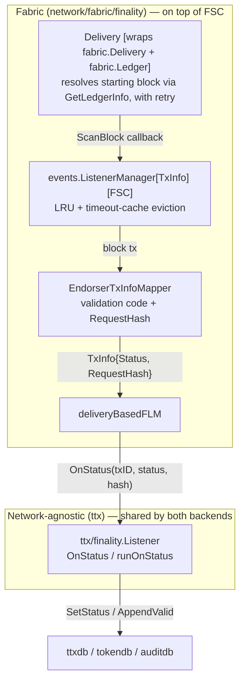
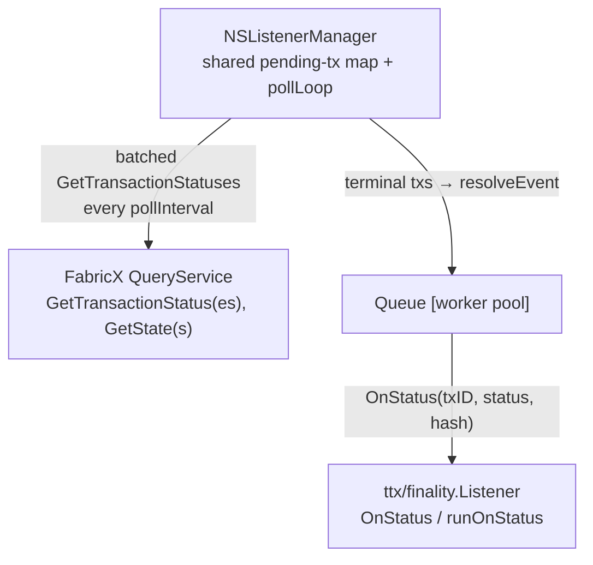
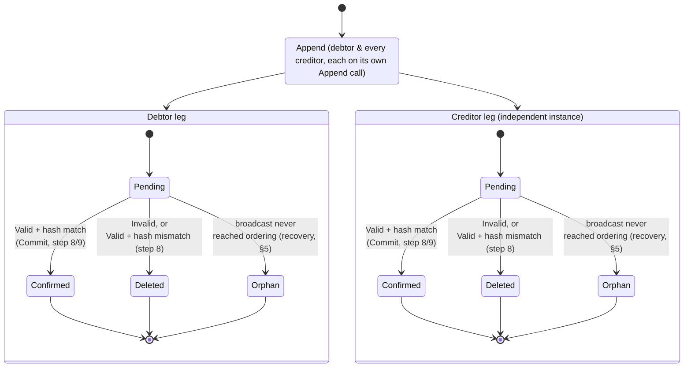

# Token Transaction Finality

This document is a step-by-step deep-dive into how a Panurus node determines that a token
transaction has reached **finality**, and exactly what changes in local storage as a result. It
complements, and cross-references rather than repeats:

- [TTX Service](./ttx.md) — the full transaction lifecycle (assembly, signing, endorsement, ordering).
- [Network Service](./network.md) — the driver-based network abstraction.
- [Network Service - Fabric Implementation](./network-fabric.md) — the Fabric delivery-based finality
  manager, its ledger-height retry budget, and the (currently stale) notification-mode config example.
- [Network Service - FabricX Implementation](./network-fabricx.md) — FabricX's async, event-queue-based
  finality processing, which is architecturally distinct from Fabric's (§2.2 below).
- [Storage Service](./storage.md) — schema for each database.
- [Transaction Recovery Service](./storage/recovery.md) — the sweep described in §5 below.

Panurus is a fork of, and shares the package layout with, `hyperledger-labs/fabric-token-sdk`
(module `github.com/LFDT-Panurus/panurus`). This document mirrors the structure of that upstream project's
`docs/services/finality.md`, adjusted throughout for Panurus's current code — most notably a shared
batch-polling fallback (§3, §6) that replaces upstream's per-transaction polling, and first-class
FabricX support (§2.2), which upstream does not have at all.

## 1. Definitions

A local transaction status, `storage.TxStatus` (aliased as `ttx.TxStatus`,
[`token/services/ttx/status.go`](../../token/services/ttx/status.go)):

| Status | Meaning |
|---|---|
| `Unknown` | No local record of this transaction. |
| `Pending` | Recorded locally and submitted to the ledger; outcome not yet known. |
| `Confirmed` | The ledger validated the transaction; local token state has been updated. |
| `Deleted` | The ledger (chaincode/ordering) actively rejected the transaction, **or** the ledger validated it but its committed token-request hash didn't match what this node holds locally — both are folded into the same status today (§3 step 8). |
| `Orphan` | The transaction never reached the ledger at all (e.g. a broadcast failure), discovered by the recovery sweep. |

There is no dedicated status for the hash-mismatch case (a `Compromised` status, distinct from
ordinary `Deleted`, has been discussed but is **not implemented** — `storage.TxStatus` defines only
the five values above). A mismatch is still distinguishable after the fact via the
`finality_listener_hash_mismatch_total` metric (§4) and the log line emitted by `checkTokenRequest`,
but not via the stored status itself.

A network-level validation code, `network.ValidationCode` (an alias of `driver.ValidationCode`,
[`token/services/network/network.go`](../../token/services/network/network.go)): `Valid`, `Invalid`,
`Busy`, `Unknown`.

**Core principle: finality is a local, per-node determination.** No component polls "is the network
final yet?" as a distributed property. Each node observes the ledger for itself and only then mutates
its own `TxStatus`. Two nodes holding the same token request can reach `Confirmed` at different
wall-clock times, but the ledger fact they're both reacting to is the same commit.

## 2. Two listener architectures, one network-agnostic decision layer

Panurus supports two backends, and each drives finality detection completely differently below the
`ttx/finality.Listener` boundary. Both eventually call the same `OnStatus(txID, status, message,
tokenRequestHash)` — the network-agnostic decision logic in §3 is identical for both.

### 2.1 Fabric — block-delivery streaming

This is the same design as upstream fabric-token-sdk: `Delivery`
([`network/fabric/finality/delivery.go`](../../token/services/network/fabric/finality/delivery.go)),
`EndorserTxInfoMapper` and `deliveryBasedFLM`
([`network/fabric/finality/deliveryflm.go`](../../token/services/network/fabric/finality/deliveryflm.go))
are wired into **FSC**'s `events.NewListenerManager[TxInfo]`, with `DeliveryScanQueryByID`
([`network/fabric/finality/deliveryqs.go`](../../token/services/network/fabric/finality/deliveryqs.go))
as the eviction-time fallback and `normalizedLedger` remapping FSC's string-based not-found errors to
the typed `ErrTxNotFound` sentinel.

**One addition Panurus has that upstream doesn't:** resolving the scan's starting block
(`Ledger.GetLedgerInfo().Height`) is now retried with exponential backoff —
`token.finality.delivery.ledgerInfoAttempts` (default 7) and `ledgerInfoRetryDelay` (default 500ms,
doubling, capped at 30s — roughly 31.5s total) — because nothing retries `ScanBlock` itself, so a
transient failure reading the starting height used to be able to leave the manager with no block-based
finality until a process restart. See [Network Service - Fabric Implementation §
Choosing the Starting Block](./network-fabric.md#choosing-the-starting-block) for the full mechanics
and the `ErrLedgerHeightUnavailable`/`ErrNoLedgerInfo` sentinels — not repeated here.

`driver.FinalityListenerManager`
([`network/driver/network.go`](../../token/services/network/driver/network.go)) declares only
`AddFinalityListener`. The Fabric driver constructs `deliveryBasedFLM` unconditionally
([`network/fabric/driver.go`](../../token/services/network/fabric/driver.go)); there is no working
config key to select an alternate mode for Fabric. See the callout in §6.1 about the stale
`type: delivery|notification` / `committer.*` example still present in
[network-fabric.md](./network-fabric.md#finality-configuration).

### 2.2 FabricX — query-service polling with an async worker queue

FabricX has no block-delivery stream to plug into; instead
[`network/fabricx/finality/finality.go`](../../token/services/network/fabricx/finality/finality.go)
implements finality detection entirely differently, and this is the one part of this document with
no upstream fabric-token-sdk equivalent at all:

- `NSListenerManager.AddFinalityListener` doesn't register anything with a stream — it just adds the
  `(namespace, listener)` pair to an in-memory `pending` map, keyed by `txID`, and lazily starts a
  single `pollLoop` goroutine (`sync.Once`) shared by every registration on that manager.
- `pollLoop` sweeps the pending set every `pollInterval`, batch-queries every pending transaction's
  status in one round trip (`GetTransactionStatuses`, falling back to one call per tx if the query
  service doesn't support batching), and for every transaction that has reached a terminal state
  (`Valid`/`Invalid` — `Unknown`/`Busy` stay pending for the next sweep) batch-fetches the
  token-request hash for the `Valid` ones (`GetStates`) before handing off.
- Resolved transactions are wrapped in a `resolveEvent` and pushed onto a `Queue` (a worker pool) so
  that `OnStatus` calls — including the hash check and DB commit in §3 — never run on the polling
  goroutine itself. `NSFinalityListener.OnStatus` (used for a live-notification path, distinct from
  the poller) does the same thing per-event via `ListenerEvent.Process`, which retries with exponential
  backoff (`defaultMaxRetries = 3`, `defaultRetryInterval = 1s`, doubling) and falls back to a direct
  `TxCheck` when the status is `Unknown`/`Busy`.
- `OnlyOnceListener` wraps every registered listener so that, whichever path resolves it first, `OnStatus`
  (or `OnError`) fires exactly once — relevant because a transaction can in principle be resolved by
  the shared poller and by a live per-event `NSFinalityListener` racing each other.
- A pending waiter that outlives `pendingTTL` is silently dropped from the poller's map rather than
  erroring — the caller's own `finalityView` timeout (§3 step 10 below, shared with Fabric) is what
  actually surfaces a timeout to the application; the poller dropping its bookkeeping slot early is not
  itself an error condition.

Both `fabricXFSCStatus` (FabricX → `driver.ValidationCode`) and the Fabric driver's
`committer.MapValidationCode` ultimately feed the same `network.Valid`/`Invalid`/`Busy`/`Unknown` set
that `runOnStatus` (§3) switches on — this is the seam that lets §3 be backend-agnostic.

See [Network Service - FabricX Implementation § Finality Processing](./network-fabricx.md#finality-processing)
for the endorser-side event-queue architecture this polling layer sits behind; not repeated here.

### 2.3 Registration

Every time a transaction is appended locally, `ttx.Service.Append`
([`token/services/ttx/db.go`](../../token/services/ttx/db.go)) creates a fresh `finality.Listener` and
registers it with `net.AddFinalityListener(namespace, txID, listener)` — the same call regardless of
which backend is behind it. This happens on the initiator's node *and* on every party that receives
the transaction via `EndorseView`/`AcceptView`, since they call the same `Append` path — this is why
every participant independently reaches finality rather than trusting the initiator's word for it.

## 3. Step-by-step walkthrough

Both legs observe the same ledger fact, so in the absence of bugs/faults they converge on the same
terminal status — but they can do so at different wall-clock times, and one leg reaching `Confirmed`
never causes or implies the other leg's transition.

1. **Selection & locking.** The Selector locks the chosen input tokens in `tokenlockdb` to prevent a
   concurrent transaction from double-spending the same UTXOs. See [Selector Service](./selector.md).
2. **Signature & audit collection.** Owner/issuer signatures and (unless skipped) the auditor's approval
   are collected. See [TTX Service](./ttx.md).
3. **Approval (endorsement).** The chaincode (Fabric) or native FSC-endorsement (FabricX, or Fabric with
   `services.network.fabric.fsc_endorsement`) path writes the token-request hash into the on-ledger
   state — this is the artifact the hash check in step 8 will compare against. See [Network Service -
   Fabric Implementation](./network-fabric.md) / [FabricX Implementation](./network-fabricx.md) for the
   endorsement flow itself.
4. **Record as Pending.** `ttx.Service.Append` writes the request and per-action records with
   `Status: Pending` and, in the same call, registers the finality listener described in §2.3. The
   auditor does the equivalent via `auditdb.Append`.
5. **Distribution.** The envelope and transaction metadata are sent to every other involved party
   (`distributeTxToParties`); each one runs `EndorseView`/`AcceptView`, which also calls `Append` and
   therefore registers its own listener.
6. **Ordering.** `orderingView.broadcast`
   ([`token/services/ttx/ordering.go`](../../token/services/ttx/ordering.go)) calls
   `Network.Broadcast(ctx, envelope)`. Right after broadcasting, `orderingView.Call` also caches the
   token request into `tokens.Service` via `CacheRequest` (unless `WithNoCachingRequest` was set) — a
   fast path the hash check in step 8 consults before falling back to `ttxdb`; a cache-write failure is
   only logged, not fatal. It then records the `OrderingDuration` histogram, labeled by
   network/channel/namespace. `NewOrderingAndFinalityView` chains ordering with a wait for finality
   (default timeout **10 minutes**, `finalityTimeout` in `ordering.go`); `NewFinalityView` called
   standalone defaults to **5 minutes** (`finality.go`).
7. **Ledger detection.** How the block/status is actually observed is backend-specific — see §2.1 for
   Fabric's block-delivery scan (plus its LRU-eviction fallback) or §2.2 for FabricX's batched
   query-service polling. Either way, the result handed to `OnStatus` is the same
   `(status, message, tokenRequestHash)` tuple.
8. **Decision.** `ttx.finality.Listener.OnStatus`
   ([`token/services/ttx/finality/listener.go`](../../token/services/ttx/finality/listener.go)) does not
   run the decision logic directly — it runs `runOnStatus` inside a bounded retry
   (`utils.RetryRunner`, `MaxRetry = 3`, one-second base backoff). Any error from `runOnStatus` —
   including a storage hiccup unrelated to the verdict itself — triggers a retry; only after all 3
   attempts fail does the listener call `OnError`, which bumps the `RetryExhausted` metric and logs,
   leaving the transaction `Pending` for the recovery sweep (§5) to pick up later. When the retries are
   exhausted, `OnStatus` also releases the transaction's selection locks exactly once — this is a
   terminal give-up for the notification, whatever failed inside `runOnStatus`, so leaving the locks for
   the lease-expiry sweep would reopen the contention window of
   [#2395](https://github.com/LFDT-Panurus/panurus/issues/2395). `Unlock` is idempotent, and a later
   selection attempt simply re-acquires what it needs. `OnStatus` also records the total wall-clock time
   (including retries) in the `OnStatusDuration` histogram.

   Inside `runOnStatus`:
   - `network.Valid` → the token request to hash-check is fetched from `tokens.Service.GetCachedTokenRequest`
     first (the fast path populated by step 6's `CacheRequest`); only on a cache miss does it fall back
     to `ttxDB.GetTokenRequest` + `hasher.ProcessTokenRequest`
     ([`token/services/ttx/finality/hasher.go`](../../token/services/ttx/finality/hasher.go)). Either
     way, the result is compared against the ledger's `RequestHash` (`checkTokenRequest`). **Match** →
     proceed to `Commit` (§4). **Mismatch** → `Deleted` + `HashMismatches` metric (§1 — this is folded
     into ordinary `Deleted`, not a distinct status, in the current implementation).
   - `network.Invalid` → `Deleted` directly.
   - `network.Busy`/`network.Unknown` → the transaction is not yet finalized. This is an expected
     transient state, so `runOnStatus` logs at Debug and returns `nil` without touching the stores and
     **without releasing the transaction's selection locks** — the transaction is still in flight, and
     dropping its locks would let a concurrent `Select` re-offer the same tokens. This matches the
     recovery handler's treatment of the same two statuses (§5).
   - Any other, genuinely unrecognized status code returns an error at this layer and is retried per
     the paragraph above. Retrying can never reclassify it, so the retries are exhausted and
     `OnStatus`'s give-up branch releases the selection locks once (see below).
   - A verdict that resolves to `Deleted` increments `DeletedTransactions`; one that reaches `Commit`
     increments `ConfirmedTransactions` (both counted once `runOnStatus` returns successfully, not per
     retry attempt).
9. **Storage mutation.** See §4 for exactly what changes per store.
10. **Waking the caller.** Status writes are push-first: `finalityView.dbFinality`
    ([`token/services/ttx/finality.go`](../../token/services/ttx/finality.go)) registers a per-waiter
    channel via `AddStatusListener`, checks `GetStatus` once (to cover the registration race), then
    blocks on that channel. `SetStatus` calls `Notify` in-process to wake it. As a safety net for lost
    push events — not per-transaction polling — a single shared `statusPoller` per database
    ([`token/services/ttx/finality_poller.go`](../../token/services/ttx/finality_poller.go), see §6)
    batch-fetches (`GetStatuses`) every transaction someone is currently waiting on and re-publishes the
    terminal ones through the same notification path; it sweeps at the smallest `WithPollingTimeout`
    among the active waiters (default **1 second**) and stops once no waiter remains. `dbFinality`
    returns success, `ErrFinalityInvalidTransaction`, or `ErrFinalityTimeout`.

    `finalityView.call` validates its inputs first — an empty `txID`, a negative timeout, or a timeout
    over 24h all fail fast with `ErrInvalidInput` rather than blocking. It then checks the transaction's
    status in **both** `ttxdb` and `auditdb`; if neither store has ever heard of the transaction it
    returns `ErrTransactionUnknown` immediately. Otherwise it runs `dbFinality` against each store that
    does know the transaction, in sequence (`ttxdb` first, then `auditdb`) — so on an auditor node the
    caller waits for both the owner-side and audit-side status rows to settle, not just one. All four
    sentinel errors (`ErrInvalidInput`, `ErrFinalityInvalidTransaction`, `ErrFinalityTimeout`,
    `ErrTransactionUnknown`) live in
    [`token/services/ttx/errors.go`](../../token/services/ttx/errors.go).

## 4. What changes in storage

| Store | On `Confirmed` | On `Deleted` / `Invalid` |
|---|---|---|
| `ttxdb` / `auditdb` (`Requests`) | `SetStatus(ctx, txID, Confirmed, "")` inside the same DB transaction as the token append (see below), then an explicit `NotifyStatus` | `SetStatus(ctx, txID, Deleted, message)`, then `Notify` |
| `tokendb` (via `tokens.Service`) | `AppendValid` runs — appends new output tokens, deletes spent input tokens, and returns a `publishTokenEvents` callback | not called — no token-state change |
| `tokenlockdb` | lock eventually released (`Transaction.Release()` on abort, or the periodic `Cleanup`) | same |
| keystore (cleanup service) | n/a | eventually purges the owner's SKI once the token is confirmed `Deleted` and past its TTL |

**tokendb, in detail** — `tokens.Service.AppendValid` is only ever called from `finality.Commit`
([`token/services/ttx/finality/listener.go`](../../token/services/ttx/finality/listener.go)) when the
verdict is `Confirmed`, and does the actual output-append / input-delete inside the `dbdriver.Transaction`
passed down from `Commit`; it does not commit anything itself.

**The atomicity point** — `finality.Commit` opens one DB transaction, calls `AppendValid`, sets status
to `Confirmed` on that same transaction, and commits — token-state mutation and the `Confirmed` status
flip happen atomically, so a node never observes `Confirmed` with stale tokens or updated tokens with a
`Pending` status. Two details here are not present in upstream fabric-token-sdk:

- `AppendValid` returns a `publishTokenEvents` function rather than publishing immediately. `Commit`
  invokes it only *after* the DB transaction has committed successfully, and *before* notifying the
  status event — so a woken finality waiter never observes a `Confirmed` status whose token-add/delete
  events haven't been published yet. A nil `publishTokenEvents` is tolerated (skipped) rather than
  causing a panic in the listener's goroutine.
- Because the `Confirmed` `SetStatus` happens inside the transactional path, it bypasses the store
  service's own `Notify` call. `Commit` therefore calls `ttxDB.NotifyStatus` explicitly right after —
  otherwise a finality waiter (§3 step 10) would only ever wake via the fallback poller, never the push
  path, for the `Confirmed` case specifically.

**Metrics emitted along this path** (`token/services/ttx/finality/metrics.go`, package `finality`, all
no-op if no `metrics.Provider` is wired):

| Metric | Kind | When |
|---|---|---|
| `finality_listener_confirmed_total` (`ConfirmedTransactions`) | Counter | verdict resolved to `Confirmed` (step 8) |
| `finality_listener_deleted_total` (`DeletedTransactions`) | Counter | verdict resolved to `Deleted`, any reason (step 8) |
| `finality_listener_hash_mismatch_total` (`HashMismatches`) | Counter | subset of the above specifically due to a token-request hash mismatch |
| `finality_listener_retry_exhausted_total` (`RetryExhausted`) | Counter | `OnError` fired — all 3 retries of `runOnStatus` failed (step 8) |
| `finality_listener_on_status_duration_seconds` (`OnStatusDuration`) | Histogram | wall-clock time of one `OnStatus` call, including retries |

`ttx/ordering.go` additionally records an `OrderingDuration` histogram, labeled by network/channel/namespace,
per `orderingView.Call` (step 6). The `TTXRecoveryHandler` (§5) reuses this same `Metrics` type and
increments `ConfirmedTransactions`/`DeletedTransactions`/`HashMismatches` for transactions it resolves,
so the counters reflect both the live listener path and recovery.

`tokenlockdb` is **not** driven by the finality callback at all; it is downstream of it only in the
sense that a `Deleted`/`Confirmed` transaction is exactly the kind the periodic `Cleanup` sweep is
designed to sweep up once its lease expires.

## 5. Recovery — when the listener is lost

A process restart, or a listener that was never delivered a verdict (an LRU eviction on Fabric, or a
`pendingTTL` expiry on FabricX, without a successful re-registration), can leave a `Pending` transaction
with no active listener anywhere. `TTXRecoveryHandler.Recover(ctx, txID)`
([`token/services/ttx/finality/recovery.go`](../../token/services/ttx/finality/recovery.go)) covers this
— instead of waiting for a push event, it calls `Network.GetTransactionStatus(ctx, namespace, txID)`
directly and runs the same decision logic as `runOnStatus` (`applyFinalityLogic`, sharing
`checkTokenRequest` and `Commit`). As on the live listener path, `Busy`/`Unknown` here is treated as an
expected transient state, not an error: the handler simply returns `nil` without touching the status,
releasing its claim so the periodic sweep in
[Transaction Recovery Service](./storage/recovery.md) picks the transaction up again on its next pass
rather than treating an unresolved verdict as a failure worth retrying immediately.

The recovery sweep itself — leadership election, claim/lease protocol, batching, and the `Orphan`
classification for transactions that never reached the ledger at all — is owned by the Storage Service;
see [Transaction Recovery Service](./storage/recovery.md) for the full mechanics, and
[Network Service § Transaction Recovery Integration](./network.md#transaction-recovery-integration) /
[TTX Service § Transaction Recovery](./ttx.md#transaction-recovery) for how the Network and TTX Services
wire a recovery manager per store (`ttxdb` and, on auditor nodes, `auditdb`). Not repeated here.

## 6. Configuration

### 6.1 Fabric delivery tuning

`token.finality.delivery.*`
([`token/services/network/fabric/config/config.go`](../../token/services/network/fabric/config/config.go)):

| Key | Default | Purpose |
|---|---|---|
| `mapperParallelism` | 10 | Parallel `EndorserTxInfoMapper.MapTxData` invocations per block. |
| `blockProcessParallelism` | 10 | Parallel block processing in FSC's listener manager. |
| `lruSize` | 30 | LRU cache size for registered-but-not-yet-fired listeners. |
| `lruBuffer` | 15 | LRU eviction buffer. |
| `listenerTimeout` | 10s | Timeout-cache eviction that triggers the `DeliveryScanQueryByID` fallback. |
| `ledgerInfoAttempts` | 7 | Retries for the ledger-height read that decides the scan's starting block (§2.1). |
| `ledgerInfoRetryDelay` | 500ms | First retry pause for the same read; doubles each attempt, capped at 30s. |

Fabric is hardwired to this delivery-based manager — `driver.go` constructs it unconditionally, and
there is no working config key to select a different mode for Fabric. **Caution:**
[network-fabric.md § Finality Configuration](./network-fabric.md#finality-configuration) shows a
`type: delivery|notification` selector and a `committer.{maxRetries,retryWaitDuration}` block; neither
is read anywhere under `token/services/network/fabric` today — that YAML snippet (and the accompanying
"Notification Mode" narrative/diagram in the same file) describes a code path that does not exist for
the Fabric driver. Real query/poll-based finality does exist in Panurus, but only for FabricX (§2.2,
§6.2) — don't conflate the two when reading that section.

### 6.2 FabricX polling tuning

FabricX's `NSListenerManager` is configured via
[`token/services/network/fabricx/finality/config.go`](../../token/services/network/fabricx/finality/config.go)
and the async worker queue via
[`token/services/network/fabricx/finality/queue/config.go`](../../token/services/network/fabricx/finality/queue/config.go).
See [Network Service - FabricX Implementation § Finality Configuration](./network-fabricx.md#finality-configuration)
for the current key names, defaults, and YAML example — not repeated here to avoid the two docs
drifting apart.

### 6.3 ttx-level wait timeouts and errors

- `NewOrderingAndFinalityView` — default **10 minutes** (`finalityTimeout`,
  [`ttx/ordering.go`](../../token/services/ttx/ordering.go)).
- `NewFinalityView` called standalone — default **5 minutes**
  ([`ttx/finality.go`](../../token/services/ttx/finality.go)).
- Both are overridable per-call via `WithTimeout(...)`; timeouts are rejected outright (`ErrInvalidInput`)
  if negative or over 24h.
- The shared fallback poller's sweep interval defaults to **1 second**
  (`NewFinalityWithOpts`/`NewFinalityView`) and is overridable via `WithPollingTimeout(...)`
  ([`ttx/opts.go`](../../token/services/ttx/opts.go)) — see §3 step 10 and the design note in §7 below.
- `ttx/finality/listener.go`'s retry policy — `MaxRetry = 3`, one-second base backoff — is a constant,
  not a configuration key.

## 7. Design note: the shared status poller

Upstream fabric-token-sdk describes `dbFinality` as re-polling `GetStatus` on a per-transaction timer as
a fallback for a lost push event. Panurus replaces that with a single shared poller per finality
database (`statusPoller` in
[`token/services/ttx/finality_poller.go`](../../token/services/ttx/finality_poller.go)): every waiter
registers its desired interval with `registerStatusWaiter`, and one goroutine per database sweeps at the
smallest currently-registered interval, batch-fetching (`GetStatuses`) the status of every
currently-waited-on transaction in chunks of 1000 (bounded by a 30-second sweep timeout so a stalled
database can't wedge the loop) and re-publishing any that have reached `Confirmed`/`Deleted` through the
same in-process notification path push events use. The poller starts on first registration and stops
once the last waiter unregisters — there is no per-transaction timer to leak, and no N-timers-for-N-
waiters cost under load. This is purely an efficiency/scalability difference from upstream; the
observable behavior at the `finalityView.Call` boundary (§3 step 10) is unchanged.

## 8. Failure modes & guarantees

| Scenario | Observed status | Recovery path |
|---|---|---|
| Chaincode/ordering rejects the tx, or FabricX marks it non-committed | `Invalid` → `Deleted` | none needed — verdict is definitive |
| On-ledger request hash ≠ local request | `Valid` but hash mismatch → `Deleted` (no dedicated status today, §1) | none needed for the transaction itself, but worth investigating — see `HashMismatches` metric (§4) |
| Listener registered but node crashes/restarts before a verdict | still `Pending` | recovery sweep (§5) re-derives status directly from the ledger/query service |
| Fabric: listener evicted from the delivery LRU before its block arrives | still `Pending` locally, but detectable | `DeliveryScanQueryByID` fallback (§2.1), and/or the recovery sweep |
| FabricX: pending waiter exceeds `pendingTTL` before a terminal status is polled | still `Pending`; the poller drops its own bookkeeping, no error surfaced there | the caller's own `finalityView` timeout (§6.3) surfaces this to the application; the recovery sweep also covers it |
| Broadcast never reached the ordering service | permanently `Pending` (ledger never sees it) | recovery sweep marks it `Orphan` after its grace period, see [Transaction Recovery Service](./storage/recovery.md) |
| Duplicate finality notification for the same tx | idempotent | `TransactionExists`-style guard in `AppendValid` |
| `runOnStatus` errors 3 times in a row (e.g. a transient storage failure while writing `Confirmed`/`Deleted`) | still `Pending`; `RetryExhausted` metric incremented, `OnError` logs, selection locks released once | recovery sweep (§5) re-derives status directly from the ledger on its own schedule — no automatic re-registration of this listener |
| Recovery sweep disabled | any of the above `Pending`-stuck cases | none — only the live listener path (and its backend-specific fallback) remains; see [Transaction Recovery Service](./storage/recovery.md) for the enable/disable key |

## Related documents

- [TTX Service](./ttx.md)
- [Network Service](./network.md)
- [Network Service - Fabric Implementation](./network-fabric.md)
- [Network Service - FabricX Implementation](./network-fabricx.md)
- [Storage Service](./storage.md)
- [Transaction Recovery Service](./storage/recovery.md)
- [Tokens Service](./tokens.md)
- [Selector Service](./selector.md)
