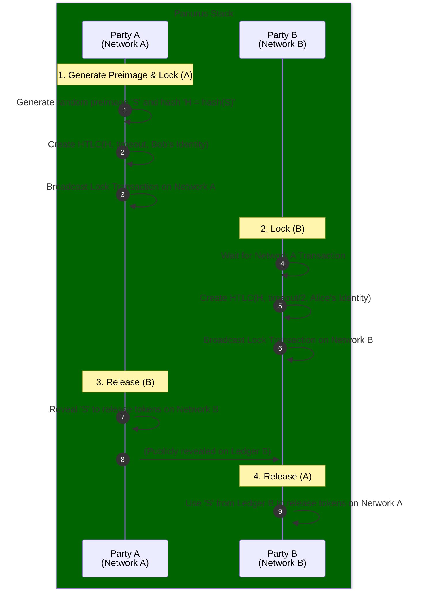

# Interoperability (Interop) Service

The **Interoperability (Interop) Service** (`token/services/interop`) enables cross-chain and cross-network token operations within Panurus. Its primary focus is on implementing secure value exchange mechanisms like **Atomic Swaps** through **Hashed Timelock Contracts (HTLCs)**.

## Core Responsibilities

The Interop Service is responsible for:
*   **Atomic Swap Orchestration**: Managing the multi-step protocol required for two parties to exchange tokens on different networks.
*   **HTLC Implementation**: Providing the necessary scripts, validation logic, and transaction structures to lock and release tokens based on a hash preimage and a time-out.
*   **Cross-Network Identity Mapping**: Facilitating the mapping of identities across different DLT environments to ensure that the correct parties can release locked tokens.

## HTLC Lifecycle

The service implements a standardized HTLC lifecycle to ensure secure, trustless exchanges.

## Key Capabilities

### Hashed Timelock Contracts (HTLCs)
The service provides the `htlc` sub-package, which includes:
*   **Script Generation**: Building the specific scripts (e.g., Fabric chaincode or FabricX script) that implement the HTLC logic.
*   **HTLC Deserialization**: Correctly parsing and verifying HTLC scripts from the ledger.
*   **Signature Verification**: Ensuring that the party releasing the tokens provides a valid signature *and* the correct hash preimage.

The claim-vs-reclaim decision hinges on the script's deadline, which each validating node evaluates
against its own clock. Endorsers therefore agree on the verdict only insofar as their clocks agree,
which makes clock synchronisation a deployment requirement and sets a lower bound on usable
deadlines. See
[HTLC Deadlines and Clock Synchronisation](../security/htlc_deadline_clock_assumptions.md).

### HTLC Validation Rules
Spending an HTLC-locked token is validated by each token driver's transfer validator
(`TransferHTLCValidate` in `token/core/fabtoken/v1/validator` and
`token/core/zkatdlog/nogh/v1/validator`). Both drivers enforce the same rules, so an action
that is valid under one driver is valid under the other:

*   **1-to-1 transfer only**: if *any* input of a transfer action is owned by an HTLC script,
    the action must have **exactly one input and exactly one output**. An HTLC-owned input may
    not be bundled with other inputs, and it may not fan out to several outputs. This matches
    the `Claim` and `Reclaim` helpers in `token/services/interop/htlc`, which each spend a
    single unspent token.
*   **Per-input checks**: the type, quantity, and owner script of the input being spent are
    checked against the single output; every input is validated on its own terms, never against
    a fixed index.
*   **No redeem**: the output corresponding to an HTLC spending must not be a redeem
    (nil owner).
*   **Deadline**: on a claim the script's deadline must not yet have passed; after the deadline
    only the sender's reclaim branch is accepted. A newly created HTLC-locked output must carry
    a deadline that is still in the future.
*   **Metadata**: a claim must publish the preimage under the script's claim key; a lock must
    publish the corresponding lock key. Both are counted so that a single action cannot reuse
    one metadata entry for several HTLC operations.

### Cross-Network Finality
The Interop Service coordinates with the **Network Service** across multiple DLT instances. It monitors the finality of "Lock" transactions on one network before initiating corresponding "Lock" transactions on another, ensuring that the atomic swap protocol can proceed safely.

### Interop Wallets
The service integrates with the **Identity Service** to handle specialized interop identities that can be used to generate and verify HTLC-based proofs of ownership.
