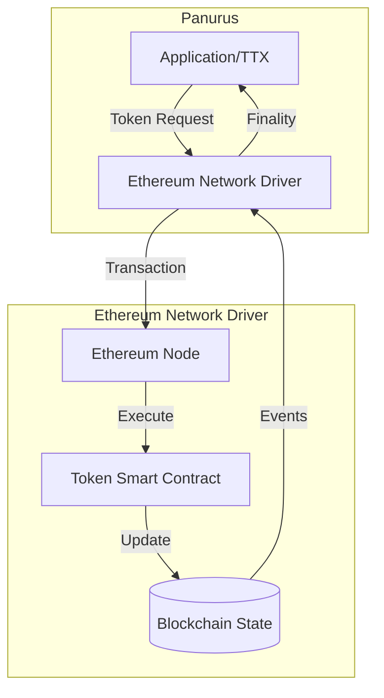
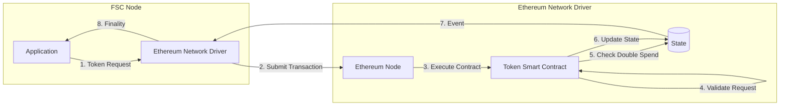
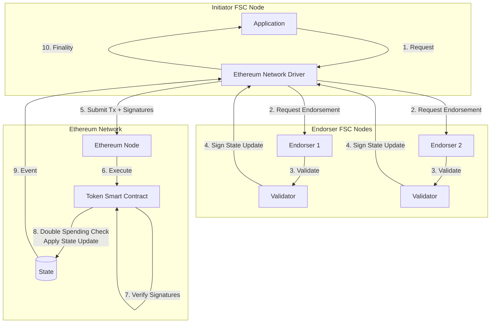
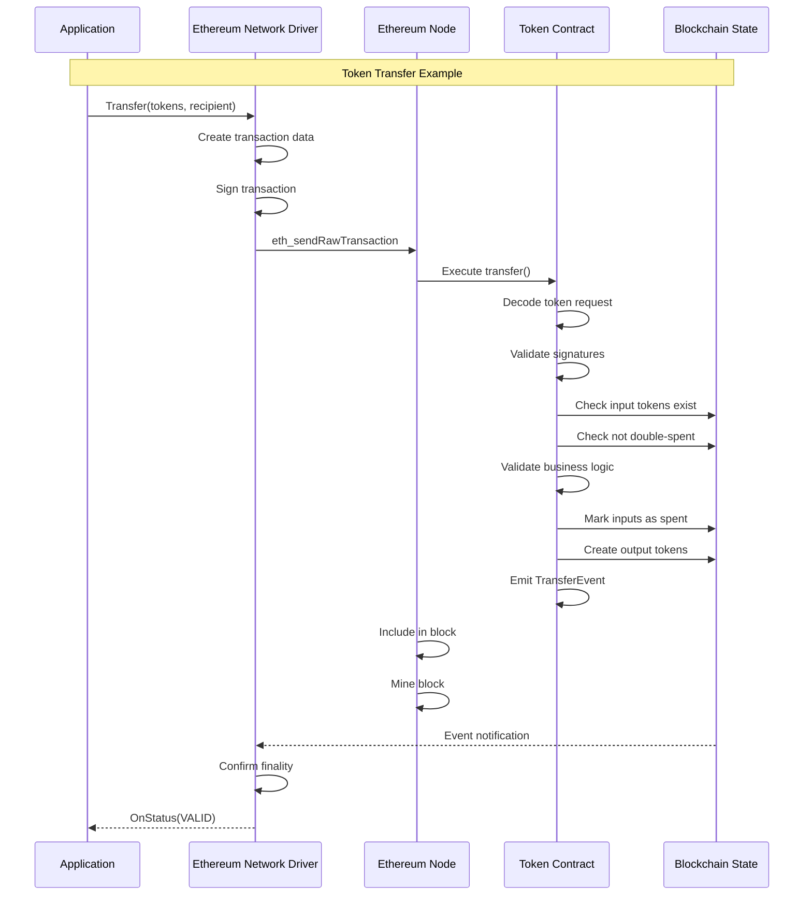
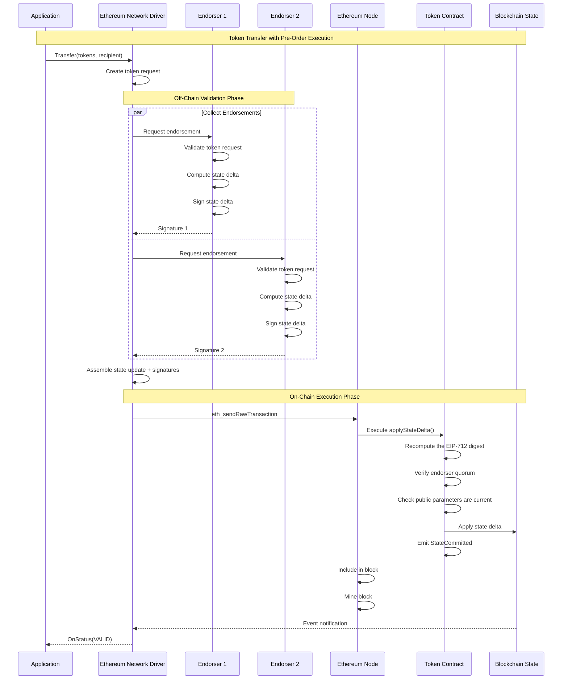
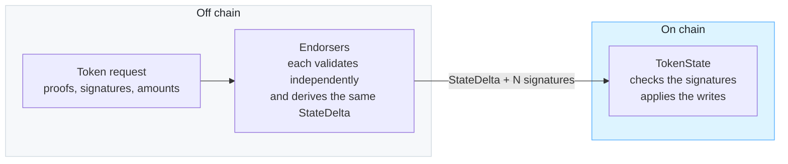
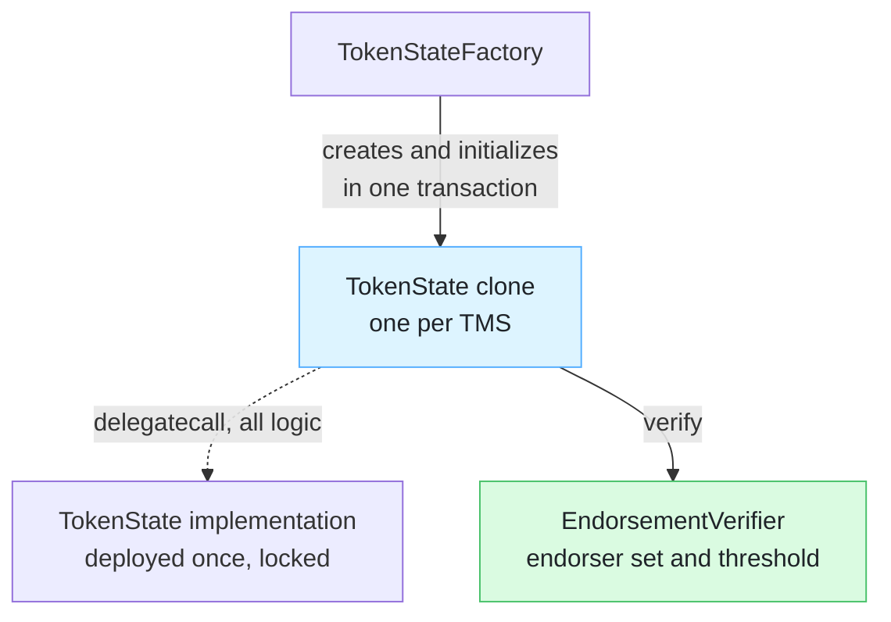
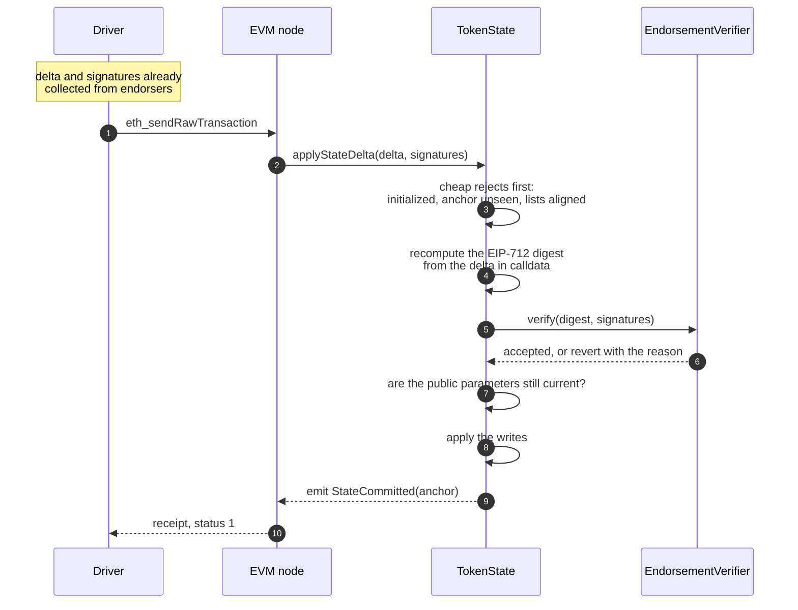
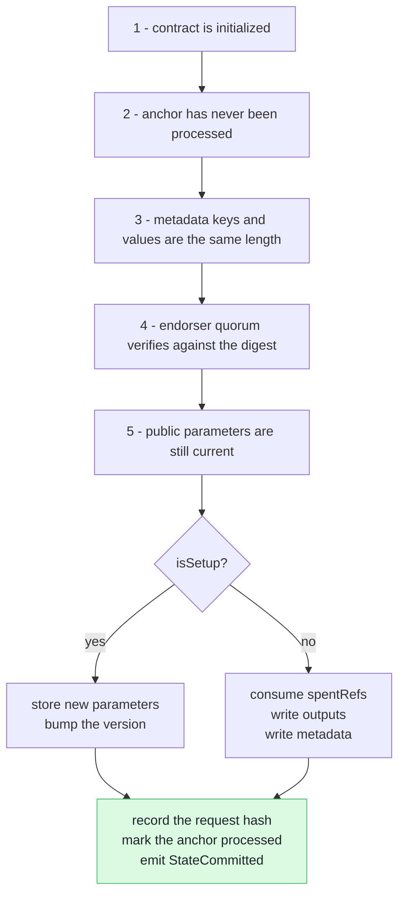

# Network Service - Ethereum Implementation Guide

This guide describes how to implement a Network Service driver for Ethereum-based networks. 
Panurus's driver architecture enables integration with Ethereum and EVM-compatible blockchains through two distinct approaches, each with different trade-offs.

## Overview

Ethereum integration requires adapting Panurus's transaction model to Ethereum's account-based ledger and smart contract execution environment. Unlike Fabric's channel-based architecture, Ethereum uses a global state model with smart contracts for business logic execution.



## Implementation Approaches

Panurus supports two architectural approaches for Ethereum integration, each suited to different requirements:

### Approach 1: Smart Contract Validation

The smart contract performs full validation logic, similar to Fabric's token chaincode model.

**Architecture:**


**Characteristics:**
- Smart contract validates token requests on-chain
- Contract maintains list of unspent tokens, or serial numbers depending on the privacy guarantees. 
- Contract performs double-spending checks
- All validation logic executed in EVM

### Approach 2: Pre-Order Execution with FSC Endorsers

FSC nodes perform validation off-chain and endorse state updates, similar to FabricX model.

**Architecture:**


**Characteristics:**
- FSC nodes validate token requests off-chain
- Endorsers sign state updates (deltas)
- Smart contract verifies endorser signatures
- Smart contract checks double-spending and then applies pre-validated state updates
- Reduced on-chain computation

## Approach Comparison

| Aspect | Approach 1: Smart Contract Validation | Approach 2: Pre-Order Execution |
|--------|--------------------------------------|--------------------------------|
| **Validation Location** | On-chain (in smart contract) | Off-chain (in FSC nodes) |
| **Gas Costs** | Higher (full validation on-chain) | Lower (only signature verification) |
| **Complexity** | Simpler (single-tier) | More complex (two-tier) |
| **Flexibility** | Limited by EVM constraints | High (validation in Go) |
| **Endorsement** | Not required | Required from FSC endorsers |
| **Best For** | Simple deployments, public tokens | Complex validation, privacy needs |

## Driver Interface Implementation

Both approaches must implement the [`driver.Network`](../../token/services/network/driver/network.go) interface:

```go
type EthereumNetwork struct {
    client      EthereumClient
    contract    TokenContract
    chainID     *big.Int
    
    // Approach 2 specific
    endorsers   []Endorser  // Only for Approach 2
}

// Core interface methods
func (n *EthereumNetwork) Name() string
func (n *EthereumNetwork) Channel() string
func (n *EthereumNetwork) Broadcast(ctx context.Context, blob interface{}) error
func (n *EthereumNetwork) RequestApproval(...) (driver.Envelope, error)
func (n *EthereumNetwork) ComputeTxID(id *driver.TxID) string
func (n *EthereumNetwork) FetchPublicParameters(namespace string) ([]byte, error)
func (n *EthereumNetwork) AddFinalityListener(...) error
```

## Approach 1: Smart Contract Validation

### Transaction Flow



### Smart Contract Interface

```solidity
// Conceptual interface - not production code
interface ITokenContract {
    // Process a token request
    function processRequest(
        bytes calldata tokenRequest,
        bytes[] calldata signatures
    ) external returns (bool);
    
    // Query functions
    function getToken(bytes32 tokenId) external view returns (bytes memory);
    function isSpent(bytes32 tokenId) external view returns (bool);
    function getPublicParameters() external view returns (bytes memory);
    
    // Events
    event TokenRequest(bytes32 indexed txId, bool success);
    event TokenCreated(bytes32 indexed tokenId, address owner);
    event TokenSpent(bytes32 indexed tokenId);
}
```

### Smart Contract Responsibilities

1. **Request Validation**
   - Decode token request from calldata
   - Apply token validation following the public parameters

2. **State Management**
   - Maintain mapping of token IDs to token data
   - Track spent tokens (double-spend prevention)
   - Store public parameters

3. **Business Logic**
   - Enforce token issuance rules
   - Validate transfer conditions
   - Handle redemption logic

4. **Event Emission**
   - Emit events for finality tracking
   - Provide queryable transaction history

### Driver Implementation Considerations

**Transaction Construction:**
```go
func (n *EthereumNetwork) RequestApproval(
    ctx view.Context,
    tms *token.ManagementService,
    requestRaw []byte,
    signer view.Identity,
    txID driver.TxID,
) (driver.Envelope, error) {
    // 1. Encode token request for contract call
    data := encodeContractCall("processRequest", requestRaw)
    
    // 2. Create Ethereum transaction
    tx := types.NewTransaction(
        nonce,
        contractAddress,
        value,
        gasLimit,
        gasPrice,
        data,
    )
    
    // 3. Sign transaction
    signedTx, err := types.SignTx(tx, signer, chainID)
    
    // 4. Return as envelope
    return &EthereumEnvelope{tx: signedTx}, nil
}
```

**Finality Tracking:**
```go
func (n *EthereumNetwork) AddFinalityListener(
    namespace string,
    txID string,
    listener driver.FinalityListener,
) error {
    // Subscribe to contract events
    eventChan := make(chan *TokenRequestEvent)
    sub, err := n.contract.WatchTokenRequest(eventChan, txID)
    
    // Monitor for finality
    go func() {
        event := <-eventChan
        status := driver.Valid
        if !event.Success {
            status = driver.Invalid
        }
        listener.OnStatus(ctx, txID, status, "", nil)
    }()
    
    return nil
}
```

## Approach 2: Pre-Order Execution

### Transaction Flow



### How the contracts interact

This section describes the contracts as built. Every name, error and check order below comes from
[`contracts/src`](../../x/token/services/network/evm/contracts/src); the conceptual sketch further down
the page predates them.

#### Where the work happens

The single most important thing to understand is that **the chain does not validate token requests**.
Zero-knowledge proofs are not verified on chain, signatures on the token request are not checked on
chain, and balances are not recomputed on chain. All of that happens off chain, in FSC endorsers running
the same Token SDK validator that a Fabric deployment uses.

What reaches the chain is a `StateDelta`: a flat list of storage writes that the endorsers agreed on,
plus their signatures over it. The contract's job is narrow and cheap.



This is why the contracts are small. They never see a proof. They answer one question: did enough
authorized endorsers sign *this exact set of writes*, and are those writes still valid to apply?

#### The StateDelta

Everything below revolves around this struct, so it is worth reading once. It is defined in
[`StateDelta.sol`](../../x/token/services/network/evm/contracts/src/StateDelta.sol) and mirrored exactly
by the Go type in `evm/statedelta`. Field order is frozen: the EIP-712 hash depends on it, and every
endorser signs over that hash.

| Field | What it is | Who consumes it |
|---|---|---|
| `anchor` | The token-request id, `SHA-256(nonce‖creator)`. **Not** the Ethereum transaction hash. | Replay guard, and the key a recipient watches for |
| `spentRefs` | The references being consumed. Meaning depends on the contract's mode, see below. | Double-spend check |
| `outputs` | New tokens: `tokenID`, `snMarker`, and the opaque `tokenData` from the token driver | Written to storage |
| `metadataKeys` / `metadataVals` | Aligned lists, keys sorted ascending so every endorser builds identical bytes | Written once, never overwritten |
| `tokenRequestHash` | `SHA-256` of the token request, matching what the rest of the Token SDK stores | Recorded against the anchor |
| `publicParamsHash` / `publicParamsVersion` | The parameters the endorsers validated against | Staleness check |
| `isSetup` | Marks a parameters-update delta rather than a token transfer | Selects which branch applies |
| `setupParameters` | The new public parameters, present only when `isSetup` | Stored by the setup branch |

Two things about this struct trip people up.

**`anchor` is not the transaction hash.** A contract cannot read its own transaction hash, so the driver
identifies transactions by the anchor it derived off chain. This is why finality is resolved by scanning
for an event keyed on the anchor rather than by looking up a transaction.

**`spentRefs` means one of two things, fixed per contract.** With `graphHiding` off, each ref is a
content-bound marker that must already exist and be unspent; because the marker commits to the token's
bytes, a spender cannot substitute different content at the same position. With `graphHiding` on, each
ref is a serial number that simply must not have been seen before, which reveals nothing about which
output is being consumed. One TMS runs one token driver, so the mode is chosen at deployment and never
changes.

#### The contracts



`TokenState` holds all token storage. `EndorsementVerifier` holds the endorser set and the threshold and
has no token storage at all: it is a pure checker. Keeping them apart means the endorsement policy can be
reviewed, and replaced, without touching the code that owns tokens.

Each TMS gets its own `TokenState`, created as an [EIP-1167](https://eips.ethereum.org/EIPS/eip-1167)
minimal proxy so a new TMS costs a proxy rather than a full deployment. The shared implementation locks
itself in its constructor, so only a clone can ever be initialized. The factory clones **and** initializes
in a single transaction, which closes the window where an uninitialized clone would be sitting on chain
for anyone to seize.

#### One transaction, end to end



Step 4 is the one worth pausing on. **`TokenState` computes the digest itself, from the delta sitting in
calldata.** The digest is never passed in as an argument. That is what makes the endorsers' signatures
binding: they signed the same typed structure the contract is about to apply. The digest also folds in a
domain separator bound to this chain id and this contract address, so signatures gathered for one TMS
cannot be replayed against another.

#### The checks, in order

`applyStateDelta` runs these gates in sequence. There is no partial success: any failure reverts the whole
transaction, so state is either fully applied or completely untouched.



The order is deliberate: the cheap rejections come before signature recovery, which is the expensive part,
so a replayed or malformed delta costs as little gas as possible.

#### What each failure means

Every gate reverts with its own typed error, so a failed receipt tells you exactly what happened. This is
the table to reach for when a transaction reverts.

| Error | Meaning | Usual cause |
|---|---|---|
| `NotInitialized` | The clone was never seeded | Deployment did not go through the factory |
| `AnchorAlreadyProcessed` | This anchor was applied before | A resubmitted transaction, or a genuine replay attempt |
| `MetadataLengthMismatch` | Key and value lists differ in length | A malformed delta; the driver builds these aligned |
| `InsufficientEndorsements` | Fewer signatures than the threshold | An endorser was unreachable when the quorum was collected |
| `UnauthorizedSigner` | A signature came from a non-endorser | The driver's endorser set has drifted from the contract's |
| `DuplicateSigner` | The same endorser signed twice | A broken initiator; N signatures from one endorser are not N endorsements |
| `InvalidSignatureLength` | A signature was not 65 bytes | A malformed or truncated signature |
| `StalePublicParams` | The delta names parameters that are no longer current | Someone updated the parameters between endorsement and submission; re-endorse |
| `InputMissingOrSpent` | A consumed marker does not exist, or is already spent | A double spend, or a token whose content does not match what was recorded |
| `DoubleSpend` | A serial number was already used (graph-hiding mode) | A double spend |
| `MetadataKeyOccupied` | A metadata key was already written | A reused key, for example an HTLC claim seen twice |
| `MalformedSetupDelta` | A setup delta carried spends, outputs or metadata, or no parameters | A driver bug; setup deltas carry only new parameters |
| `MalformedTransferDelta` | A transfer delta carried setup parameters | A driver bug |

Metadata keys being write-once is worth calling out. A reused key reverts rather than overwriting, which
matches Fabric's `StateMustNotExist`. Silently overwriting something like an HTLC claim key would be a
correctness bug, not a convenience.

#### Why a failure is invisible to a recipient

A revert emits no `StateCommitted` event. Since a recipient who only saw the token request knows the
anchor and nothing else, and finds the transaction by scanning for that event, **log scanning can only
ever discover success**. There is no failure event to find, because the failed transaction wrote nothing.

A recipient must therefore treat "no event by the timeout" as failure. This asymmetry is a consequence of
identifying transactions by anchor rather than by transaction hash, and it is why the finality timeout is a
correctness setting rather than a tuning knob.

### Smart Contract Interface

The sketch below predates the implementation and is kept for the shape of the idea. The contracts that
were actually built live in
[`contracts/src`](../../x/token/services/network/evm/contracts/src): the entry point is
`TokenState.applyStateDelta(StateDelta, bytes[])`, described above.

```solidity
// Conceptual interface - not production code
interface ITokenContractWithEndorsement {
    // Apply a pre-validated state update
    function applyStateUpdate(
        bytes32 stateRoot,
        bytes calldata stateDelta,
        bytes[] calldata endorserSignatures
    ) external returns (bool);
    
    // Endorser management
    function addEndorser(address endorser) external;
    function removeEndorser(address endorser) external;
    function setThreshold(uint256 threshold) external;
    
    // Query functions
    function getToken(bytes32 tokenId) external view returns (bytes memory);
    function isSpent(bytes32 tokenId) external view returns (bool);
    function getEndorsers() external view returns (address[] memory);
    
    // Events
    event StateUpdate(bytes32 indexed stateRoot, bool success);
    event EndorserAdded(address indexed endorser);
    event EndorserRemoved(address indexed endorser);
}
```

### Smart Contract Responsibilities

1. **Signature Verification**
   - Verify endorser signatures on state delta
   - Check signature threshold is met
   - Validate endorser authorization

2. **State Application**
   - Apply pre-validated state delta
   - Update token mappings
   - Update spent token markers (double spending check)

3. **Endorser Management**
   - Maintain list of authorized endorsers
   - Enforce endorsement policies
   - Support dynamic endorser updates

### FSC Endorser Implementation

**Endorser Service:**
```go
type EthereumEndorserService struct {
    validator    TokenValidator
    signer       crypto.Signer
    stateManager StateManager
}

func (e *EthereumEndorserService) Endorse(
    ctx context.Context,
    request []byte,
) (*Endorsement, error) {
    // 1. Validate token request
    if err := e.validator.Validate(request); err != nil {
        return nil, err
    }
    
    // 2. Compute state delta
    delta, err := e.stateManager.ComputeDelta(request)
    if err != nil {
        return nil, err
    }
    
    // 3. Sign state delta
    signature, err := e.signer.Sign(delta)
    if err != nil {
        return nil, err
    }
    
    return &Endorsement{
        Delta:     delta,
        Signature: signature,
    }, nil
}
```

**Driver Implementation:**
```go
func (n *EthereumNetwork) RequestApproval(
    ctx view.Context,
    tms *token.ManagementService,
    requestRaw []byte,
    signer view.Identity,
    txID driver.TxID,
) (driver.Envelope, error) {
    // 1. Collect endorsements from FSC nodes
    endorsements := make([]*Endorsement, 0)
    for _, endorser := range n.endorsers {
        endorsement, err := endorser.Endorse(ctx, requestRaw)
        if err != nil {
            return nil, err
        }
        endorsements = append(endorsements, endorsement)
    }
    
    // 2. Aggregate state deltas (should be identical)
    stateDelta := endorsements[0].Delta
    
    // 3. Collect signatures
    signatures := make([][]byte, len(endorsements))
    for i, e := range endorsements {
        signatures[i] = e.Signature
    }
    
    // 4. Create Ethereum transaction
    data := encodeContractCall(
        "applyStateUpdate",
        stateRoot,
        stateDelta,
        signatures,
    )
    
    tx := types.NewTransaction(nonce, contractAddress, value, gasLimit, gasPrice, data)
    signedTx, err := types.SignTx(tx, signer, chainID)
    
    return &EthereumEnvelope{tx: signedTx}, nil
}
```

## Operational Behaviour (Approach 2 driver)

These are properties of the shipped Approach-2 driver that an operator has to know about. Bootstrapping
steps live in the [Ethereum Deployment Runbook](./network-ethereum-deployment.md).

### Error classification

A caller decides what to do with a failure by class, not by reading a message. The driver exposes the
distinction that matters — whether the chain has judged the transaction — as sentinel errors, matched with
`errors.Is`:

| Sentinel | Class | What it means | Recovery |
|----------|-------|---------------|----------|
| `evm.ErrTransactionReverted` | permanent | the node executed the transaction and it reverted: a double spend, stale public parameters, a quorum the contract will not accept | re-derive the request against current state; do **not** resend |
| `evm.ErrNetworkUnavailable` | transient | the node could not be reached, timed out, or refused the transaction without executing it | retry with backoff; the request is untouched |
| `client.ErrExecutionReverted` | permanent | the JSON-RPC layer's view of the same revert, before the driver wraps it | classified by the driver |

The split is load-bearing. Collapsing the two leaves a caller choosing between retrying a doomed transaction
forever and giving up on a working one. A revert is detected during `eth_estimateGas`, which executes the
transaction — so a rejected transaction is reported **before** any gas is paid for it.

### Transaction recovery across restarts

The ttx layer registers a finality listener **in memory** when it stores a transaction. A node that restarts
between storing a transaction and its finality would otherwise be left with a row stuck at `Pending` and
nothing that would ever move it: the chain has the answer and nobody is asking. Every later wait on that
transaction runs to its timeout, which looks like a finality bug and is not one.

The driver therefore starts the SDK's recovery manager over both the transaction store and the audit store
when a namespace connects. It periodically re-asks the chain about transactions that have been `Pending`
longer than the configured TTL, using the same anchor lookup a fresh listener would have performed.

- Settings come from the standard `recovery` block of the TMS configuration; a TMS with none uses the SDK
  defaults (enabled, 30s TTL, 5s scan interval).
- A failure to start recovery is logged, not fatal — the node still works, it just cannot rescue
  transactions left over from a previous run.

### One funded account per submitting node

Every node that broadcasts needs **its own** Ethereum account. Nonces are per account and each node's nonce
manager counts locally, so two nodes sharing an account will reuse a consumed nonce and get `nonce too low`.
Anything else spending from that account — an administrative parameters update, for instance — moves the
nodes' nonces behind their backs in the same way. Keep a separate operator account for deployment and
administrative submissions.

### Node compatibility

The driver speaks plain JSON-RPC and does not link go-ethereum, so it works against any EVM node. Two things
are worth checking against a new backend:

- **`eth_maxPriorityFeePerGas` is a client extension, not part of the specification.** Besu does not implement
  it; the driver asks first and falls back to deriving the tip from the part of `eth_gasPrice` above the base
  fee. The fallback triggers only on `method not found` — a node that supports neither is an error, since a
  zero tip produces transactions that never mine.
- **Revert wording differs between clients** ("execution reverted" on geth, "Execution reverted" on Besu), and
  the JSON-RPC error code for it (`-32000`) is implementation-defined and shared with other server-side
  failures. The driver pairs the code with the message rather than trusting either alone.

Contracts must be compiled for the EVM version the target node supports. Besu's dev network has no PUSH0, so
contracts build for `paris`; a `shanghai` build reverts every contract creation.

## Trade-offs Summary

**Choose Approach 1 (Smart Contract Validation) when:**
- Simplicity is preferred over gas optimization
- Full on-chain validation is required for compliance
- Endorser infrastructure is not available
- Token logic is relatively simple

**Choose Approach 2 (Pre-Order Execution) when:**
- Gas costs are a primary concern
- Complex validation logic is needed
- Privacy is important (less data on-chain)
- FSC endorser infrastructure is available
- Flexibility in validation logic is required

## See Also

- [Ethereum Deployment Runbook](./network-ethereum-deployment.md) - Bootstrapping a TMS with the Approach-2 driver
- [Network Service Overview](./network.md) - Generic network service concepts
- [Fabric Implementation](./network-fabric.md) - Chaincode-based validation
- [FabricX Implementation](./network-fabricx.md) - FSC endorser model
- [Driver Interface](../../token/services/network/driver/network.go) - Network driver interface
- [Panurus Architecture](../tokensdk.md) - Overall system design