# Network Service - Ethereum Implementation Guide

This guide describes how to implement a Network Service driver for Ethereum-based networks. 
Panurus's driver architecture enables integration with Ethereum and EVM-compatible blockchains through two distinct approaches, each with different trade-offs.

## Overview

Ethereum integration requires adapting Panurus's transaction model to Ethereum's account-based ledger and smart contract execution environment. Unlike Fabric's channel-based architecture, Ethereum uses a global state model with smart contracts for business logic execution.

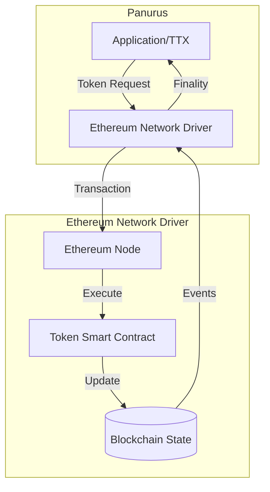

## Implementation Approaches

Panurus supports two architectural approaches for Ethereum integration, each suited to different requirements:

### Approach 1: Smart Contract Validation

The smart contract performs full validation logic, similar to Fabric's token chaincode model.

**Architecture:**
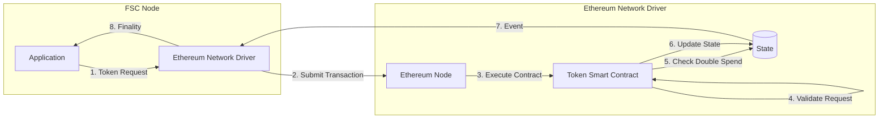

**Characteristics:**
- Smart contract validates token requests on-chain
- Contract maintains list of unspent tokens, or serial numbers depending on the privacy guarantees. 
- Contract performs double-spending checks
- All validation logic executed in EVM

### Approach 2: Pre-Order Execution with FSC Endorsers

FSC nodes perform validation off-chain and endorse state updates, similar to FabricX model.

**Architecture:**
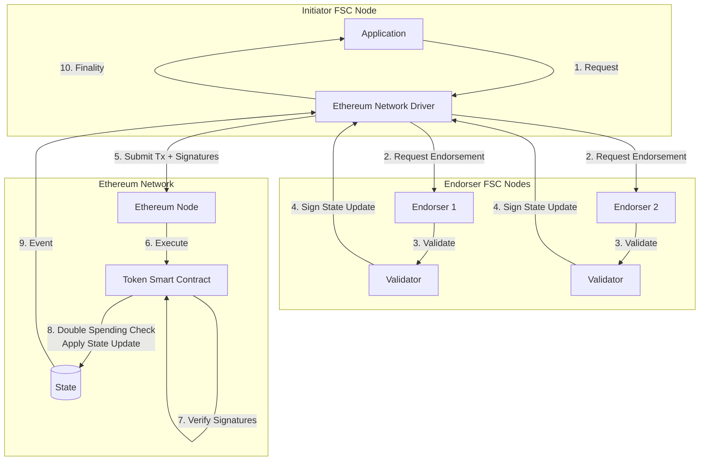

**Characteristics:**
- FSC nodes validate token requests off-chain
- Endorsers sign state updates (deltas)
- Smart contract verifies endorser signatures
- Smart contract checks double-spending and then applies pre-validated state updates
- Reduced on-chain computation

## Approach Comparison

| Aspect | Approach 1: Smart Contract Validation | Approach 2: Pre-Order Execution |
|--------|--------------------------------------|--------------------------------|
| **Validation Location** | On-chain (in smart contract) | Off-chain (in FSC nodes) |
| **Gas Costs** | Higher (full validation on-chain) | Lower (only signature verification) |
| **Complexity** | Simpler (single-tier) | More complex (two-tier) |
| **Flexibility** | Limited by EVM constraints | High (validation in Go) |
| **Endorsement** | Not required | Required from FSC endorsers |
| **Best For** | Simple deployments, public tokens | Complex validation, privacy needs |

## Driver Interface Implementation

Both approaches must implement the [`driver.Network`](../../token/services/network/driver/network.go) interface:

```go
type EthereumNetwork struct {
    client      EthereumClient
    contract    TokenContract
    chainID     *big.Int
    
    // Approach 2 specific
    endorsers   []Endorser  // Only for Approach 2
}

// Core interface methods
func (n *EthereumNetwork) Name() string
func (n *EthereumNetwork) Channel() string
func (n *EthereumNetwork) Broadcast(ctx context.Context, blob interface{}) error
func (n *EthereumNetwork) RequestApproval(...) (driver.Envelope, error)
func (n *EthereumNetwork) ComputeTxID(id *driver.TxID) string
func (n *EthereumNetwork) FetchPublicParameters(namespace string) ([]byte, error)
func (n *EthereumNetwork) AddFinalityListener(...) error
```

## Approach 1: Smart Contract Validation

### Transaction Flow

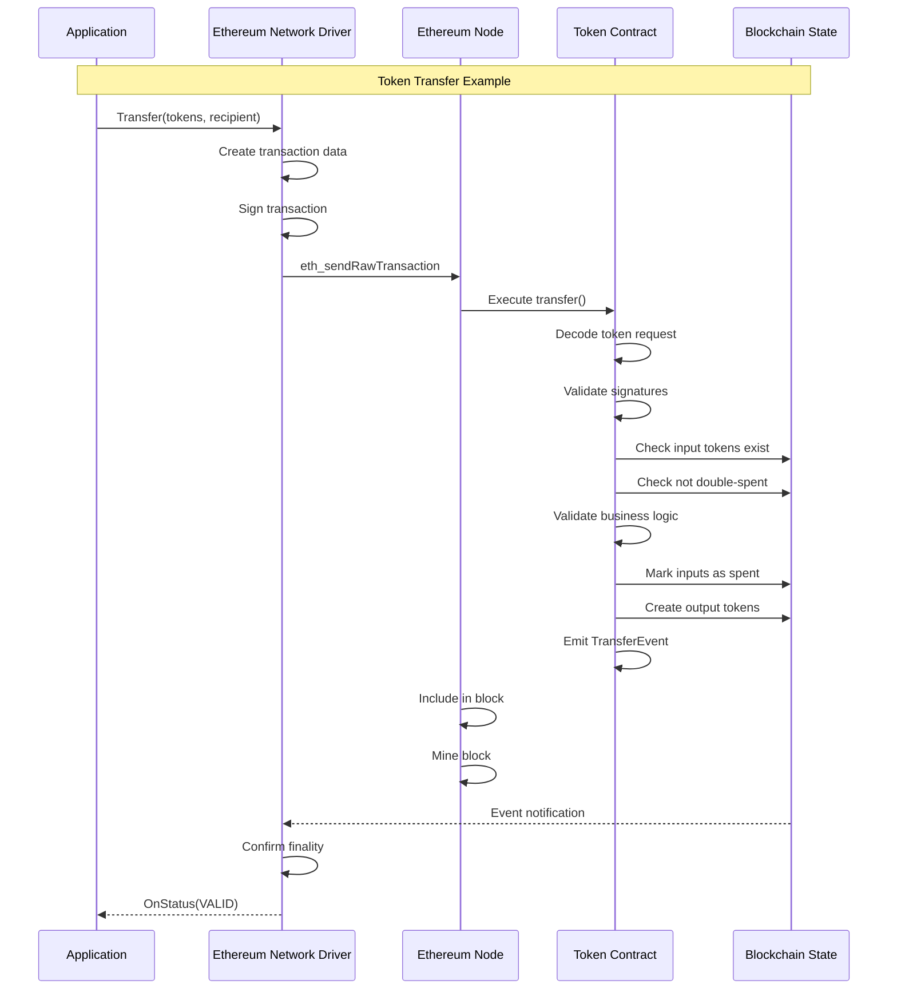

### Smart Contract Interface

```solidity
// Conceptual interface - not production code
interface ITokenContract {
    // Process a token request
    function processRequest(
        bytes calldata tokenRequest,
        bytes[] calldata signatures
    ) external returns (bool);
    
    // Query functions
    function getToken(bytes32 tokenId) external view returns (bytes memory);
    function isSpent(bytes32 tokenId) external view returns (bool);
    function getPublicParameters() external view returns (bytes memory);
    
    // Events
    event TokenRequest(bytes32 indexed txId, bool success);
    event TokenCreated(bytes32 indexed tokenId, address owner);
    event TokenSpent(bytes32 indexed tokenId);
}
```

### Smart Contract Responsibilities

1. **Request Validation**
   - Decode token request from calldata
   - Apply token validation following the public parameters

2. **State Management**
   - Maintain mapping of token IDs to token data
   - Track spent tokens (double-spend prevention)
   - Store public parameters

3. **Business Logic**
   - Enforce token issuance rules
   - Validate transfer conditions
   - Handle redemption logic

4. **Event Emission**
   - Emit events for finality tracking
   - Provide queryable transaction history

### Driver Implementation Considerations

**Transaction Construction:**
```go
func (n *EthereumNetwork) RequestApproval(
    ctx view.Context,
    tms *token.ManagementService,
    requestRaw []byte,
    signer view.Identity,
    txID driver.TxID,
) (driver.Envelope, error) {
    // 1. Encode token request for contract call
    data := encodeContractCall("processRequest", requestRaw)
    
    // 2. Create Ethereum transaction
    tx := types.NewTransaction(
        nonce,
        contractAddress,
        value,
        gasLimit,
        gasPrice,
        data,
    )
    
    // 3. Sign transaction
    signedTx, err := types.SignTx(tx, signer, chainID)
    
    // 4. Return as envelope
    return &EthereumEnvelope{tx: signedTx}, nil
}
```

**Finality Tracking:**
```go
func (n *EthereumNetwork) AddFinalityListener(
    namespace string,
    txID string,
    listener driver.FinalityListener,
) error {
    // Subscribe to contract events
    eventChan := make(chan *TokenRequestEvent)
    sub, err := n.contract.WatchTokenRequest(eventChan, txID)
    
    // Monitor for finality
    go func() {
        event := <-eventChan
        status := driver.Valid
        if !event.Success {
            status = driver.Invalid
        }
        listener.OnStatus(ctx, txID, status, "", nil)
    }()
    
    return nil
}
```

## Approach 2: Pre-Order Execution

### Transaction Flow

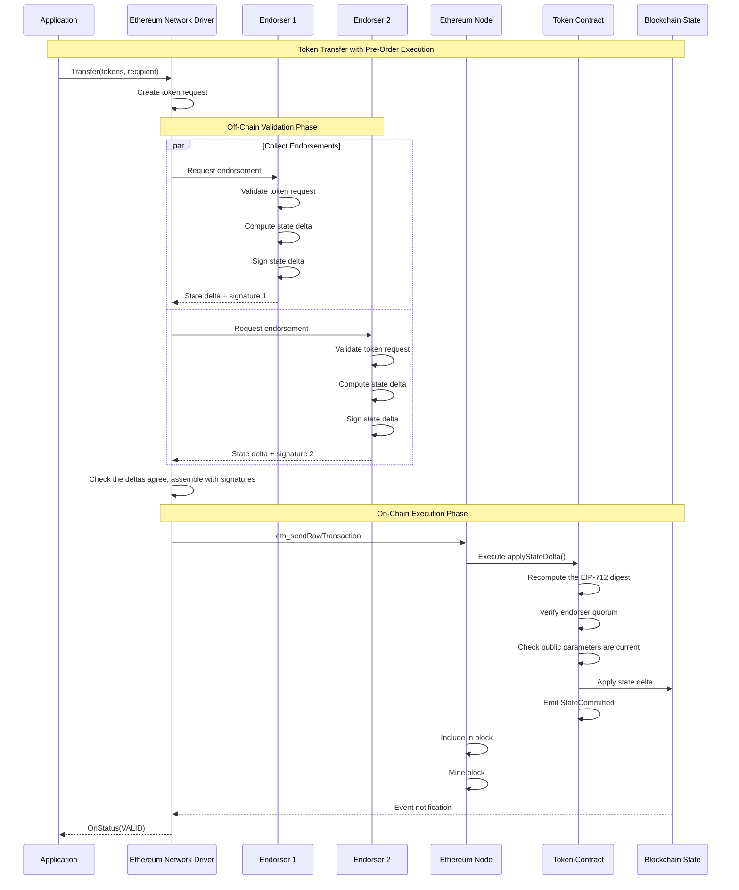

### How the contracts interact

This section describes the contracts as built. Every name, error and check order below comes from
[`contracts/src`](../../x/token/services/network/evm/contracts/src); the conceptual sketch further down
the page predates them.

#### Where the work happens

The single most important thing to understand is that **the chain does not validate token requests**.
Zero-knowledge proofs are not verified on chain, signatures on the token request are not checked on
chain, and balances are not recomputed on chain. All of that happens off chain, in FSC endorsers running
the same Token SDK validator that a Fabric deployment uses.

What reaches the chain is a `StateDelta`: a flat list of storage writes that the endorsers agreed on,
plus their signatures over it. The contract's job is narrow and cheap.

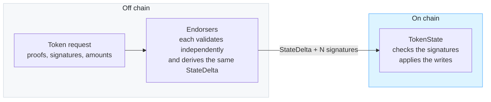

This is why the contracts are small. They never see a proof. They answer one question: did enough
authorized endorsers sign *this exact set of writes*, and are those writes still valid to apply?

#### The StateDelta

Everything below revolves around this struct, so it is worth reading once. It is defined in
[`StateDelta.sol`](../../x/token/services/network/evm/contracts/src/StateDelta.sol) and mirrored exactly
by the Go type in `evm/statedelta`. Field order is frozen: the EIP-712 hash depends on it, and every
endorser signs over that hash.

| Field | What it is | Who consumes it |
|---|---|---|
| `anchor` | The token-request id, `SHA-256(nonce‖creator)`. **Not** the Ethereum transaction hash. | Replay guard, and the key a recipient watches for |
| `spentRefs` | The references being consumed. Meaning depends on the contract's mode, see below. | Double-spend check |
| `outputs` | New tokens: `tokenID`, `snMarker`, and the opaque `tokenData` from the token driver | Written to storage |
| `metadataKeys` / `metadataVals` | Aligned lists, keys sorted ascending so every endorser builds identical bytes | Written once, never overwritten |
| `tokenRequestHash` | `SHA-256` of the token request, matching what the rest of the Token SDK stores | Recorded against the anchor |
| `publicParamsHash` / `publicParamsVersion` | The parameters the endorsers validated against | Staleness check |
| `isSetup` | Marks a parameters-update delta rather than a token transfer | Selects which branch applies |
| `setupParameters` | The new public parameters, present only when `isSetup` | Stored by the setup branch |

Two things about this struct trip people up.

**`anchor` is not the transaction hash.** A contract cannot read its own transaction hash, so the driver
identifies transactions by the anchor it derived off chain. This is why finality is resolved by scanning
for an event keyed on the anchor rather than by looking up a transaction.

**`spentRefs` means one of two things, fixed per contract.** With `graphHiding` off, each ref is a
content-bound marker that must already exist and be unspent; because the marker commits to the token's
bytes, a spender cannot substitute different content at the same position. With `graphHiding` on, each
ref is a serial number that simply must not have been seen before, which reveals nothing about which
output is being consumed. One TMS runs one token driver, so the mode is chosen at deployment and never
changes.

#### The six files, and what each one is

`contracts/src` holds six files, but only four of them become contracts at an address. The other two are
libraries whose functions are all `internal`, which the Solidity compiler inlines into whoever calls them,
so they never get deployed on their own.

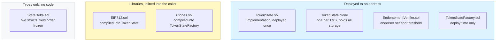

`StateDelta.sol` is compiled into both `TokenState` and `EIP712`. Its field order is frozen because the
EIP-712 hash is computed from it and every endorser signs that hash, so reordering a field would silently
invalidate every signature.

The two libraries are worth being explicit about, because their names suggest more than they are.
`Clones.sol` is production code, not test scaffolding: `TokenStateFactory.create` calls
`Clones.clone(implementation)` to create each per-TMS clone. It also appears in the contract tests, which
clone directly so they exercise the same shape production uses.

#### Phase 1, deployment

Run once per network, from
[`Deploy.s.sol`](../../x/token/services/network/evm/contracts/script/Deploy.s.sol). Three contracts are
created, and then the factory produces the clone that a TMS will actually use.

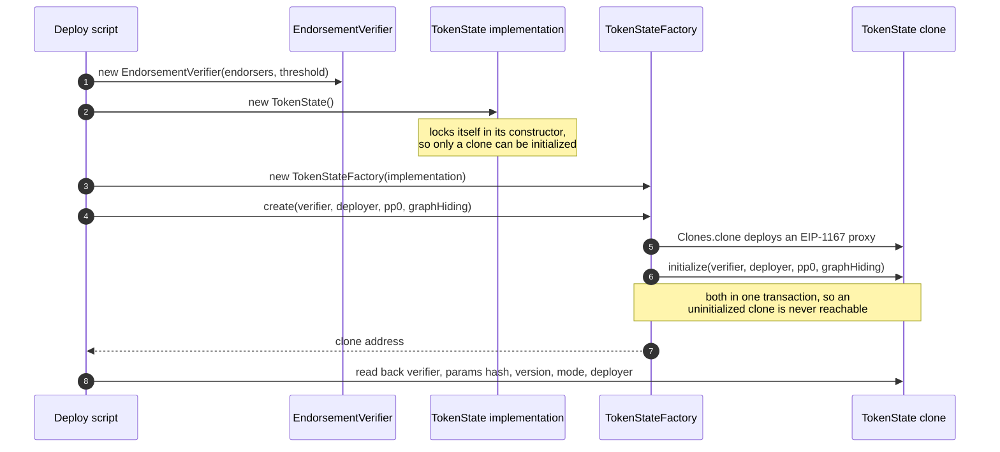

Cloning and initializing in one call is deliberate. `initialize` is deliberately unguarded, because the
implementation is locked and only a fresh clone can ever be initialized. Doing it in two transactions
would leave a window in which anyone could seize the clone by initializing it first with their own
verifier, and the honest deployer's call would then revert with `AlreadyInitialized`.

Each TMS gets its own [EIP-1167](https://eips.ethereum.org/EIPS/eip-1167) minimal proxy, so a new TMS
costs a proxy rather than a full deployment while sharing one copy of the logic. Every clone has its own
storage.

#### Phase 2, processing a transaction

Three addresses take part, but only one of them holds any state.

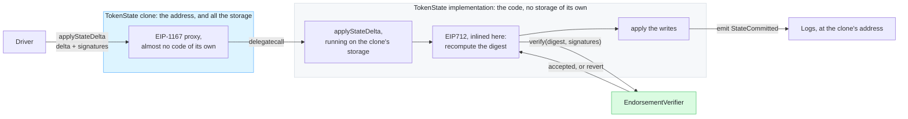

Two things there are easy to get wrong when reading the sources.

**The code does not live where the storage lives.** The clone owns the address, the token map, the spent
markers and the public parameters, but it is a minimal proxy and carries almost no logic. Every call to it
`delegatecall`s the shared implementation, which then executes against the clone's storage. So
`applyStateDelta` is the implementation's code running as though it were the clone.

**`EIP712` is not a contract.** Its functions are all `internal`, so the compiler copies them into
`TokenState` at build time. Recomputing the digest costs no external call, and there is no `EIP712`
address to look up on a block explorer.

That leaves exactly one call crossing an address boundary while a transaction is processed: `TokenState`
asking `EndorsementVerifier` to check the quorum. `TokenStateFactory` and `Clones` play no part at all
once deployment is over.

Because the writes and the event happen in the clone's context, `StateCommitted` is emitted at the
clone's address, and that is the address the finality layer filters `eth_getLogs` on.

#### The same transaction, step by step

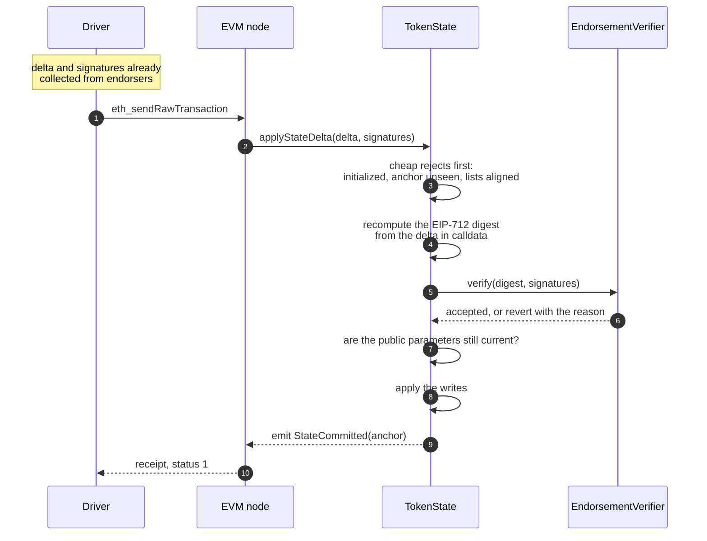

Step 4 is the one worth pausing on. **`TokenState` computes the digest itself, from the delta sitting in
calldata.** The digest is never passed in as an argument. That is what makes the endorsers' signatures
binding: they signed the same typed structure the contract is about to apply. The digest also folds in a
domain separator bound to this chain id and this contract address, so signatures gathered for one TMS
cannot be replayed against another.

#### The checks, in order

`applyStateDelta` runs these gates in sequence. There is no partial success: any failure reverts the whole
transaction, so state is either fully applied or completely untouched.

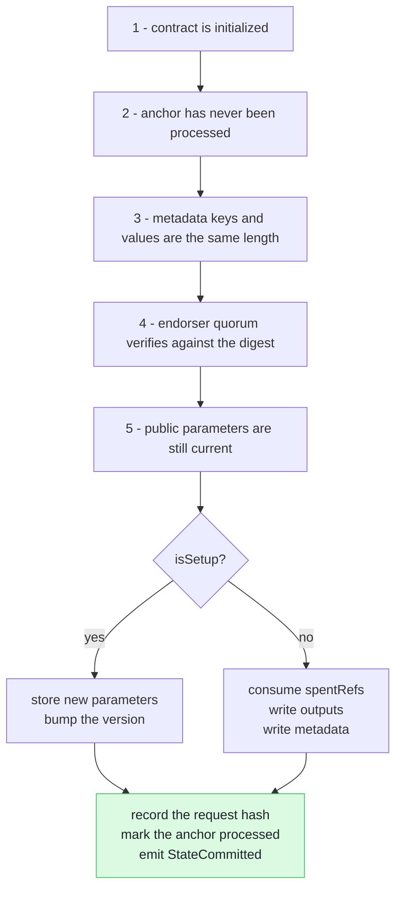

The order is deliberate: the cheap rejections come before signature recovery, which is the expensive part,
so a replayed or malformed delta costs as little gas as possible.

#### What each failure means

Every gate reverts with its own typed error, so a failed receipt tells you exactly what happened. This is
the table to reach for when a transaction reverts.

| Error | Meaning | Usual cause |
|---|---|---|
| `NotInitialized` | The clone was never seeded | Deployment did not go through the factory |
| `AnchorAlreadyProcessed` | This anchor was applied before | A resubmitted transaction, or a genuine replay attempt |
| `MetadataLengthMismatch` | Key and value lists differ in length | A malformed delta; the endorser's translator builds these aligned |
| `InsufficientEndorsements` | Fewer signatures than the threshold | An endorser was unreachable when the quorum was collected |
| `UnauthorizedSigner` | A signature came from a non-endorser | The driver's endorser set has drifted from the contract's |
| `DuplicateSigner` | The same endorser signed twice | A broken initiator; N signatures from one endorser are not N endorsements |
| `InvalidSignatureLength` | A signature was not 65 bytes | A malformed or truncated signature |
| `StalePublicParams` | The delta names parameters that are no longer current | Someone updated the parameters between endorsement and submission; re-endorse |
| `InputMissingOrSpent` | A consumed marker does not exist, or is already spent | A double spend, or a token whose content does not match what was recorded |
| `DoubleSpend` | A serial number was already used (graph-hiding mode) | A double spend |
| `MetadataKeyOccupied` | A metadata key was already written | A reused key, for example an HTLC claim seen twice |
| `MalformedSetupDelta` | A setup delta carried spends, outputs or metadata, or no parameters | A driver bug; setup deltas carry only new parameters |
| `MalformedTransferDelta` | A transfer delta carried setup parameters | A driver bug |

Metadata keys being write-once is worth calling out. A reused key reverts rather than overwriting, which
matches Fabric's `StateMustNotExist`. Silently overwriting something like an HTLC claim key would be a
correctness bug, not a convenience.

#### Why a failure is invisible to a recipient

A revert emits no `StateCommitted` event. Since a recipient who only saw the token request knows the
anchor and nothing else, and finds the transaction by scanning for that event, **log scanning can only
ever discover success**. There is no failure event to find, because the failed transaction wrote nothing.

A recipient must therefore treat "no event by the timeout" as failure. This asymmetry is a consequence of
identifying transactions by anchor rather than by transaction hash, and it is why the finality timeout is a
correctness setting rather than a tuning knob.

### Smart Contract Interface

The interfaces as actually built, in
[`contracts/src`](../../x/token/services/network/evm/contracts/src):

```solidity
interface ITokenState {
    // delta is a typed struct, not opaque bytes, so the contract recomputes the EIP-712 hash itself.
    function applyStateDelta(StateDelta calldata delta, bytes[] calldata signatures) external returns (bool);

    function getToken(bytes32 tokenID) external view returns (bytes memory);
    function isSpent(bytes32 tokenID) external view returns (bool);
    function areTokensSpent(bytes32[] calldata tokenIDs) external view returns (bool[] memory);
    function isSerialUsed(bytes32 serial) external view returns (bool);
    function getPublicParameters() external view returns (bytes memory);
    function getPublicParamsVersion() external view returns (uint64);
    function getTransferMetadata(bytes32 key) external view returns (bytes memory);
    function getTokenRequestHash(bytes32 anchor) external view returns (bytes32);

    event StateCommitted(bytes32 indexed anchor, bool success, string message);
    event PublicParametersUpdated(bytes32 indexed paramsHash, uint64 version);
}

interface IEndorsementVerifier {
    function verify(bytes32 digest, bytes[] calldata signatures) external view returns (bool);

    function isEndorser(address a) external view returns (bool);
    function getEndorsers() external view returns (address[] memory);
    function getThreshold() external view returns (uint256);
}
```

There is deliberately no `setPublicParameters(address admin)`: parameters update through an endorsed
setup delta, gated by the same threshold as any other state change (see "Phase 2" above). There is also
no `addEndorser`/`removeEndorser`/`setThreshold` in v1 — the endorser set and threshold are fixed at
construction. Runtime endorser-set changes are a quorum-gated feature for a later version, not a
deployer privilege; none of the v1 flows (issue, transfer, redeem, parameters update) need to mutate the
endorser set.

### The endorsement flow (driver side)

The contract side above is the small, cheap half of the system. The Go side does the actual work: by the
time a transaction reaches the chain, a quorum has already validated it off chain. This is the
responder/initiator pair in `evm/endorsement`, the same shape as the Fabric and FabricX endorsement
views.

**The responder** runs on every node that endorses, once per request:

```go
type EndorseRequest struct {
    TokenRequest []byte
    TMSID        token.TMSID
    Anchor       string
    Metadata     map[string][]byte
}

type EndorseResponse struct {
    Delta           *statedelta.StateDelta
    Signature       []byte
    EndorserAddress string
    Err             string
}
```

1. Authorize the caller by FSC identity, against the TMS's configured allowlist (the EVM analog of
   Fabric's MSP/ACL creator check).
2. Validate the token request against the ledger (`eth_call` at `finalized`), using the same Token SDK
   validator a Fabric deployment uses.
3. Persist a validation record, for audit.
4. Translate the validated actions into a `StateDelta`.
5. Check the delta's public-parameters version against this node's synced version; refuse to sign a
   stale one.
6. Sign the EIP-712 digest, and reply with the delta, the signature, and the endorser's address.

**The initiator does not build a `StateDelta`.** Producing one means validating the request against
on-chain state, which is exactly the work already delegated to endorsers, so the initiator relays what
they signed rather than computing its own copy. For each reply it checks that the anchor matches what it
asked about, the delta's structural invariants hold, and the signature recovers to a registered endorser
over *that delta's* own digest, then groups signatures by delta. The quorum is the first delta to reach
threshold distinct signers; a reply that disagrees with the rest is set aside rather than treated as
fatal, so one node computing a different delta cannot break the transaction for everyone else.

An earlier version of the driver had the initiator independently rebuild the delta as a cross-check
before comparing it to what came back. It came out during review, for two reasons: rebuilding bought no
security (a quorum willing to sign something bad does not need the initiator's agreement to apply it),
and it cost liveness (an initiator that read public parameters on the other side of an update from its
endorsers computed a different digest and discarded every valid signature as an unrecognized signer).
What the initiator keeps is what it can check without running a validator: the anchor binding and the
delta's shape.

Once threshold is met, the initiator ABI-encodes `applyStateDelta(delta, signatures)`, signs the
Ethereum transaction with the submitter's key, and broadcasts it.

## Operational Behaviour (Approach 2 driver)

These are properties of the shipped Approach-2 driver that an operator has to know about. Bootstrapping
steps live in the [Ethereum Deployment Runbook](./network-ethereum-deployment.md).

### Startup checks

`Connect` refuses to bind a TMS to a network whose configuration contradicts the chain, so a
misconfiguration surfaces at startup rather than as failing transactions later. It checks two things.

The first is the chain id: the node has to report the chain the driver is configured to sign for,
otherwise every signature would be produced for a chain nobody is running.

The second is the endorsement policy. `contracts.tokenState` names the verifier it delegates signature
checking to, and the driver reads the threshold and endorser set back from it. The configured
`endorsement.threshold` has to equal the one the `EndorsementVerifier` was constructed with, and every
address in `endorsement.endorsers` has to be registered in it. Getting either wrong is expensive to
diagnose without this check, because it does not look like a configuration problem: the node collects
what it believes is a quorum, spends a full endorsement round trip doing it, and the contract then
rejects the bundle, which arrives as a revert. One stale endorser address is enough to fail every
transaction, because the initiator counts its reply toward the quorum and the contract rejects the whole
bundle as an unauthorized signer.

Only a contradiction the driver actually observed is fatal. If the verifier cannot be read at all — the
contract is not deployed yet, or the node is briefly unhappy — the check is logged and skipped rather
than refusing the connection. These reads use the `latest` block tag rather than the configured one:
the endorser set and threshold are immutable after the verifier is constructed, so there is nothing a
later block can change, and reading at `finalized` would leave a freshly deployed network unable to see
its own verifier for the whole finalization window.

A third check runs once, when the driver builds the network rather than per TMS: every TMS declaring the
same `network` name has to agree on `endpoint` and `chainID`. One `network` name means one JSON-RPC
connection, shared by every TMS on it, so a disagreement here is refused at startup rather than leaving
a second TMS silently talking to the first TMS's chain.

### Multiple TMS on one network

More than one TMS can declare the same EVM `network`. There is no `channel` to separate them by, so the
network name is the only sharing key. Each TMS still keeps its own `services.network.evm` block in full:
its own `contracts.tokenState` (and therefore its own `EndorsementVerifier` and EIP-712 domain), its own
`endorsement` policy, `submitter` account and `gas` policy. Only the JSON-RPC connection itself
(`endpoint`, `chainID`) is actually shared, and the startup check above enforces that every TMS on the
network agrees on it.

A public-parameters watcher is started per distinct `contracts.tokenState`, not per network: two TMS with
different TokenState clones get independent watchers, so an update to one TMS's contract is never applied
to another TMS's public parameters. Two TMS that are deliberately configured to point at the very same
`contracts.tokenState` do share one watcher and see the same updates, which is the intended behaviour for
that setup.

This node's own role as an endorser (`endorser.enabled`, `endorser.keystore`, `endorser.address`) is the
one thing that stays node-wide rather than per TMS, because FSC can register only one endorsement
responder per process (see `registerEndorser`'s doc comment in `driver.go`). If more than one TMS on the
network enables endorsing, they must all name the same key; the driver refuses to start otherwise.

### How finality resolves

The primary signal is the transaction receipt, polled alongside `eth_getTransactionByHash`: known but no
`blockNumber` yet means still pending; a receipt with status 1 means valid, status 0 means invalid; a
hash the node has never seen means dropped. This works against any JSON-RPC node, Besu included. A
fabric-x-evm gateway additionally exposes a `pending → in-progress → committed | failed | superseded`
lifecycle, which the driver can use as a faster signal where available, but it is an efficiency layer,
not a requirement — the receipt path is what the driver is built and accepted against.

Reads happen at the PoS **`finalized`** block tag (about two epochs, roughly 13 minutes on Ethereum
mainnet), which takes reorg handling out of scope for v1.

A recipient who only saw the token request doesn't have the Ethereum transaction hash, only the anchor.
That's deliberate: a contract has no way to read its own transaction hash, so the driver never relies on
one. Recipient-side resolution instead scans `StateCommitted` logs filtered by the indexed anchor, which
is also where the transaction hash comes from when it's needed (every log carries it as node-supplied
metadata).

This produces a real asymmetry, the same one noted above: a failed `applyStateDelta` reverts, so it never
emits `StateCommitted`, and log scanning by anchor can only ever discover success. A recipient must treat
"no event by the configured timeout" as failure, which makes `finality.timeout` a correctness setting,
not a tuning knob. It has to exceed both the chain's real time-to-finality at the configured block tag
and the longest gap an application leaves between preparing a transaction and broadcasting it — otherwise
recovery condemns transactions that were merely slow to submit, not ones that were rejected.

### Error classification

A caller decides what to do with a failure by class, not by reading a message. The driver exposes the
distinction that matters — whether the chain has judged the transaction — as sentinel errors, matched with
`errors.Is`:

| Sentinel | Class | What it means | Recovery |
|----------|-------|---------------|----------|
| `evm.ErrTransactionReverted` | permanent | the node executed the transaction and it reverted: a double spend, stale public parameters, a quorum the contract will not accept | re-derive the request against current state; do **not** resend |
| `evm.ErrNetworkUnavailable` | transient | the node could not be reached, timed out, or refused the transaction without executing it | retry with backoff; the request is untouched |
| `client.ErrExecutionReverted` | permanent | the JSON-RPC layer's view of the same revert, before the driver wraps it | classified by the driver |

The split is load-bearing. Collapsing the two leaves a caller choosing between retrying a doomed transaction
forever and giving up on a working one. A revert is detected during `eth_estimateGas`, which executes the
transaction — so a rejected transaction is reported **before** any gas is paid for it.

Recognising a revert is node-specific, which is worth knowing when adding support for a new one. Besu
reports it as JSON-RPC code `-32000`, inside the range the spec reserves for implementations; geth and
anvil use EIP-1474's code `3`. The driver accepts either, and anything else in the reserved range, always
paired with `revert` appearing in the message — so a non-revert failure carrying one of those codes
(`out of gas` on `3`, `header not found` on `-32000`) stays in the transient class. A node that reports a
revert some other way would have its transactions classified transient, and callers would retry them
forever, so that is the first thing to check against an unfamiliar client.

### Transaction recovery across restarts

The ttx layer registers a finality listener **in memory** when it stores a transaction. A node that restarts
between storing a transaction and its finality would otherwise be left with a row stuck at `Pending` and
nothing that would ever move it: the chain has the answer and nobody is asking. Every later wait on that
transaction runs to its timeout, which looks like a finality bug and is not one.

The driver therefore starts the SDK's recovery manager over both the transaction store and the audit store
when a namespace connects. It periodically re-asks the chain about transactions that have been `Pending`
longer than the configured TTL, using the same anchor lookup a fresh listener would have performed.

- Settings come from the standard `recovery` block of the TMS configuration; a TMS with none uses the SDK
  defaults (enabled, 30s TTL, 5s scan interval).
- A failure to start recovery is logged, not fatal — the node still works, it just cannot rescue
  transactions left over from a previous run.

### One funded account per submitting node

Every node that broadcasts needs **its own** Ethereum account. Nonces are per account and each node's nonce
manager counts locally, so two nodes sharing an account will reuse a consumed nonce and get `nonce too low`.
Anything else spending from that account — an administrative parameters update, for instance — moves the
nodes' nonces behind their backs in the same way. Keep a separate operator account for deployment and
administrative submissions.

### Node compatibility

The driver speaks plain JSON-RPC and does not link go-ethereum, so it works against any EVM node. Two things
are worth checking against a new backend:

- **`eth_maxPriorityFeePerGas` is a client extension, not part of the specification.** Besu does not implement
  it; the driver asks first and falls back to deriving the tip from the part of `eth_gasPrice` above the base
  fee. The fallback triggers only on `method not found` — a node that supports neither is an error, since a
  zero tip produces transactions that never mine.
- **Revert wording differs between clients** ("execution reverted" on geth, "Execution reverted" on Besu), and
  the JSON-RPC error code for it (`-32000`) is implementation-defined and shared with other server-side
  failures. The driver pairs the code with the message rather than trusting either alone.

Contracts must be compiled for the EVM version the target node supports. Besu's dev network has no PUSH0, so
contracts build for `paris`; a `shanghai` build reverts every contract creation.

## Trade-offs Summary

**Choose Approach 1 (Smart Contract Validation) when:**
- Simplicity is preferred over gas optimization
- Full on-chain validation is required for compliance
- Endorser infrastructure is not available
- Token logic is relatively simple

**Choose Approach 2 (Pre-Order Execution) when:**
- Gas costs are a primary concern
- Complex validation logic is needed
- Privacy is important (less data on-chain)
- FSC endorser infrastructure is available
- Flexibility in validation logic is required

## See Also

- [Ethereum Deployment Runbook](./network-ethereum-deployment.md) - Bootstrapping a TMS with the Approach-2 driver
- [Network Service Overview](./network.md) - Generic network service concepts
- [Fabric Implementation](./network-fabric.md) - Chaincode-based validation
- [FabricX Implementation](./network-fabricx.md) - FSC endorser model
- [Driver Interface](../../token/services/network/driver/network.go) - Network driver interface
- [Panurus Architecture](../tokensdk.md) - Overall system design