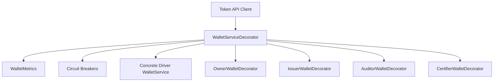
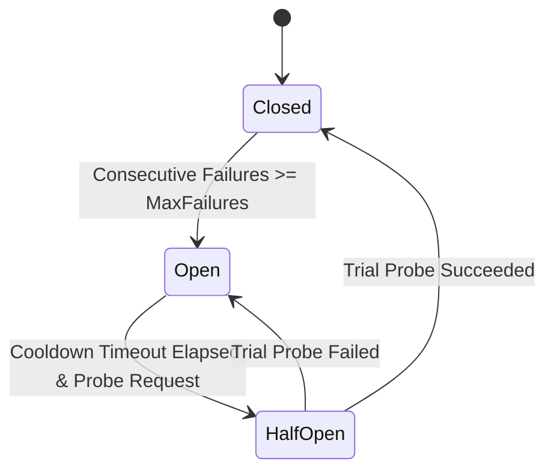

# Token-API Observability Service

The **Observability Service** (`token/services/observability`) provides non-intrusive, injectable decorators, Prometheus metrics collection, and circuit breaker back-pressure protection for Token-API entry points (`driver.WalletService`, `driver.OwnerWallet`, `driver.IssuerWallet`, `driver.AuditorWallet`, and `driver.CertifierWallet`).

## Core Responsibilities

The Observability Service is responsible for:
*   **Decorator Wrapping**: Wrapping underlying concrete token driver wallet services and wallets without modifying driver implementation code.
*   **Metrics Instrumentation**: Exposing request throughput, execution duration, in-flight concurrency, error rates, circuit breaker rejections, and state metrics compatible with Prometheus, keyed by wallet ID to prevent series collisions.
*   **Circuit Breaking & Back-Pressure**: Fast-failing operations when underlying storage or network dependencies experience sustained failures, preventing cascading crashes and resource exhaustion.
*   **Wallet Isolation & Memory Bounding**: Caching independent circuit breakers per wallet ID with an LRU cache eviction policy (`maxWalletBreakers`, default 1000) so that errors in one wallet do not impact unrelated wallets and memory usage remains bounded.
*   **Configurable & Optional**: Circuit breakers can be tuned or disabled completely via TMS configuration (`token.circuitBreaker`).

## Architecture

The decorator wraps token driver services during Token Manager Service (TMS) initialization:



### Wallet Isolation & Lookup Gating

1. **Lookups Operate Outside Breakers**: In-memory deserialization and read lookups (`OwnerWallet`, `IssuerWallet`, `AuditorWallet`, `CertifierWallet`, `GetAuditInfo`, `GetEnrollmentID`, `GetRevocationHandle`, `GetEIDAndRH`) operate outside the circuit breaker. This guarantees that benign lookup misses (such as foreign transaction participant identities) never trip a circuit breaker and authorization checks like `IsMine` do not misclassify ownership due to transient trips.
2. **Operations & Mutations Are Gated**: Mutating registration operations (`RegisterRecipientIdentity`, `RegisterOwnerIdentity`, `RegisterIssuerIdentity`) and per-wallet operations (`ListTokens`, `Balance`, `Sign`, `SpendIDs`) are protected by circuit breakers.
3. **Per-Wallet Breakers**: Returned wallets are wrapped with independent `CircuitBreaker` instances cached in an LRU map per wallet ID. Failures within one wallet only trip the breaker for that specific wallet.

## Circuit Breaker State Machine

Each circuit breaker implements a three-state machine:



*   **Closed**: Requests execute normally. Consecutive errors increment failure counters.
*   **Open**: Requests fast-fail immediately with `ErrCircuitOpen`. The base service is not invoked.
*   **HalfOpen**: Once the cooldown timeout elapses, the first incoming request is admitted as a single trial probe (`halfOpenInFlight` token). Concurrent callers during the probe are rejected with `ErrCircuitOpen` to prevent stampeding a recovering backend. If the probe succeeds, the breaker resets to `Closed`. If the probe fails, it transitions back to `Open` and restarts the cooldown.

### Error Classification

Routine, expected, or benign conditions are filtered out using typed sentinel errors and do not increment the failure count or trip the circuit breaker:
*   `identity.ErrUnresolvableIdentity`
*   `driver.ErrTokenNotFound` (routine query miss for unspent or deleted tokens)
*   `context.Canceled` (client cancelled request)
*   `context.DeadlineExceeded` (client timeout)

Arbitrary string matching is avoided so that genuine storage, network, or deserialization failures are never masked as routine query misses.

### Configuration

Circuit breakers are configured via the TMS configuration provider under the `token.circuitBreaker` key:

```yaml
token:
  circuitBreaker:
    enabled: true                 # Set to false to disable circuit breaker gating entirely
    maxConsecutiveFailures: 5     # Number of consecutive failures before tripping to Open
    cooldownTimeout: 30s          # Cooldown period before transitioning from Open to HalfOpen
    maxWalletBreakers: 1000       # Maximum number of per-wallet circuit breakers in LRU cache
```

## Metrics Reference

The following metrics are exposed under the standard Panurus Prometheus namespace when the observability decorator is enabled. All metrics include `wallet_id` to prevent metric series collisions across wallets:

| Metric Name | Type | Labels | Description |
|---|---|---|---|
| `wallet_requests_total` | Counter | `network`, `channel`, `namespace`, `method`, `wallet_id` | Total number of wallet service requests |
| `wallet_errors_total` | Counter | `network`, `channel`, `namespace`, `method`, `wallet_id` | Total number of wallet service errors (excludes circuit breaker rejections) |
| `wallet_request_duration_seconds` | Histogram | `network`, `channel`, `namespace`, `method`, `wallet_id` | Execution duration in seconds (fast-failed rejections are not recorded to avoid skewing latency) |
| `wallet_inflight_requests` | Gauge | `network`, `channel`, `namespace`, `method` | Current number of in-flight wallet service requests |
| `wallet_circuit_breaker_rejections_total` | Counter | `network`, `channel`, `namespace`, `method`, `wallet_id` | Total number of calls fast-failed by circuit breaker |
| `wallet_circuit_breaker_state` | Gauge | `network`, `channel`, `namespace`, `method`, `wallet_id` | Current circuit breaker state (0=Closed, 1=Open, 2=HalfOpen) |

### Metric Label Cardinality Considerations

The wallet metrics include `wallet_id` as a label dimension to enable granular debugging and isolate high error rates, latencies, or circuit breaker trips to specific wallets:
*   **Static & Named Wallets**: In typical production deployments where wallets correspond to well-known operational roles or node-configured identities (e.g., node issuer wallets, auditor wallets, and designated organizational owner wallets), the number of distinct `wallet_id` values is small and bounded.
*   **High-Cardinality / Ephemeral Wallets**: In systems where wallet IDs are generated dynamically or represent ephemeral end-user accounts at high scale, the number of distinct time series in Prometheus can grow significantly. Operators should consider Prometheus metric relabeling configurations (such as dropping or aggregating the `wallet_id` label) if cardinality exceeds monitoring capacity in high-churn environments.
