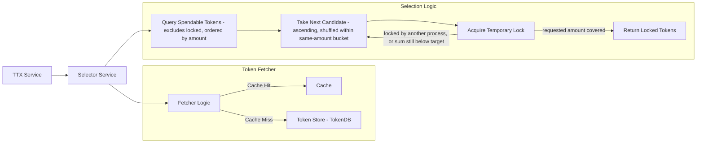

# Selector Service

The **Selector Service** (`token/services/selector`) picks the unspent tokens (UTXOs) that fund a transaction and holds them under a temporary lock while the transaction is assembled, so that concurrent transactions of the same wallet do not try to spend the same tokens.

## Core Responsibilities

The Selector Service is responsible for:
*   **UTXO Selection**: Finding a set of spendable tokens that cover the total quantity required for a transfer operation.
*   **Double-Spending Mitigation**: Temporarily locking selected tokens during the transaction assembly phase to prevent multiple concurrent transactions from attempting to spend the same tokens.
*   **Candidate Enumeration**: Walking the wallet's candidate tokens, locking each one as it is encountered, and stopping as soon as the accumulated amount covers the request. Under `sherdlock`, candidates already locked by another process are excluded from the query itself, and the remaining candidates are ordered ascending by amount with only same-amount candidates shuffled against each other (see [Token Selection Algorithm](#token-selection-algorithm)). Under `simple`, candidates are walked in database order with no amount ranking.

## Interaction with TTX and Storage

The Selector Service bridges the gap between the high-level **TTX Service** and the internal **TokenDB**.



**How the components interact:**
- **Selector Service**: Creates a selector instance per transaction and orchestrates the Selection Logic steps
- **Query Spendable Tokens**: Selector calls the Fetcher to retrieve available tokens
- **Fetcher Logic**: Checks cache first (fast path), queries Token Store - TokenDB on cache miss (slow path)
- **Take Next Candidate**: Under `sherdlock`, the selector takes the next token from a candidate set ordered ascending by amount, with only same-amount candidates shuffled against each other, and already-locked tokens excluded from the set entirely. Under `simple`, candidates are taken in database order and amount plays no part in the choice.
- **Acquire Temporary Lock**: Selector locks each candidate as it is encountered, before it knows whether the request can be covered at all; a candidate already locked by another process is skipped and the loop moves on

## Key Components

### Selector Manager
The `SelectorManager` is the entry point for obtaining a `Selector` instance anchored to a specific transaction. It ensures that the selection process is consistent and tied to the lifecycle of a single token request.

### Token Selection Algorithm

Selection is a **greedy first-fit**, not configurable. It is amount-aware only to the extent
described below (see [#2395](https://github.com/LFDT-Panurus/panurus/issues/2395) mechanisms
2–3); it is not a smallest-fit or largest-fit strategy. `Selector.selectInternal`
(`token/services/selector/sherdlock/selector.go`) does the following:

1. the candidate tokens of the wallet and token type are enumerated — under `sherdlock`,
   already-locked candidates are excluded from the query (the anti-join, below) and the
   remainder is ordered ascending by amount with same-amount runs shuffled against each other
   (the bucketed shuffle, below); under `simple`, candidates are walked in database order,
2. each candidate is locked as it is encountered — a candidate already locked by another
   process is skipped, and (`sherdlock` only) blacklisted for the remainder of this `Select`
   call so a refetch does not immediately re-attempt and re-lose the same race; a lock failure
   wrapping `token.SelectorRateLimited` is a hard abort (not a skip),
3. the amounts of the successfully locked tokens are added up, and
4. the selector returns as soon as the running sum reaches the requested quantity.

Two consequences worth planning for still hold:

*   **The number and size of the inputs is not minimized.** Ordering ascending by amount
    means a request is preferentially funded by several small tokens before a large one is
    even considered, which can *increase* the number of inputs relative to a single large
    token that could have covered the request alone.
*   **The result is not fully deterministic.** Candidates of the same amount are shuffled
    against each other, so the same request against the same wallet can still select a
    different set of same-amount tokens on each run; the amount ordering across different
    amounts, however, is deterministic.

**`sherdlock`-only: anti-join against locked tokens.** The candidate query excludes any token
currently held by a lock in the `TokenLocks` table (`NOT EXISTS` against `TokenLocks`, added
to `buildSpendableTokensIteratorByQuery` in `token/services/storage/db/sql/common/tokens.go`).
This stops a selector from *starting* a race it is bound to lose; the `INSERT`-based lock
acquisition (below) remains the race-safe backstop, since the anti-join is read-then-act and
therefore not itself race-free. Because the anti-join can hide every remaining token from a
wallet that is not actually out of funds — everything left is simply locked by someone else —
`Selector.selectInternal` disambiguates an empty scan with
`TokenFetcher.HasAnySpendableTokens`, a lock-ignoring existence check, before returning
`token.SelectorInsufficientFunds`.

**`sherdlock`-only: size-ordered, bucket-shuffled candidates.** Candidates are ordered
ascending by amount (an `ORDER BY` added to the same query), then shuffled only *within* runs
of equal amount — `bucketedIterator.NewPermutation()` in
`token/services/selector/sherdlock/fetcher.go`. A strictly deterministic smallest-fit rule was
deliberately avoided: it would just relocate all contention onto the single smallest token
instead of spreading it. **The shuffle is still deliberate** for the reason it always was: it
spreads concurrent selectors of the same wallet across different same-amount candidates —
walking a fixed order within a bucket would make every selector contend for the same leading
candidate, driving up lock failures and, with them, the immediate-retry path that gives up
with `token.SelectorSufficientButLockedFunds`, and beyond it the backoff path that ends in
`token.SelectorInsufficientFunds`. The bucketing lives in the sherdlock fetcher, not in the
selection loop: the lazy fetcher and the cached fetcher both hand out a fresh
`bucketedIterator` permutation on every query. The `simple` driver does **neither** the
anti-join nor the size ordering — it walks the database iterator in the order the token store
returns it (`token/services/selector/simple/selector.go`), unordered and un-shuffled — so
concurrent selectors under `simple` remain fully exposed to colliding on the same leading
candidates and to starting races against already-locked tokens.

**How it works in the flow (see "Selection Logic" subgraph in diagram):**
1. **TTX Request**: TTX Service requests token selection for a transfer operation
2. **Query Spendable Tokens**: Selector queries via Fetcher (Cache Hit → fast path, Cache Miss → Token Store - TokenDB)
3. **Take Next Candidate**: Selector takes the next token from the randomized candidate set
4. **Acquire Temporary Lock**: The candidate is locked to prevent double-spending (in the `TokenLocks` table under the `sherdlock` driver, in memory under `simple`); on success its amount is added to the running sum, on failure the loop moves to the next candidate
5. **Return or Retry**: The selector returns as soon as the sum covers the request; if the
   candidate set is exhausted while other processes hold locks, it retries in two distinct
   layers:
   - **Immediate-retry layer** (`sherdlock` only): the inner loop refetches — refreshing the
     sherdlock token cache via the fetcher — up to a hardcoded `maxImmediateRetries = 5` times
     without releasing its already-acquired locks, then gives up with
     `token.SelectorSufficientButLockedFunds`. Under `simple`, there is no equivalent cache
     layer; the outer retry loop re-queries the query service directly on every attempt.
   - **Backoff layer**: a configurable `numRetries` / `retryInterval` outer loop (the
     `StubbornSelector` wrapper in `sherdlock`; the `numRetry` / `timeout` loop in `simple`)
     releases locks, sleeps, and re-runs the whole selection from scratch. Exhausting this
     layer returns `token.SelectorInsufficientFunds`.

#### Strategies that are not implemented

Deterministic amount-aware strategies — strict smallest-first, largest-first,
First-In-First-Out, or minimizing the number of inputs — are **not** implemented and cannot
be configured, even though `sherdlock` now orders candidates ascending by amount (see above):
that ordering is bucket-shuffled specifically to avoid becoming a deterministic smallest-fit
rule. There is no strategy abstraction in the code and no configuration key that selects one.
Making selection fully amount-aware (e.g. minimizing input count) is tracked in
[issue #2017](https://github.com/LFDT-Panurus/panurus/issues/2017).

### Locking Mechanism
To prevent double-spending *before* the transaction is committed to the ledger, the Selector Service uses a local `TokenLocks` table in the **Storage Service** (see "TokenLocks" box in diagram above).

**Lock lifecycle:**
1.  **Lock Acquisition**: When the selector takes a candidate token, it attempts to insert a record in the `TokenLocks` table.
2.  **Concurrency Control**: If another concurrent process has already locked that token, the insertion fails, and the selector moves on to the next candidate.
3.  **Lock Release**: Locks are released as soon as the transaction that took them reaches
    a terminal finality status (`Confirmed` or `Deleted`) — see "Release on settlement"
    below — with the lease-expiry sweep as a backstop for locks whose consumer never
    reaches finality (crashed or abandoned transactions, or `Orphan`).

#### Release on settlement

The finality path — `finality.Listener.runOnStatus` for the live subscription, and
`TTXRecoveryHandler.applyFinalityLogic` for recovery on restart — releases a
transaction's locks (`token.SelectorManager.Unlock`) the moment its status is known to
be terminal, for both `Confirmed` and `Deleted` alike: a failed transaction will never
spend the tokens it selected, so there is no reason to hold them either. This closes
the window, previously bounded only by `leaseExpiry` (default several minutes), during
which a settled transaction's already-spent-for tokens stayed locked and therefore
invisible to other selectors — the dominant source of lock contention on hot tokens
under concurrent load (issue #2395). Release is best-effort: a failure to unlock is
logged and does not fail the settlement or recovery path, since the lease-expiry sweep
below still reclaims the lock eventually.

#### Lease expiry

Every `leaseCleanupTickPeriod`, `sherdlock` runs a cleanup pass over the `TokenLocks`
table that releases a lock when **either** of the following holds.

> **Both `leaseExpiry` and `leaseCleanupTickPeriod` must be non-zero for the cleanup
> goroutine to start.** `Config.GetLeaseExpiry()`/`GetLeaseCleanupTickPeriod()` treat an
> unset *or* explicitly-zero YAML value the same way: 0 is substituted with the default
> (`leaseExpiry`: several minutes; `leaseCleanupTickPeriod`: about a minute), so writing
> `leaseExpiry: 0` in configuration does **not** disable the sweep — it silently falls
> back to the default instead. The sweep can only be disabled by an in-process caller
> that constructs `sherdlock.NewManager` directly with `leaseExpiry`/
> `leaseCleanupTickPeriod` of `0`, bypassing the `Config` getters; there is currently no
> supported way to disable the sweep from YAML configuration, by design — locks held by
> `Orphan` consumers, or by a consumer whose release-on-settlement call failed, would
> otherwise never be released and those tokens would remain permanently unselectable.
> If the sweep is disabled this way, `NewManager` logs a warning naming both values.

*   the **consuming** transaction — the one that took the lock, stored in
    `consumer_tx_id` — has reached `Deleted` or `Orphan`, so it will never spend the
    token; or
*   the lease is older than `leaseExpiry`, which covers the consumer that crashed or was
    abandoned without ever reaching a terminal status.

In the common case a lock is now released by "Release on settlement" above well before
its lease would expire; this pass remains the backstop for `Orphan` consumers (which the
finality path does not observe) and for any release-on-settlement call that failed.

Two properties of the pass are worth spelling out:

*   **The status that matters is the consumer's, not the producer's.** A lock row is keyed
    by `(tx_id, idx)`, which identifies the *locked token* and therefore the transaction
    that created it. That transaction's status says nothing about whether the lock is
    still live, so it is never used to expire a lease.
*   **Expiry is per token, not per transaction.** Only the affected `(tx_id, idx)` rows are
    deleted; the other outputs of the same transaction keep their locks.

The pass is the same statement on every SQL backend (SQLite and Postgres), so lock
expiry behaviour is identical across those backends. `created_at` is stored as
`TIMESTAMPTZ`, so the comparison with the database-side `NOW()` expression is always
timezone-consistent on Postgres regardless of the session `TimeZone` setting.
On Postgres a single replica per TMS runs the pass per tick, elected through an advisory
lock; SQLite is non-distributed and always runs it locally.

The in-memory locker described below does not use the `TokenLocks` table and never
expires locks via `Cleanup`; its lifecycle is entirely managed in process.

#### Lock-acquisition strategies (Postgres, `sherdlock` only)

The Postgres `TokenLockStore` supports three lock-acquisition strategies, selected via
`token.storage.db.lockStrategy` (see [Configuration](#configuration)). SQLite and `simple`
are unaffected: SQLite's `LoadStorageConfig` call reads and ignores the key, and `simple`
never reaches this configuration path at all.

*   **`insert` (default).** A plain `INSERT` into `TokenLocks`; a lost race surfaces as a
    server-side unique-constraint violation on `(tx_id, idx)`, caught and translated to
    `driver.ErrTokenAlreadyLocked`.
*   **`onConflict`.** `INSERT ... ON CONFLICT (tx_id, idx) DO NOTHING RETURNING`; a lost
    race is a clean zero-row result instead of a server-side error.
*   **`skipLocked`.** Behaves like `onConflict` for a single-token `Lock` call, and
    additionally implements `BatchLocker.LockBatch`: given a covering window of candidate
    `(tx_id, idx)` pairs, it claims them in one statement using
    `FOR UPDATE OF <tokens> SKIP LOCKED` against the `Tokens` rows, joined with the same
    `INSERT ... ON CONFLICT DO NOTHING` backstop, so a claimant walks past a row a
    concurrent claimant is already mid-claim on instead of colliding with it.

**What each strategy actually changes, precisely — the mechanism has a narrower effect
than "reduces lock contention" might suggest:**

*   **Server-side unique-constraint errors are eliminated only for callers that take the
    single-token `Lock` path directly.** `Selector.selectInternal` type-asserts the
    configured `Locker` for `BatchLocker` and, when present (i.e. under Postgres
    regardless of strategy, since `LockBatch` is defined on the strategy-aware store),
    always claims its covering window through `LockBatch` — which already issues
    `INSERT ... ON CONFLICT DO NOTHING` under every strategy, `insert` included.
    `insert`'s error-surfacing single-token `Lock` path is therefore not on `sherdlock`'s
    hot path at all; it only matters for a `Locker` implementation that does not satisfy
    `BatchLocker` (a custom or older backend, or a rolling deploy where some replicas have
    not yet upgraded). This is the case `postgres.TokenLockStore.RoundTrips()` and
    `.UniqueViolations()` are instrumented to measure directly (exercised by
    `TestHotTokenContention_SingleTokenLockPath` in `sherdlock/contention_test.go`), rather
    than being inferred from the conflict-rate benchmark below, which cannot see it.
*   **`FOR UPDATE SKIP LOCKED` only helps against a genuinely simultaneous holder, not
    against an already-committed lock — the dominant conflict mode under load.** It lets a
    claimant skip a row a rival transaction is mid-claim on *at that exact instant*; it does
    nothing for a row whose lock row was already committed moments earlier, which loses the
    race the same way under every strategy. Consequently the aggregate conflict rate
    measured by `TestHotTokenContention`/`TestHotTokenContentionWideWindow` does **not**
    move across strategies — this was verified empirically, not assumed, and is expected
    given the mechanism rather than a sign Phase 6 underperforms.
    `TestTokenLockStore_LockBatch_SkipLocked_SkipsRowLockedByConcurrentTx` in
    `token/services/storage/db/sql/postgres` isolates the mechanism deterministically
    instead: it holds a row lock on one candidate via a concurrent transaction, confirms a
    plain `FOR UPDATE` on that row genuinely blocks (proving the held lock is real), then
    confirms `LockBatch` under `skipLocked` claims every other candidate without blocking
    while excluding that one.
*   **Round-trip reduction comes from batching the claim into one statement per covering
    window, not from strategy choice.** `LockBatch` issues exactly one round trip per
    window under every strategy (`onConflict`/`insert` via a multi-row
    `INSERT ... ON CONFLICT DO NOTHING`, `skipLocked` via the `FOR UPDATE SKIP LOCKED` join
    above), so `RoundTrips()` comes out equal across strategies for the same workload in
    `TestHotTokenContention`/`TestHotTokenContentionWideWindow`. The saving Phase 6
    contributes here is the batch claim itself (`BatchLocker`), which all three strategies
    share once configured; `lockStrategy` chooses only *how* that one round trip claims the
    window, not *whether* claiming is batched.

### In-Memory Locker Internals

The `simple` driver keeps its locks in memory (`token/services/selector/simple/inmemory`)
instead of the `TokenLocks` table. Its state is sharded per owner (the wallet the tokens
are selected for): every owner has its own `shard`, holding that owner's locked tokens
behind its own mutex, and the shards themselves live in a registry map behind a second
mutex. Two owners therefore never serialize against each other, not even while a lock
attempt is waiting on a transaction-status lookup.

Two invariants keep the two mutex levels safe:

*   **Lock order is shard first, registry second.** The only place that takes the
    registry lock while holding a shard lock is the pruning of an empty shard, which must
    observe the shard as empty while holding it. Every operation that needs to walk all
    shards (`IsLocked`, `UnlockByTxID`, the background collector, the locked-token count)
    therefore snapshots the registry, releases the registry lock, and only then takes the
    individual shard locks. Taking the two in the opposite order deadlocks the locker.
*   **A pruned shard is never written to.** When a shard becomes empty it is removed from
    the registry and marked as pruned. A `Lock` that had already obtained that shard
    re-checks the mark under the shard lock and retries on the freshly registered shard,
    so a lock can never end up in a shard no other operation can reach. Pruning also
    removes the registry entry only if it still points at that exact shard, so a stale
    empty shard cannot evict a newer shard holding live locks.

The background collector (the goroutine that frees locks of finalized transactions) copies
a shard's entries, releases the shard lock, and only then looks the transaction statuses
up, so a slow status provider never blocks locking or unlocking. Because the shard is
unlocked in between, each entry is re-validated before removal — same transaction ID and
same last-access time — and entries that were reclaimed or re-accessed meanwhile are kept.

## Token Fetcher and Cache

The selector uses a **Token Fetcher** to retrieve available tokens from the database. The fetcher uses a **Ristretto LRU cache** to improve performance by caching token queries (keyed by wallet+currency).

**Flow**: `Selector.Select()` → `Fetcher.UnspentTokensIteratorBy(wallet, currency)` → `Token Iterator`

**How it works:**
1. Selector requests tokens from Fetcher for a specific wallet and currency
2. Fetcher checks its cache (keyed by wallet+currency)
3. If cache is fresh, returns cached tokens immediately (fast path)
4. If cache is stale, queries database and updates cache
5. Selector iterates through tokens, attempting to lock each one
6. If insufficient tokens, selector requests fresh data and retries

**Iterator lifecycle:** the iterator the fetcher hands out owns a resource — on the lazy
path it wraps the query's `sql.Rows`, and therefore a database cursor and its pooled
connection — so exactly one `Close()` per iterator is required. The selector holds at most
one iterator at a time: step 6 above closes the iterator it displaces before installing the
refreshed one, and `Selector.Close()` closes whichever is current. Both happen under the
selector's mutex, so closing a selector while a retry is in flight neither leaks an iterator
nor races with the retry.

**Adaptive refresh strategy** with two triggers:
- **Time-based**: Refreshes when data is older than `fetcherCacheRefresh`
- **Query-based**: Refreshes after `fetcherCacheMaxQueries` queries to prevent serving stale data in high-throughput scenarios

## Configuration

Configure the selector service in your `core.yaml`:

```yaml
token:
  selector:
    driver: sherdlock                    # Selector implementation and locking backend: sherdlock | simple (default: sherdlock)
    numRetries: 3                        # Retry attempts for token selection (default: 3)
    retryInterval: 5s                    # Wait time between retries (default: 5s)
    leaseExpiry: 3m                      # Lock expiration time (default: 3m)
    leaseCleanupTickPeriod: 1m           # Lock cleanup interval (default: 1m)
    fetcherCacheSize: 1000               # Cache size in entries (default: 0 = use fetcher default)
    fetcherCacheRefresh: 30s             # Cache refresh interval (default: 0 = use fetcher default)
    fetcherCacheMaxQueries: 100          # Max queries before cache refresh (default: 0 = use fetcher default)
  storage:
    db:
      lockStrategy: skipLocked           # Postgres lock-acquisition strategy: insert | onConflict | skipLocked (default: insert)
```

`lockStrategy` is read by the Postgres storage driver, independently of `selector.driver`
above (see [Lock-acquisition strategies](#lock-acquisition-strategies-postgres-sherdlock-only)).
It has no effect under SQLite or `simple`.

### Driver

`driver` selects the selector implementation and, with it, the locking backend:

- **sherdlock** (default): locks in the `TokenLocks` table of the Storage Service, with
  leases governed by `leaseExpiry` and `leaseCleanupTickPeriod`.
- **simple**: keeps its locks in memory (see [In-Memory Locker Internals](#in-memory-locker-internals)).

It does **not** select a selection algorithm: both drivers walk candidates greedily and stop
on first cover, but they diverge in several ways beyond the shuffle:

- `sherdlock` orders candidates ascending by amount (shuffling only within same-amount runs)
  and excludes already-locked tokens from the query via an anti-join; `simple` walks tokens
  in unordered database order and does not exclude locked tokens from its query.
- `sherdlock` holds already-acquired locks across immediate retries; `simple` releases all
  locks between every retry attempt.
- `simple` runs a `GetTokens` concurrency check after a successful cover and can return a
  fourth error sentinel, `token.SelectorSufficientFundsButConcurrencyIssue`, which
  `sherdlock` does not produce.

### Cache Configuration

The fetcher cache improves performance by caching token queries:

- **fetcherCacheSize**: Maximum number of cached query results. Set to 0 to use the fetcher's default size.
- **fetcherCacheRefresh**: Time interval after which cached data is considered stale and refreshed. Set to 0 to use the fetcher's default interval.
- **fetcherCacheMaxQueries**: Maximum number of queries before forcing a cache refresh. Set to 0 to use the fetcher's default limit.

**Example**: With `fetcherCacheSize: 1000`, `fetcherCacheRefresh: 30s`, and `fetcherCacheMaxQueries: 100`, the cache stores up to 1000 query results, refreshes data every 30 seconds, and forces a refresh after 100 queries.
