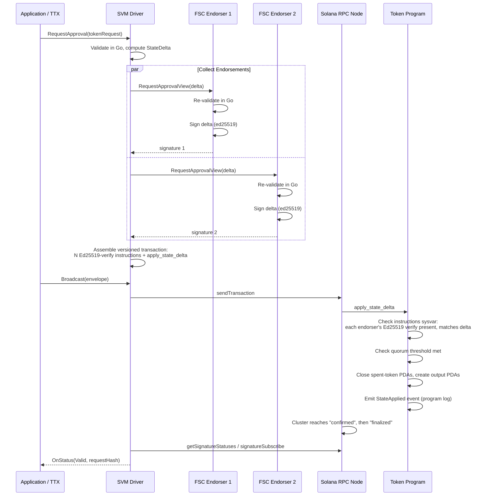

# SVM Network Driver: Design Proposal for Panurus

**Status:** Proposal, not started. No branch, no code.
**Proposed location once work begins:** `x/token/services/network/svm/`, its own Go module, mirroring the (unmerged) `x/token/services/network/evm/` precedent.
**Companion doc to write first:** `docs/services/network-solana.md`, a short conceptual guide in the style of the existing `docs/services/network-ethereum.md`, before a full design doc like this one gets treated as final.

---

## 1. Executive Summary

This document proposes a Solana (SVM) network driver for Panurus: a third non-Fabric backend alongside the in-progress Ethereum/EVM driver, letting a Panurus token management service issue, transfer, and audit tokens against a Solana cluster instead of a Fabric channel.

It deliberately does not start from a blank page. Panurus already has a working answer to "how does a Fabric-shaped token SDK talk to a chain with no chaincode, no endorsement policy, and no MSP": the EVM driver, built over roughly two months across 20+ PRs on `feature/evm-network-driver`, with its own 1000-line design doc at `x/token/services/network/evm/eth_network_driver_design.md`. Everything below either reuses that architecture directly or explains precisely why Solana's account model and consensus give a reason to diverge.

**Trust model (unchanged from the EVM driver, and worth stating up front because everything else follows from it):** validation stays off-chain, in Go, using the same `driver.Validator` every token driver already implements. Endorsers independently re-run that validation and sign a compact state delta. The chain never runs a zero-knowledge verifier or a balance check; it checks that a quorum of known endorsers signed the *same* delta, checks the delta hasn't been applied before, and applies it. The Solana program is a signature-threshold gate and a state store, nothing more, exactly like the Ethereum `TokenState` contract.

### Key design decisions

- **Token driver support**: both fabtoken and zkatdlog/nogh from v1, unchanged, since token validation is chain-agnostic (see §2 and §7).
- **On-chain representation**: one token = one Program Derived Address (PDA), not one contract-wide mapping. This is the one place this proposal deliberately does not copy the EVM driver's `TokenState.sol` shape, because that shape leaves Solana's actual advantage on the table (§4).
- **Signature envelope**: endorsers sign a borsh-encoded `StateDelta` with native ed25519 keys; the program checks those signatures on-chain via Solana's native Ed25519 program plus instruction introspection, the same pattern bridges like Wormhole use for "verify an off-chain-collected signature set" (§6).
- **Finality**: Solana's native commitment levels (`processed` / `confirmed` / `finalized`) replace the EVM driver's confirmation-depth heuristic and reorg-detection machinery outright. This is the single biggest simplification relative to the EVM driver (§8).
- **Backend**: an `SVMClient` interface over Solana's JSON-RPC and WebSocket API, with `solana-test-validator` for local network bootstrapping, the direct analog of the EVM driver's `EVMClient` abstraction and its use of a Besu devnet.
- **Program framework**: Anchor, not a raw native program, specifically because Anchor's generated account/signer/owner checks close whole bug classes the EVM bug-hunt found expensive to chase down by hand in Solidity (§15).
- **Isolation**: per-namespace state and per-TMS endorser/program-address binding, designed in from day one. The single most expensive lesson from the EVM driver's own bug-hunt history was a multi-TMS state-sharing bug that took a dedicated round to find and fix (§7, §15); this proposal treats that as a starting requirement, not a later hardening pass.

### Out of scope for v1

- A true graph-hiding privacy driver. Even the EVM driver only supports `nogh` ("no graph hiding") zkatdlog; a graph-hiding dlog driver is dormant work independent of which chain sits underneath, and nothing here changes that.
- SPL Token / Token-2022 interoperability (wrapping Panurus tokens as inspectable SPL mints). Recommended as a v2 extension, not v1 (§17).
- State compression (Merkle-tree-backed accounts, the mechanism behind compressed NFTs) for token/metadata storage at very large scale. Flagged as a v2 optimization (§5).
- Cross-chain interoperability, contract/program upgradability policy, and advanced fee/priority-fee estimation, matching the EVM driver's own out-of-scope list.

---

## 2. Why SVM, and why not just "port the EVM driver"

### The pitch

Three things about Solana matter specifically for a token SDK driver, not just "another chain to support":

**Parallel execution rewards a different on-chain shape.** Solana's runtime (Sealevel) executes transactions in parallel when they don't touch the same accounts. A design that represents "all tokens in this TMS" as rows in one contract-owned mapping, the way `TokenState.sol` does for the EVM driver, forces every transfer to write-lock that one account and serializes them regardless of how parallel the underlying hardware is. A design that gives each token its own account lets Sealevel actually parallelize unrelated transfers. This is a real architectural difference, not a marketing line, and it is the reason §4 recommends per-token PDAs instead of a straight port of the EVM contract's mapping.

**Finality is a solved problem here, not a driver problem.** The EVM driver's design doc devotes an entire subsystem, a poller plus a reorg detector plus a confirmation-depth config knob plus a status cache, to approximating "how sure can I be this transaction won't be reverted." Solana exposes that as a first-class RPC concept: `processed`, `confirmed`, `finalized`. Today `finalized` typically lands in the 12 to 32 second range under the current TowerBFT-based consensus; the Alpenglow consensus rewrite, live on a public test cluster since May 2026 and targeted for mainnet as early as late Q3 or early Q4 2026, is designed to cut that to roughly 150 milliseconds. Either way, the driver asks the RPC node "what commitment level is this signature at" and gets a real answer instead of guessing from a confirmation count. ([Alpenglow test cluster](https://coinmarketcap.com/academy/article/solana-alpenglow-upgrade-enters-community-validator-testing), [Alpenglow timeline](https://www.coindesk.com/tech/2026/05/05/solana-s-alpenglow-upgrade-could-arrive-next-quarter-co-founder-yakovenko-says))

**Reach.** Firedancer, a from-scratch validator client, went live on mainnet in December 2025 after roughly three years of development and now runs a meaningful share of stake directly, with its Frankendancer hybrid running more; for the first time a significant fraction of the network isn't running a single client implementation, which matters for the same client-diversity reasons it matters on any chain. ([Firedancer mainnet status](https://cryptoslate.com/firedancer-is-live-but-solana-is-violating-the-one-safety-rule-ethereum-treats-as-non-negotiable/)) Combined with an existing wallet ecosystem (Phantom, Solflare, Backpack) and a large stablecoin/payments footprint, an SVM driver gives Panurus deployments a distribution channel neither Fabric nor a permissioned EVM chain has.

### Where this genuinely is not a Solidity-to-Rust port

A few structural differences change the driver's shape, not just its implementation language:

| | EVM | SVM |
|---|---|---|
| State model | Contract storage slots, addressed by contract + key | Independent accounts, each owned by exactly one program, addressed directly |
| Replay/liveness window | Nonce, monotonic per sender account, never expires | Recent blockhash, expires in roughly 60-90 seconds, unless a durable nonce account is used |
| Off-chain-signature verification | `ecrecover` precompile, callable directly from Solidity | No general-purpose signature-check precompile callable mid-program; verification of an arbitrary detached signature is done via a separate native Ed25519 program instruction plus introspection of that instruction from your own program (§6) |
| Transaction size / call data | Effectively unbounded (gas-limited) calldata | Hard ~1232-byte transaction size ceiling (more addresses reachable via versioned transactions and address lookup tables, but not unbounded) |
| Compute limit | Gas, priced and metered per opcode, no hard per-transaction ceiling beyond the block gas limit | Fixed compute-unit budget per transaction (default 200k per instruction, requestable up to 1.4M per transaction) |
| Native token privacy | None; Token-2022's confidential transfer path does not exist on Ethereum at all | Exists as a native extension, but its ZK proof program was only re-enabled in June 2026 after a 2025 security shutdown, and adoption is close to zero as of this writing ([confidential transfers status](https://dev.to/sulimanmukhtar/confidential-transfers-on-solana-whats-native-whats-helius-rings-and-whats-actually-on-mainnet-329p)) |

That last row matters for the "why does Panurus's own privacy driver still earn its keep on SVM" question, and the answer is that it clearly does: the chain's own confidential-transfer extension is real cryptography, not vaporware, but it is new enough that "close to zero usage" is an accurate description of where it stands today, and it only covers balance/amount confidentiality for a single SPL mint, not the graph-hiding and auditor-disclosure model zkatdlog already provides. An SVM zkatdlog driver is not competing with a mature native alternative; it is filling a gap Solana itself has only just started to fill natively, with a design that is already battle-tested inside Panurus.

The costs worth being honest about: Anchor programs are Rust, a language the current driver authors have not needed for Fabric or EVM work; the durable-nonce-vs-blockhash-expiry tradeoff is new state management the EVM driver's nonce manager doesn't need to think about; and the transaction-size and compute-budget ceilings put a real limit on how large a single `TokenRequest` (many inputs and outputs at once) can be before it has to be split across multiple instructions or transactions, a constraint the EVM driver never had to design around (§4, §17).

---

## 3. Architecture Overview

### Component comparison

| | Fabric | FabricX | EVM (in progress) | SVM (proposed) |
|---|---|---|---|---|
| Consensus / finality | Ordering service, per-channel | Ordering service, per-channel | Chain consensus, block-based, confirmation-depth heuristic | Chain consensus, commitment-level native (`processed`/`confirmed`/`finalized`) |
| On-chain validation | Chaincode endorsement policy | FSC-node endorsement, MVCC re-validation at commit | Signature-threshold check only, no business logic | Signature-threshold check only, no business logic |
| Off-chain validation | N/A, validation is the endorsement | Go, via `driver.Validator` | Go, via `driver.Validator` | Go, via `driver.Validator` (unchanged) |
| State representation | Fabric ledger key-value + RWSet | Fabric ledger key-value + RWSet | Contract storage mapping | Per-token Program Derived Address |
| Identity for endorsement | MSP / X.509 | MSP / X.509 | secp256k1 + EIP-712 | ed25519 native |
| Program/contract language | Chaincode (Go) | Chaincode (Go) | Solidity | Rust (Anchor) |
| Privacy | zkatdlog (off-chain ZK) | zkatdlog (off-chain ZK) | zkatdlog (off-chain ZK) | zkatdlog (off-chain ZK); native Token-2022 confidential transfers exist but are immature |

### High-level flow

This is the same two-phase shape as the EVM driver: collect endorsements off-chain, then submit one on-chain transaction that checks and applies them.



### Package layout

```
x/token/services/network/svm/
├── go.mod                  # own module, mirroring x/.../evm/go.mod
├── driver.go                # driver.Driver registration, per-TMS config resolution
├── network.go                # driver.Network implementation
├── ledger.go                # driver.Ledger implementation
├── envelope.go                # SVM transaction envelope
├── client.go                # SVMClient interface + JSON-RPC/WS implementation
├── ed25519.go                # signing utilities, Ed25519 native-program instruction builder
├── config.go                # configuration structures and validation
├── keys/
│   └── pda.go                # token ID -> PDA derivation, spent-marker scheme
├── statedelta/
│   └── translator.go        # TokenRequest -> StateDelta, the SVM analog of the EVM translator
├── endorsement/
│   └── esp.go                # endorsement service provider, quorum assembly
├── finality/
│   └── commitment.go        # commitment-level polling / subscription
└── program/
    ├── programs/token_state/  # the Anchor program itself (Rust)
    └── idl/                   # generated IDL + Go client bindings
```

---

## 4. On-Chain Program Design

### Why not a direct port of `TokenState.sol`

The EVM driver's contract holds one `mapping(bytes32 => bytes) tokens` for the whole TMS. Every transfer, regardless of which tokens it touches, writes into that same contract account. Porting that shape to Solana as "one big account holding a map" would work, but it throws away Sealevel's actual advantage: two transactions that touch disjoint accounts execute in parallel, and two transactions that touch the same account do not. A single "TokenState" account makes every transfer against one TMS serialize behind the same account lock, on a chain whose whole pitch is that unrelated work doesn't have to.

The idiomatic Solana answer, and the one this proposal recommends, is one PDA per token. "Spent" becomes "this account no longer exists" (closed, lamports reclaimed) rather than a boolean flag flipped inside a shared map; two transfers spending different tokens touch different accounts and can execute in the same slot without contention. This also sidesteps the unbounded-single-account-growth problem a big map would eventually hit against Solana's per-account size ceiling.

### Accounts

- **TMS config PDA** (seeds: `[b"tms", tms_id]`): holds the endorser ed25519 pubkey set, the signature threshold (M-of-N), the current public-parameters hash, and an admin authority. One per TMS, created once at setup.
- **Token PDA** (seeds: `[b"token", tms_id, token_id_bytes]`): exists if and only if the token is unspent. Holds the token's serialized data (owner, type, committed value for zkatdlog, or cleartext value for fabtoken) up to the program's account-size cap. "Spending" a token closes this account; "issuing" a token creates it.
- **Metadata PDA** (seeds: `[b"meta", tms_id, keccak_or_sha256(key)]`, mirroring the EVM driver's domain-separated metadata-key hashing to avoid cross-TMS collisions): holds transfer/issue metadata that needs to be discoverable by key later (the SVM analog of `LookupTransferMetadataKey`).
- **Public parameters PDA** (seeds: `[b"pp", tms_id]`): holds the current public parameters bytes and a version counter, read by `FetchPublicParameters`.

### Instructions

- `initialize_tms(endorsers, threshold, public_params)`: creates the TMS config and public-parameters PDAs. Admin-only.
- `apply_state_delta(delta, endorser_bitmap)`: the main instruction. Reads the preceding instructions in the same transaction via the `Instructions` sysvar, confirms an Ed25519-verify instruction exists for each endorser named in `endorser_bitmap` over exactly this delta's bytes, confirms the bitmap meets the configured threshold, then for each spent input closes that token's PDA (transferring its rent lamports back to a configured sink, not the caller, to avoid a rent-refund incentive to grief), and for each output creates a new token PDA with the delta's specified data. Rejects if the delta's internal transaction ID has been seen before (replay protection independent of Solana's own blockhash-based replay window, for the same reason the EVM driver needs its own internal ID, see §7).
- `set_public_parameters(new_params)`: admin-only, bumps the version counter.
- `rotate_endorsers(new_set, new_threshold)`: admin-only, with an event log so off-chain endorser-registry caches know to refresh.

### Compute budget and transaction size

A `TokenRequest` with many inputs and outputs produces a delta with many closed and created accounts in one instruction, plus one Ed25519-verify instruction per endorser ahead of it. Both the transaction's account list and its compute-unit cost grow with the delta's size. Two mitigations, in order of preference:

1. Request a higher compute-unit ceiling via the `ComputeBudget` program (up to 1.4M CU per transaction) for large deltas, which covers the common case.
2. For deltas too large even for that, or with too many accounts to fit a single (even versioned, ALT-backed) transaction, split into multiple `apply_state_delta` calls against a two-phase commit: a `begin_state_delta` that registers the whole delta's hash and endorsement, followed by N `apply_state_delta_chunk` calls that each close/create a bounded slice of accounts, and a `finalize_state_delta` that checks every chunk landed before letting the tokens become spendable. This is flagged as a v1.1 item, not required for the common case, and should not be built until real TokenRequest size distributions from actual usage justify it.

---

## 5. Token ID / Account Mapping and Metadata

Token IDs map to PDAs deterministically: `find_program_address([b"token", tms_id.as_bytes(), token_id.tx_id, token_id.index.to_le_bytes()], program_id)`. This is the direct structural analog of the EVM driver's `keccak256(anchor, index)` key scheme, just using Solana's native PDA derivation instead of a mapping key.

Metadata storage in the account's own data field is fine for the common case (a handful of small key/value pairs per action). For a driver instance with very high token/metadata volume, Solana's state compression (the Merkle-tree-backed account scheme behind compressed NFTs) is the natural v2 path: it trades a cheaper on-chain footprint for needing an off-chain indexer to reconstruct proofs, which is more infrastructure than a v1 deployment should require. Flagged as future work, not a v1 blocker, since the EVM driver's v1 didn't need an equivalent optimization either.

---

## 6. Endorsement / Signature Envelope

### Message format

Endorsers sign a canonical borsh-serialized `StateDelta`:

```rust
#[derive(BorshSerialize, BorshDeserialize)]
pub struct StateDelta {
    pub tms_id: [u8; 32],
    pub program_id: Pubkey,
    pub cluster_genesis_hash: [u8; 32],   // domain separation across mainnet-beta/devnet/testnet
    pub internal_tx_id: [u8; 32],          // sha256(nonce || creator || tms_id || program_id)
    pub public_params_hash: [u8; 32],
    pub spent_token_ids: Vec<[u8; 40]>,     // pda seeds for each spent input
    pub outputs: Vec<TokenOutput>,
    pub metadata_keys: Vec<[u8; 32]>,
    pub metadata_values: Vec<Vec<u8>>,
    pub request_hash: [u8; 32],
}
```

`cluster_genesis_hash` is the ed25519 equivalent of EIP-712's chain-ID domain separator: it stops a signature collected against a devnet deployment from being replayable against mainnet-beta, the same threat the EVM driver's domain separator exists to close.

### On-chain verification: the introspection pattern, not native multisig

Solana does support transactions with multiple required signers natively, which sounds like the obvious fit for "M-of-N endorsers must sign." It is not the recommended path here, for two reasons: every signer has to co-sign the literal transaction (not an arbitrary off-chain message), which means all endorsers need to be available at transaction-assembly time rather than able to sign asynchronously the way EIP-712 endorsement works today; and the transaction's signer list grows with N, competing with the transaction-size ceiling described in §4 against the same budget as the accounts list.

The established alternative, used in production by cross-chain bridges including Wormhole, is: each endorser signs the message with `Ed25519Program.createInstructionWithPublicKey` producing a *detached* signature, and the caller assembles one transaction containing N of those Ed25519-verify instructions immediately followed by the program's own `apply_state_delta` instruction. `apply_state_delta` reads the `Instructions` sysvar to confirm, for each endorser it expects, that a preceding Ed25519-verify instruction exists in this same transaction with that endorser's pubkey and exactly the expected message bytes. This gets asynchronous, EIP-712-style endorsement collection (each endorser signs independently, no need to be online at the same moment as the others) with a verification mechanism that is a known, audited pattern rather than a novel one.

---

## 7. Driver Interface Implementation

The driver implements `token/services/network/driver.Network` (verified directly against `token/services/network/driver/network.go` in the current tree, not assumed from the EVM doc):

- **`Name()` / `Channel()`**: `Name()` returns the configured network name; `Channel()` returns `""`, exactly as the EVM driver does, since Solana has no channel concept either.
- **`Normalize(opt)`**: fills in `network: solana` and `channel: ""` defaults from TMS-scoped config, mirroring the EVM driver's `Normalize`.
- **`Connect(ns)`**: resolves this namespace's per-TMS config (program address, endorser set, cluster RPC/WS endpoints), and critically, does so **per TMS from the start**, not per (network, channel) the way the EVM driver's `Provider` memoization initially did before a dedicated bug-hunt round found that two TMSes sharing one network silently shared one endorsement domain and one contract address. This proposal's `Connect` keys everything it caches by TMS ID, not by network name alone (see §15 for why this is called out as a top risk rather than left implicit).
- **`Broadcast(ctx, blob)`**: submits the assembled versioned transaction via `sendTransaction`, handling blockhash-expiry retries and `AccountInUse` write-lock contention (a Solana-specific transient-failure class the EVM driver's nonce/gas retry logic has no equivalent for, see §14).
- **`NewEnvelope()`**: returns an empty SVM envelope (internal tx ID, unsigned transaction, delta, collected endorsements).
- **`RequestApproval(...)`**: implements the flow in §3's diagram: computes the `StateDelta` once, sends it to each endorser via an ordinary FSC view/session call, collects signatures, checks the endorsement policy is satisfied, and assembles the final transaction.
- **`ComputeTxID(id)`**: `sha256(id.Nonce || id.Creator || tms_id || program_id)`, computed before signing for the same reason the EVM driver needs a pre-signing deterministic ID: a Solana transaction's actual signature (its "hash") only exists once it's signed, but the SDK's transaction lifecycle needs a stable ID before that point.
- **`FetchPublicParameters(ns)`**: reads the public-parameters PDA.
- **`QueryTokens(ctx, ns, IDs)`**: batched `getMultipleAccounts` against the derived PDAs; a token's account not existing means "already spent or never issued," distinguishable from a genuine error, since a missing account is a normal, cheap RPC response rather than a call needing to be wrapped in error-handling the way a reverted `eth_call` would.
- **`AreTokensSpent(...)`**: same batched account-existence check, negated.
- **`LocalMembership()`**: unchanged from any other driver; this is chain-agnostic FSC-node identity, not something the SVM driver needs to reimplement.
- **`AddFinalityListener(ns, txID, listener)`**: registers against the commitment-tracking component in §8. Supports **more than one listener per anchor from the start** (a node that is both the owner and the auditor of one transaction needs both registrations to succeed), because the EVM driver initially only allowed one listener per anchor and broke exactly this owner+auditor case until fixed in a later round.
- **`GetTransactionStatus(...)`**: reads the current commitment level and, if finalized, the outcome (applied vs never-landed) via program logs or the transaction's own success/failure.
- **`LookupTransferMetadataKey(ns, key, timeout)`**: reads the corresponding metadata PDA, or polls briefly if it doesn't exist yet.
- **`Ledger()`**: returns a thin adapter satisfying `driver.Ledger` (`Status`, `GetTransactionStatus`, `GetStates`, `TransferMetadataKey`) backed by the same account-read and commitment-tracking machinery as the rest of the driver.

---

## 8. Finality Tracking

This is where the SVM driver is structurally simpler than the EVM driver, not just differently implemented. The EVM driver needs an entire subsystem, a poller, a confirmation-depth config knob, reorg detection, and a status cache, because Ethereum gives you a block number and leaves "how sure am I this won't unwind" as a judgment call. Solana answers that question directly.

```
Application (AddFinalityListener)
        |
        v
FinalityListenerManager
  - immediate status check via getSignatureStatuses
  - register for a future update if not yet at the desired commitment
  - OnlyOnceListener wrapper, reused as-is from the FabricX/EVM precedent
        |
        v
Commitment Tracker
  - primary: signatureSubscribe (WebSocket) at "confirmed" or "finalized" commitment
  - production option: Geyser/Yellowstone gRPC push stream, for deployments already
    running or paying for a validator with that plugin, lower latency than polling
  - fallback: periodic getSignatureStatuses polling if no WebSocket/Geyser is configured
```

No reorg-detection subsystem is needed because Solana's commitment levels already encode that guarantee: `finalized` means no fork containing a conflicting transaction can be adopted without more than a third of stake acting dishonestly, which is the same finality assumption any PoS chain's own "finalized" checkpoint gives you. The confirmation-depth heuristic the EVM driver needs specifically because Ethereum (pre- and even some time post-merge, depending on client and network conditions) doesn't hand you a clean binary "this cannot revert" signal has no analog here.

Configuration surface is correspondingly smaller than the EVM driver's `finality.*` block:

```yaml
solana:
  finality:
    commitmentLevel: confirmed   # or "finalized" for stronger guarantees, slower
    subscriptionMode: geyser      # "websocket" | "geyser" | "poll"
    pollInterval: 1s              # only used if subscriptionMode is "poll"
    timeout: 2m
```

---

## 9. Identity and Signing

### ed25519 endorser keys

Endorsers sign with native Solana ed25519 keypairs, the same key type Solana wallets already use, rather than needing a new curve integration the way the EVM driver had to build secp256k1-plus-EIP-712 support from nothing. This is genuinely less new cryptographic plumbing than the EVM driver needed, though the driver still needs new signer/identity wiring specific to this network (loading an endorser keypair, exposing it through the same `endorser.enabled` configuration convention the EVM driver established):

```yaml
token:
  tms:
    mytms:
      network: solana
      channel: ""
      namespace: token
      driver: fabtoken  # or dlog for zkatdlog
      services:
        network:
          solana:
            cluster: devnet          # or mainnet-beta, testnet, or a custom RPC URL
            programId: <base58 program address>
            endorser:
              enabled: true
              keypairPath: /path/to/endorser-keypair.json
            submitter:
              keypairPath: /path/to/submitter-keypair.json
              nonceAccount: <base58 durable-nonce account address>  # optional but recommended
```

### Durable nonce vs blockhash expiry

A Solana transaction is normally only valid for roughly 60-90 seconds after the recent blockhash it embeds; a submitter that assembles a transaction and then has to wait on slow endorsers risks the blockhash expiring before broadcast. The EVM driver's answer to "how does the submitter avoid a stuck/racing counter" was `NonceManager.WithNonce`, holding a lock across the entire allocate-and-use step rather than handing a nonce back after the fact, closing a race an earlier version of that code had. The direct Solana analog is a durable nonce account: the submitter creates one nonce account up front, and every transaction it submits uses that account's current nonce value instead of a recent blockhash, with no expiry window. The same lock-across-the-whole-step discipline applies: allocate the nonce, build and sign the transaction, and only then release the lock, rather than releasing it before the transaction is actually on the wire.

---

## 10. Backend Abstraction

```go
type SVMClient interface {
    GetAccountInfo(ctx context.Context, pubkey solana.PublicKey, commitment CommitmentLevel) (*AccountInfo, error)
    GetMultipleAccounts(ctx context.Context, pubkeys []solana.PublicKey, commitment CommitmentLevel) ([]*AccountInfo, error)
    SendTransaction(ctx context.Context, tx *solana.Transaction) (solana.Signature, error)
    SimulateTransaction(ctx context.Context, tx *solana.Transaction) (*SimulateResult, error)
    GetSignatureStatuses(ctx context.Context, sigs []solana.Signature) ([]*SignatureStatus, error)
    SubscribeSignature(ctx context.Context, sig solana.Signature, commitment CommitmentLevel) (<-chan SignatureStatus, error)
    GetLatestBlockhash(ctx context.Context, commitment CommitmentLevel) (solana.Hash, error)
    AdvanceNonce(ctx context.Context, nonceAccount solana.PublicKey) (solana.Hash, error)
}
```

The reference implementation wraps [`solana-foundation/solana-go`](https://github.com/solana-foundation/solana-go) (the actively maintained successor to `gagliardetto/solana-go`, now under the Solana Foundation's own organization) for JSON-RPC and WebSocket access, the direct analog of the EVM driver's raw JSON-RPC client. A production deployment can additionally point the finality tracker (§8) at a Geyser/Yellowstone gRPC endpoint for push-based updates without polling; this is optional infrastructure, not a hard requirement, mirroring how the EVM driver treats `fabric-x-evm` as one gateway option among others rather than a mandatory dependency.

For local integration testing and NWO bootstrap, `solana-test-validator` (bundled with the Agave/Solana CLI tooling) is the direct analog of the EVM driver's use of a local Besu devnet: single-node, instant-ish slot production, no real stake or fees to manage, and a `--clone`/`--bpf-program` flag set that lets the test harness deploy the Anchor program fresh for each suite run.

**License note carried over from the EVM driver's own requirements**: the EVM driver could not link `go-ethereum` even transitively, for licensing reasons, and had to hand-roll RLP/signing over permissively licensed libraries instead. Before committing to a Solana Go SDK dependency, the same audit needs to happen here; `solana-foundation/solana-go` is Apache-2.0 licensed as of this writing, which should clear the same bar, but this should be explicitly re-verified before implementation starts, not assumed from this document.

---

## 11. Configuration

```yaml
token:
  tms:
    mytms:
      network: solana
      channel: ""
      namespace: token
      driver: dlog
      services:
        network:
          solana:
            cluster: devnet
            rpcEndpoint: https://api.devnet.solana.com
            wsEndpoint: wss://api.devnet.solana.com
            programId: TokenSt8VMwXhE3xrz1wJZgqQzM5nWnV9nkPxo8VJT
            endorsers:
              - pubkey: 6ZRCB7AAqGre6c72KGE8gxRW9dj2ZFmQVMdKpDe9UAtM
              - pubkey: 9WzDXwBbmkg8ZTbNMqUxvQRAyrZzDsGYdLVL9zYtAWWM
              - pubkey: FdKz1TFGvY1cX6PvNQNzowdM9DDwUFHfvLzWZbXJ9WT4
            threshold: 2
            endorser:
              enabled: true
              keypairPath: /etc/panurus/endorser-keypair.json
            submitter:
              keypairPath: /etc/panurus/submitter-keypair.json
              nonceAccount: 3nMFwSXwbFhFbSnGfQ7pRC6R2z3yLZ4dBSMkzc4RxSQb
            finality:
              commitmentLevel: confirmed
              subscriptionMode: geyser
              timeout: 2m
```

---

## 12. Testing Strategy

- **Unit tests**: `statedelta.Translator` (action-to-delta mapping, mirroring the EVM translator's test suite shape), PDA derivation, ed25519 signing/verification, config validation. Every parser that reads untrusted bytes (borsh-decoding account data, decoding an incoming `StateDelta` before validating its own internal bounds) needs a `FuzzXxx` test per AGENTS.md's fuzzing requirement, wired into `nightly-fuzz.yml`, exactly as the EVM driver had to retrofit nine of these after starting without any.
- **Integration tests against `solana-test-validator`**: an end-to-end suite mirroring `fungible.TestAll`, and, following the EVM driver's own pattern of running the *same shared test bodies* over `evmfabtoken` and `evmdlog` to catch driver-specific bugs by comparison, a `svmfabtoken`/`svmdlog` pair here for the same reason.
- **Program tests (Anchor's own test framework, `anchor test`)**: instruction-level tests for `apply_state_delta`'s signature-quorum checking, replay rejection, and account lifecycle (create on issue, close on spend), the Rust/Anchor analog of the EVM driver's Foundry test suite for `TokenState.sol`.
- **The "test against a real node, not a fixture encoding your own assumption" lesson**: the single most consequential bug the EVM driver's bug-hunt history surfaced was an error-classification bug that a table-driven unit test could not catch, because the test's own fixture was written from the same wrong assumption as the code (it labelled a case "geth wording" using Besu's revert error code). It only surfaced once tested against a real anvil node returning its own actual error shape. The equivalent risk here is assuming Agave's, or a future Firedancer node's, simulation/preflight error shapes without checking a real cluster; the test plan should include running the full suite against both `solana-test-validator` (Agave-based) and, once mature enough for CI use, a Firedancer-based local validator, specifically to catch a client-specific assumption baked into a fixture rather than into the code being tested.

---

## 13. Metrics and Monitoring

Mirroring the EVM driver's metrics surface, adapted:

- `svm_endorsement_duration_seconds`, `svm_endorsement_quorum_failures_total`
- `svm_transaction_submit_duration_seconds`, `svm_transaction_retries_total{reason}`
- `svm_commitment_wait_duration_seconds{level}` (time from submit to `confirmed`, and separately to `finalized`, worth tracking separately given Alpenglow's expected effect on the second one specifically)
- `svm_account_read_duration_seconds`, `svm_account_read_errors_total`
- `svm_nonce_advance_failures_total`

---

## 14. Error Handling

| Error class | Cause | Classification | Recovery |
|---|---|---|---|
| Blockhash not found / expired | Submitter too slow, or not using a durable nonce | Transient | Retry with a fresh blockhash, or switch that submitter to a durable nonce account |
| `AccountInUse` (write-lock contention) | Another transaction in the same slot wrote the same account (a hot TMS-config or metadata account under heavy load) | Transient | Retry with backoff; a real signal to reconsider a hot shared account's design, not just a retry target |
| Insufficient compute budget | Delta too large for the requested CU ceiling | Permanent for this delta as constructed | Request a higher CU ceiling (up to the 1.4M cap) or split the delta (§4) |
| Rent-exempt minimum not met | An output account's data doesn't carry enough lamports to stay rent-exempt | Permanent, configuration/funding bug | Fund the payer account correctly; should be caught in simulation before submission, not after |
| Program custom error (quorum not met, replay detected, unauthorized) | Genuine on-chain rejection | Permanent | Surface directly to the caller, no retry |
| Simulation/preflight failure | Any of the above, caught before broadcast | Depends on the underlying cause | Classify by the underlying error, not just "preflight failed" |

The EVM driver's own hard-won lesson applies directly here: whatever this table says today should be verified against a real node's actual error text and codes before shipping, not assumed from documentation, because the EVM driver's most serious bug was exactly a case where a plausible-looking classification table was wrong for one client's actual wording.

---

## 15. Security Considerations

### Threat model

**Endorser key compromise.** Same mitigation as the EVM driver: HSM-backed key storage where operationally feasible, key rotation via `rotate_endorsers`, monitoring for unexpected signing activity.

**Replay across clusters.** Mitigated by including `cluster_genesis_hash` in the signed `StateDelta` (§6), the ed25519 equivalent of the EVM driver's EIP-712 chain-ID domain separator.

**Endorsement quorum coercion.** The EVM driver's bug-hunt history specifically tested four attack shapes against its quorum logic: divergent-delta signing (getting different endorsers to sign different deltas for the same request), cross-anchor signature replay, double-counting a single endorser's signature toward the threshold, and timing manipulation of which of several diverging deltas "wins." All four should be explicitly modeled and tested here too, not assumed safe by analogy; the instruction-introspection verification path in §6 needs its own adversarial pass checking, in particular, that a signature over one delta cannot be miscounted toward a different delta's quorum, and that duplicate Ed25519-verify instructions from the same endorser can't be double-counted toward the threshold.

**Front-running / MEV.** A materially different flavor of risk than the EVM driver's public-mempool assumption: Solana historically has no public mempool in the Ethereum sense, most transactions go directly to the current leader, though this has been evolving with Jito's bundle/MEV infrastructure. Worth a dedicated review once implementation starts rather than assuming either "no risk" or a direct port of the EVM threat model.

**Double-spend via pre-finalization fork.** Bounded by design: a fork before `finalized` commitment can in principle contain a conflicting transaction, exactly like any PoS chain's pre-finality window. Mitigation is the same as any consumer of commitment levels: wait for `finalized`, not `confirmed`, before treating a high-value transaction as irreversible, and make that threshold configurable per deployment risk tolerance (§8's config surface already exposes this).

**Denial of service.** Compute-unit pricing and rent economics already make spam expensive on Solana in a way that doesn't need the same gas-market reasoning the EVM driver documents; the main DoS surface specific to this driver is an oversized or malformed `StateDelta` imposing decode/verification cost on an endorser before any size check runs, the same class of bug the EVM driver found and fixed (`StateDelta.Validate` rejecting entry counts and field sizes before per-element work). Build that bound in from the first version of `statedelta.Translator`, not as a later hardening pass.

**Program vulnerabilities.** Anchor's generated account-validation macros (`#[account(...)]` constraints checking ownership, signer status, and PDA derivation) close entire bug classes that plague hand-written Solana programs, most notably missing-signer and missing-owner checks. This materially reduces, but does not eliminate, the audit burden the EVM driver's Solidity contracts still carry; a security review before any mainnet deployment remains necessary regardless of framework.

### Multi-TMS isolation: a first-class requirement, not a later fix

The most expensive single lesson from the EVM driver's development history was not a cryptography bug or a Solidity bug. It was an architectural one: the network-level `Provider` memoized one driver instance per `(network, channel)` pair with no namespace in that key, so two TMSes sharing one network silently shared one contract address, one submitter, and, worst of all, one fixed EIP-712 signing domain, meaning the second TMS's endorsements could never actually verify on-chain at all. Finding and fixing this took a dedicated bug-hunt round, a config-splitting refactor across `driver.go`, `network.go`, and the endorsement service factory, and a purpose-built regression test.

This proposal's `Connect(ns)` (§7) is written to resolve and cache configuration per TMS ID from the very first version, not per network name, specifically to avoid rediscovering this same bug independently on a different chain. Any implementation of this design should treat "can two TMSes share one Solana cluster connection without silently sharing state" as a question answered by a test from day one, not an assumption.

---

## 16. Implementation Phases

Mirroring the EVM driver's phased plan:

**Phase 1: Driver scaffold**: package structure, driver registration keyed per-TMS from the start, `SVMClient` JSON-RPC implementation, configuration loading and validation, error taxonomy, basic unit tests.

**Phase 2: Core transaction flow**: envelope implementation, `ComputeTxID`, `Broadcast` against `solana-test-validator`, durable-nonce management, basic integration test.

**Phase 3: StateDelta translator**: `TokenRequest` to `StateDelta` mapping for issue and transfer actions, metadata handling, public-parameters dependency, unit tests.

**Phase 4: Endorsement and signing**: ed25519 signer integration, endorsement service provider, `RequestApproval` flow, Ed25519-verify-instruction assembly.

**Phase 5: Anchor program**: `initialize_tms`, `apply_state_delta` with instruction introspection and quorum checking, `set_public_parameters`, `rotate_endorsers`, Anchor test suite, security review preparation.

**Phase 6: Finality and queries**: commitment-level tracking (poll and, separately, Geyser/Yellowstone push), `AddFinalityListener` with multi-listener-per-anchor support from the start, `GetTransactionStatus`, `QueryTokens`, `AreTokensSpent`, `FetchPublicParameters`.

**Phase 7 (new relative to the EVM plan): adversarial quorum and isolation pass**: explicitly budgeted, not squeezed into Phase 5, given how much of the EVM driver's real engineering cost after "done" turned out to live here: the four quorum-coercion attack shapes from §15, and a live multi-TMS isolation test built the same way the EVM driver's kept regression test was, observing real contamination or its absence rather than only reasoning about the code.

---

## 17. Risks and Open Questions

**Transaction-size ceiling for large `TokenRequest`s.** A request with many inputs and outputs produces a delta that may not fit one transaction even with versioned transactions and address lookup tables. §4 sketches a chunked two-phase-commit fallback; whether it's needed in practice depends on real usage patterns this design doc can't predict, so it should stay a documented fallback rather than built speculatively.

**Custom program state vs. SPL Token / Token-2022 wrapping.** This proposal recommends custom program-owned state for v1, matching the EVM driver's choice of a custom `TokenState` contract over ERC-20/721. The case for a v2 "wrapped SPL representation" is real: it would make Panurus tokens visible to ordinary Solana wallets and DEXes, at the cost of exposing more on-chain than the off-chain-validation trust model otherwise needs to. This is a genuine product decision, not just an engineering one, and should be revisited once there's a concrete use case asking for wallet-level visibility.

**Dependency licensing.** Needs a real audit before implementation starts, not an assumption from this document (§10).

**Local test-network parity.** `solana-test-validator` is mature and well-supported, but the EVM driver's own experience (its acceptance backend, Besu, needed real gotchas worked out, like the lack of `eth_maxPriorityFeePerGas` and no PUSH0 support) suggests budgeting real time for discovering whatever the Solana equivalent of those surprises turns out to be, rather than assuming a local validator behaves identically to mainnet-beta in every respect that matters.

**Whether a future graph-hiding driver ever gets built.** Independent of this proposal; noted only so this document doesn't imply an SVM graph-hiding driver is closer than it is. It is not scoped here, the same way it isn't scoped for the EVM driver.

---

## 18. Why This Is Worth Building

Three things compound in Panurus's favor here. First, most of the hard architectural work already happened: the off-chain-validation-plus-on-chain-signature-threshold trust model, the endorsement service pattern, the finality-listener and recovery-manager integration points, all of it is proven inside this codebase already, on a chain with a much less forgiving finality story than Solana's. Adapting that to SVM is real work, not a rewrite. Second, Solana's actual technical properties, native commitment levels instead of a guessed confirmation depth, an account model that rewards per-token isolation instead of penalizing it, and a growing multi-client validator landscape, remove entire subsystems the EVM driver had to build (reorg detection, confirmation-depth tuning) rather than just relocating them. Third, the market timing argument is concrete, not speculative: Solana's own native privacy tooling is real but new enough that Panurus's already-shipping zkatdlog driver would arrive into a genuine gap rather than a crowded field, at the same moment Solana's client and consensus landscape (Firedancer live on mainnet, Alpenglow in public testing) is making the chain itself materially more attractive to build on than it was even a year ago.
